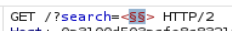
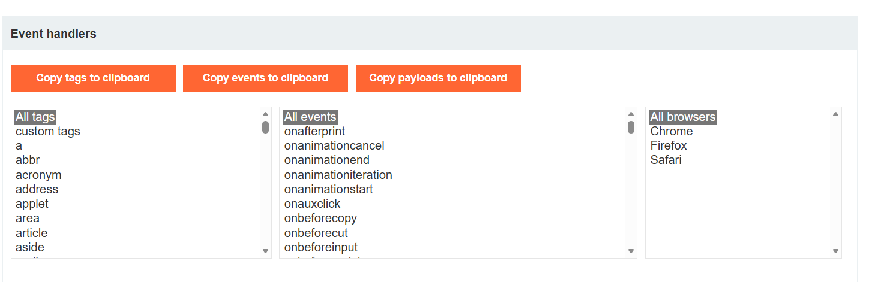
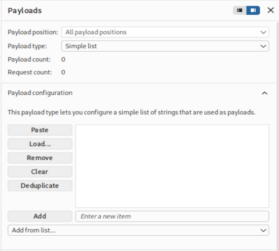
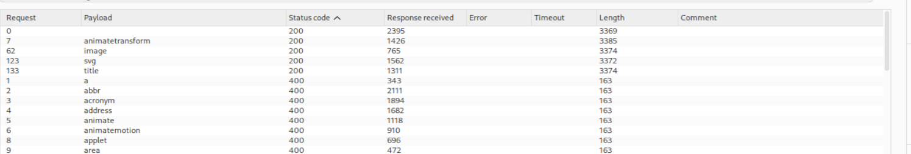
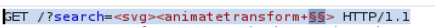
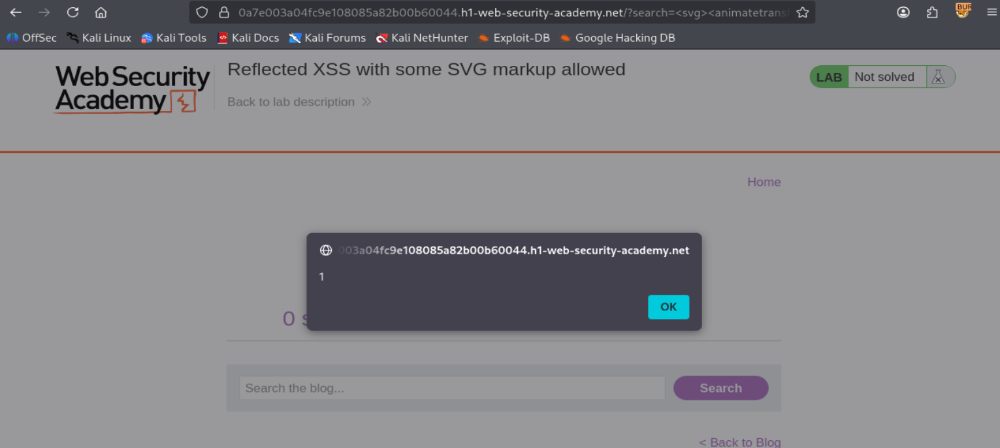

# Lab 30 - Cross-site scripting: Reflected XSS with some SVG markup allowed

**URL del laboratorio:**  
`https://portswigger.net/web-security/cross-site-scripting/contexts/lab-some-svg-markup-allowed`

**Categoría:** Cross-site scripting / XSS reflejado / evasión de filtros / SVG markup permitido  
**Objetivo del laboratorio:** ejecutar `alert()` mediante un payload XSS reflejado.  
**Punto vulnerable:** parámetro `search` del buscador del blog.

---

## 1. Descripción traducida del laboratorio

**Laboratorio: XSS reflejado con parte de marcado SVG permitido**

Este laboratorio contiene una vulnerabilidad simple de **cross-site scripting reflejado**. El sitio bloquea las etiquetas comunes, pero deja pasar algunas etiquetas y eventos de SVG.

Para resolver el laboratorio, realiza un ataque de cross-site scripting que invoque la función `alert()`.

---

## 2. Objetivo principal

El objetivo principal es conseguir que el navegador ejecute JavaScript controlado por nosotros dentro del contexto de la página vulnerable.

En concreto, necesitamos ejecutar:

```js
alert(1)
```

No sirve simplemente escribir texto en la página. Tiene que ejecutarse JavaScript real en el navegador.

En este laboratorio, los payloads típicos de XSS están bloqueados. Por tanto, el camino correcto no es intentar directamente el clásico:

```html
<script>alert(1)</script>
```

ni tampoco:

```html

```

El laboratorio está diseñado para que tengamos que:

1. Confirmar que existe reflexión del input.
2. Confirmar que hay un filtro o WAF bloqueando etiquetas comunes.
3. Enumerar qué etiquetas HTML/SVG permite el filtro.
4. Enumerar qué eventos permite el filtro dentro de la estructura permitida.
5. Construir un payload válido usando únicamente lo permitido.
6. Ejecutar `alert(1)` y resolver el laboratorio.

---

## 3. Contexto inicial del laboratorio

Al iniciar el laboratorio se abre la siguiente aplicación:

`https://0a7e003a04fc9e108085a82b00b60044.h1-web-security-academy.net/`

La aplicación tiene el aspecto de un blog con un buscador.


El buscador es el punto importante. Todo apunta a que el parámetro `search` será reflejado en la respuesta HTML.

La idea inicial es la misma que en otros laboratorios de XSS reflejado:

- Introducimos una cadena en el buscador.
- Observamos si aparece reflejada en la respuesta.
- Probamos si se interpreta como HTML o si se codifica.
- Si se interpreta o se puede romper el contexto, construimos un payload.

Pero aquí hay una dificultad adicional: **el sitio bloquea muchas etiquetas comunes**.

---

## 4. Repaso rápido: qué es XSS reflejado

Un XSS reflejado ocurre cuando una aplicación toma un dato de la petición HTTP y lo devuelve en la respuesta inmediata sin tratarlo correctamente.

Ejemplo conceptual:

```http
GET /?search=test HTTP/1.1
```

Y la respuesta contiene:

```html
<h1>1 search results for 'test'</h1>
```

Si la aplicación no escapa bien el valor de `search`, podríamos intentar enviar HTML o JavaScript:

```html
<script>alert(1)</script>
```

Si el navegador lo interpreta como código, tenemos XSS.

La diferencia en este laboratorio es que sí hay filtrado. El servidor detecta muchas etiquetas sospechosas y responde con error.

---

## 5. Primer intento: payload clásico bloqueado

Probamos una etiqueta clásica:

```html
<script>alert(1)</script>
```

La aplicación responde:

```text
Tag is not allowed
```

Esto nos da información muy importante.

No significa que no exista XSS. Significa que hay un filtro que está mirando las etiquetas que enviamos.

El filtro no está diciendo:

> “No reflejo el parámetro.”

Está diciendo:

> “Esta etiqueta concreta no está permitida.”

Eso cambia completamente el enfoque.

Ahora el problema no es solo encontrar XSS, sino encontrar qué partes de HTML/SVG deja pasar el filtro.

---

## 6. Qué está haciendo probablemente el WAF

El comportamiento indica un modelo de filtrado basado en listas.

Probablemente el WAF tiene una lista de etiquetas bloqueadas, por ejemplo:

```text
script
img
iframe
object
embed
body
input
svg parcialmente
...
```

O también podría tener una lista de etiquetas permitidas y rechazar todo lo demás.

En este laboratorio el resultado práctico es:

- Etiquetas comunes peligrosas como `<script>` se bloquean.
- Etiquetas habituales para XSS como `` también se bloquean.
- Pero algunas etiquetas relacionadas con SVG sí pasan.

Este tipo de defensa es frágil porque intenta identificar “lo malo” por nombres de etiquetas y atributos. El problema es que HTML y SVG tienen muchísima superficie de ataque:

- etiquetas normales de HTML,
- etiquetas SVG,
- eventos DOM,
- eventos específicos de animación SVG,
- atributos que cambian comportamiento,
- distintos contextos de parsing.

Un WAF que bloquea solo lo típico puede dejar pasar combinaciones menos frecuentes pero igualmente ejecutables.

---

## 7. Captura de la petición con Burp Suite

Abrimos Burp Suite Professional y activamos FoxyProxy en el navegador para que las peticiones pasen por Burp.

Hacemos una búsqueda con el payload bloqueado y localizamos la petición en **Proxy > HTTP history**.

La petición capturada es:

```http
GET /?search=%3Cscript%3Ealert%281%29%3C%2Fscript%3E HTTP/1.1
Host: 0a7e003a04fc9e108085a82b00b60044.h1-web-security-academy.net
Cookie: session=K5Ftqj2dS1CFX0T2s1jk4UYavEVVnXOA
User-Agent: Mozilla/5.0 (X11; Linux x86_64; rv:140.0) Gecko/20100101 Firefox/140.0
Accept: text/html,application/xhtml+xml,application/xml;q=0.9,*/*;q=0.8
Accept-Language: en-US,en;q=0.5
Accept-Encoding: gzip, deflate, br
Referer: https://0a7e003a04fc9e108085a82b00b60044.h1-web-security-academy.net/
Upgrade-Insecure-Requests: 1
Sec-Fetch-Dest: document
Sec-Fetch-Mode: navigate
Sec-Fetch-Site: same-origin
Sec-Fetch-User: ?1
Priority: u=0, i
Te: trailers
Connection: keep-alive
```

El parámetro vulnerable es:

```http
search=
```

En este caso la búsqueda va URL-encodeada:

```text
%3Cscript%3Ealert%281%29%3C%2Fscript%3E
```

Decodificado sería:

```html
<script>alert(1)</script>
```

Como el servidor lo bloquea, lo vamos a enviar a **Intruder** para enumerar qué etiquetas sí permite.

---

## 8. Enumeración de etiquetas permitidas con Intruder

Enviamos la petición a **Burp Intruder**.

Modificamos el parámetro `search` para que tenga esta forma:

```http
GET /?search=<§§> HTTP/1.1
```



La idea es que Intruder sustituya `§§` por una lista completa de etiquetas.

Ejemplo de peticiones que se van a probar:

```html
<a>
<script>

<svg>
<title>
<animatetransform>
```

¿Por qué hacemos esto?

Porque no sabemos qué etiquetas bloquea el WAF ni cuáles permite. En vez de probar a mano una por una, usamos un diccionario grande.

Para obtener la lista usamos el **XSS cheat sheet de PortSwigger**, que tiene un apartado para copiar tags.



Pegamos la lista en **Payloads > Simple list**.



Lanzamos el ataque.

Cuando termina, ordenamos por **Status code**.

La mayoría de etiquetas devuelven:

```http
400 Bad Request
```

Eso significa que el WAF las bloquea.

Pero algunas devuelven:

```http
200 OK
```

Eso significa que esas etiquetas han pasado el filtro.

En nuestro caso, las etiquetas permitidas son:

```text
animatetransform
image
svg
title
```



---

## 9. Interpretación de las etiquetas permitidas

El resultado es muy revelador.

Las etiquetas permitidas están relacionadas con SVG:

```text
svg
animatetransform
image
title
```

Esto significa que el WAF está bloqueando HTML común, pero deja pasar parte del ecosistema SVG.

### 9.1. Qué significa que pase `<svg>`

`<svg>` crea un contexto SVG dentro del documento HTML.

SVG significa **Scalable Vector Graphics**. Es un lenguaje XML/HTML-like para dibujar gráficos vectoriales en el navegador.

Ejemplo normal:

```html
<svg width="100" height="100">
  <circle cx="50" cy="50" r="40"></circle>
</svg>
```

Aunque SVG se usa para gráficos, también tiene:

- etiquetas propias,
- atributos propios,
- eventos propios,
- animaciones,
- interacción con el DOM.

Por eso SVG ha sido históricamente una fuente frecuente de vectores XSS.

### 9.2. Qué significa que pase `<animatetransform>`

`<animatetransform>` es una etiqueta SVG de animación.

En SVG, las animaciones pueden tener eventos como:

```text
onbegin
onend
onrepeat
```

Estos eventos no son los típicos `onclick`, `onerror` u `onload` de HTML clásico.

Por eso algunos filtros los pasan por alto.

### 9.3. Qué significa que pase `<image>`

`<image>` en SVG sirve para insertar imágenes dentro de un SVG.

No es igual que `` de HTML.

El WAF puede bloquear `` pero permitir `<image>` porque son etiquetas distintas.

Aun así, en este laboratorio no es el camino más cómodo.

### 9.4. Qué significa que pase `<title>`

`<title>` dentro de SVG puede proporcionar texto descriptivo o tooltip.

No suele ser suficiente por sí sola para ejecutar JavaScript.

Por eso la combinación interesante es:

```html
<svg><animatetransform ...>
```

---

## 10. Por qué el WAF deja pasar SVG

Este laboratorio demuestra un error clásico de filtrado: el WAF parece estar diseñado pensando en HTML estándar, no en todo el modelo de parsing del navegador.

Un WAF básico suele centrarse en patrones conocidos:

```text
<script

```

cambia el contexto de parsing a SVG. A partir de ahí, etiquetas como:

```html
<animate>
<animateTransform>
<set>
<image>
```

pueden tener significado real.

El WAF puede cometer el error de decir:

> “He bloqueado `<script>` y ``, por tanto estoy protegido.”

Pero el navegador dice:

> “Esto es SVG válido, lo voy a parsear como SVG y voy a inicializar sus animaciones.”

Esa diferencia entre lo que entiende el filtro y lo que entiende el navegador es la raíz de la evasión.

---

## 11. HTML parsing vs DOM parsing vs SVG parsing

Para entender este laboratorio bien, hay que diferenciar tres cosas.

### 11.1. HTML parsing

El HTML parser convierte texto HTML en nodos del DOM.

Ejemplo:

```html
<h1>Hola</h1>
```

Se convierte en un nodo DOM:

```text
HTMLHeadingElement
```

Cuando el parser encuentra una etiqueta HTML normal, aplica reglas HTML.

### 11.2. DOM parsing

El DOM es la representación viva de la página en memoria.

El navegador no trabaja con texto HTML una vez parseado. Trabaja con nodos:

```text
document
 └── html
     └── body
         └── h1
```

Un XSS ocurre cuando conseguimos que el navegador cree nodos o atributos ejecutables controlados por nosotros.

### 11.3. SVG parsing

Cuando el parser encuentra:

```html
<svg>
```

entra en contexto SVG.

Los elementos que se crean ya no son exactamente elementos HTML normales, sino elementos SVG dentro del DOM.

Ejemplo:

```html
<svg><animatetransform></animatetransform></svg>
```

El navegador crea nodos SVG y procesa animaciones SVG.

Esto es importante porque algunos eventos SVG, como `onbegin`, no se comportan igual que eventos típicos de HTML.

---

## 12. Por qué no basta con que una etiqueta pase el filtro

Que una etiqueta devuelva `200 OK` no significa automáticamente que sirva para XSS.

Ejemplo:

```html
<title>alert(1)</title>
```

Puede pasar el filtro, pero eso no ejecuta JavaScript.

Lo que necesitamos es una combinación que cumpla tres condiciones:

1. Que pase el WAF.
2. Que el navegador la parseé como estructura válida.
3. Que tenga un evento o comportamiento que ejecute JavaScript.

Por eso nos interesan especialmente:

```html
<svg>
<animatetransform>
onbegin
```

Porque juntas forman una estructura válida y autoejecutable.

---

## 13. Enumeración de eventos permitidos

Después de identificar las etiquetas permitidas, necesitamos saber qué eventos permite el WAF.

No basta con saber que `<svg>` y `<animatetransform>` pasan.

Necesitamos un evento que ejecute JavaScript.

El siguiente paso es probar eventos dentro de la estructura SVG válida.

En Intruder modificamos la petición así:

```http
GET /?search=<svg><animatetransform §=1> HTTP/1.1
```

En la práctica, dejamos el cursor justo donde irá el nombre del evento y añadimos la posición de payload.



Pegamos la lista de eventos del XSS cheat sheet de PortSwigger.

Lanzamos el ataque y revisamos qué eventos devuelven `200 OK`.

El evento interesante que pasa es:

```text
onbegin
```

---

## 14. Qué es `onbegin`

`onbegin` es un evento asociado a animaciones SVG/SMIL.

Se dispara cuando una animación comienza.

Ejemplo conceptual:

```html
<svg>
  <animateTransform onbegin="alert(1)" attributeName="transform">
</svg>
```

Cuando el navegador inicializa la animación, esta comienza automáticamente. Al comenzar, se dispara el evento `begin`, y el atributo `onbegin` ejecuta el JavaScript asociado.

Eso nos interesa muchísimo porque:

- no requiere click,
- no requiere mover el ratón,
- no requiere escribir,
- se ejecuta al cargar/parsear el SVG.

Es decir, es ideal para este laboratorio.

---

## 15. Payload final

El payload final es:

```html
<svg><animatetransform onbegin=alert(1) attributeName=transform>
```

También puede escribirse respetando la capitalización SVG habitual:

```html
<svg><animateTransform onbegin=alert(1) attributeName=transform>
```

En HTML, el parser suele normalizar nombres de etiquetas/atributos, por eso en el laboratorio funciona también en minúsculas.

Al introducirlo en el buscador, aparece el popup:



Y el laboratorio queda resuelto:


---

## 16. Análisis completo del payload

Payload:

```html
<svg><animatetransform onbegin=alert(1) attributeName=transform>
```

Vamos parte por parte.

### 16.1. `<svg>`

Crea un contexto SVG.

Esto es necesario porque `animatetransform` es un elemento SVG. Sin `<svg>`, el navegador puede no interpretar correctamente el elemento de animación.

El WAF permite `<svg>`, por tanto lo usamos como contenedor.

### 16.2. `<animatetransform>`

Crea una animación SVG.

Su función normal no es atacar, sino animar transformaciones de elementos SVG.

Por ejemplo, en SVG legítimo podría usarse para rotar un objeto:

```html
<animateTransform attributeName="transform" type="rotate" from="0" to="360" dur="5s">
```

Pero nosotros lo usamos porque soporta eventos de animación.

### 16.3. `onbegin=alert(1)`

Es el núcleo del XSS.

Significa:

> Cuando la animación comience, ejecuta `alert(1)`.

El evento se dispara automáticamente cuando el navegador inicializa la animación.

### 16.4. `attributeName=transform`

Este atributo es importante.

En SVG/SMIL, una animación necesita saber qué atributo del elemento está animando.

`attributeName` indica el atributo objetivo de la animación.

En este caso:

```html
attributeName=transform
```

significa:

> Esta animación afecta al atributo `transform`.

¿Por qué es necesario?

Porque `animateTransform` no es una etiqueta decorativa. Es una definición de animación. Para que el navegador la inicialice como animación válida, necesita una propiedad objetivo.

Si se omite `attributeName`, algunos navegadores pueden no inicializar correctamente la animación y, por tanto, `onbegin` podría no dispararse.

Dicho de forma simple:

- `onbegin` depende de que la animación empiece.
- Para que la animación empiece, debe ser una animación válida.
- Para que sea válida, necesita saber qué va a animar.
- `attributeName=transform` cumple ese papel.

---

## 17. Por qué aquí no hace falta `">`

En otros laboratorios, el payload empieza con algo como:

```html
"><svg onload=alert(1)>
```

Eso ocurre cuando el input está dentro de un atributo, por ejemplo:

```html
<input value="TU_INPUT">
```

En ese caso necesitas salir del atributo cerrando comillas.

Pero en este laboratorio el input se refleja en contexto HTML de texto, algo como:

```html
<h1>0 search results for 'TU_INPUT'</h1>
```

Ahí el navegador está en contexto de HTML normal, no encerrado dentro de un atributo.

Por eso podemos introducir directamente:

```html
<svg><animatetransform onbegin=alert(1) attributeName=transform>
```

El navegador lo interpreta como una nueva etiqueta dentro del flujo del documento.

Matiz importante: técnicamente no “sale” de `<h1>` de forma explícita. Lo que ocurre es que el parser HTML intenta construir un DOM válido a partir de markup inválido o inesperado. Al encontrarse nuevas etiquetas, reestructura el árbol DOM según las reglas de parsing del navegador.

El punto práctico es que no estamos encerrados dentro de comillas ni dentro de un atributo, por eso no necesitamos `">`.

---

## 18. Payload URL-encoded

Si queremos enviar el payload directamente por URL, debe ir codificado.

Payload en claro:

```html
<svg><animatetransform onbegin=alert(1) attributeName=transform>
```

URL-encoded:

```text
%3Csvg%3E%3Canimatetransform%20onbegin%3Dalert%281%29%20attributeName%3Dtransform%3E
```

Petición ejemplo:

```http
GET /?search=%3Csvg%3E%3Canimatetransform%20onbegin%3Dalert%281%29%20attributeName%3Dtransform%3E HTTP/1.1
Host: 0a7e003a04fc9e108085a82b00b60044.h1-web-security-academy.net
```

En Burp puedes codificar seleccionando el payload y usando `Ctrl+U`.

---

## 19. Variantes del payload

La variante principal es:

```html
<svg><animatetransform onbegin=alert(1) attributeName=transform>
```

También puede funcionar con capitalización SVG:

```html
<svg><animateTransform onbegin=alert(1) attributeName=transform>
```

Otra variante más explícita podría incluir atributos adicionales para hacer la animación más formal:

```html
<svg><animateTransform attributeName=transform type=rotate from=0 to=1 dur=1s onbegin=alert(1)>
```

Otra variante usando comillas:

```html
<svg><animateTransform attributeName="transform" onbegin="alert(1)">
```

Otra variante con cierre explícito:

```html
<svg><animateTransform attributeName=transform onbegin=alert(1)></animateTransform></svg>
```

En este laboratorio concreto, el payload mínimo funciona porque el navegador es tolerante con HTML incompleto.

Pero en entornos reales, cuanto más formal sea el SVG, más consistente será el comportamiento entre navegadores.

---

## 20. Por qué no funciona ``

Payload clásico:

```html

```

Este payload normalmente funciona porque:

1. Crea una imagen.
2. La imagen intenta cargar `src=1`.
3. Esa imagen falla.
4. Se dispara `onerror`.
5. Se ejecuta `alert(1)`.

Pero aquí falla porque el WAF bloquea `` o bloquea `onerror`.

Es un vector demasiado conocido.

El laboratorio nos obliga a buscar una ruta menos típica: SVG + animación + evento `onbegin`.

---

## 21. Por qué no funciona `<script>alert(1)</script>`

`<script>` es la etiqueta XSS más evidente.

Cualquier WAF básico la bloquea.

Cuando enviamos:

```html
<script>alert(1)</script>
```

el servidor responde:

```text
Tag is not allowed
```

Eso confirma que el WAF detecta nombres de etiquetas y rechaza las que considera peligrosas.

Pero como hemos visto, no controla todo el espacio de etiquetas SVG.

---

## 22. Por qué `title` e `image` no son la mejor opción aquí

El Intruder mostró que también pasan:

```text
image
title
```

Pero pasar el filtro no significa ejecutar código.

`<title>` normalmente solo representa texto descriptivo dentro de SVG.

`<image>` podría tener vectores en algunos contextos, pero en este laboratorio el camino documentado y práctico es usar animación SVG.

La combinación más directa es:

```html
<svg><animatetransform onbegin=alert(1) attributeName=transform>
```

Porque:

- `<svg>` crea el contexto.
- `<animatetransform>` crea la animación.
- `onbegin` se dispara automáticamente.
- `attributeName=transform` hace que la animación sea válida.

---

## 23. Flujo completo de explotación

El flujo completo es:

1. Entramos al laboratorio.
2. Probamos `<script>alert(1)</script>`.
3. El servidor responde `Tag is not allowed`.
4. Capturamos la petición en Burp.
5. La enviamos a Intruder.
6. Enumeramos etiquetas con `<§§>`.
7. Descubrimos que pasan:

```text
animatetransform
image
svg
title
```

8. Identificamos que todas están relacionadas con SVG.
9. Construimos una estructura SVG:

```html
<svg><animatetransform ...>
```

10. Enumeramos eventos dentro de esa estructura.
11. Descubrimos que `onbegin` pasa.
12. Construimos el payload final:

```html
<svg><animatetransform onbegin=alert(1) attributeName=transform>
```

13. Lo introducimos en el buscador.
14. El navegador parsea el SVG.
15. La animación comienza.
16. Se dispara `onbegin`.
17. Se ejecuta `alert(1)`.
18. El laboratorio queda resuelto.

---

## 24. Explicación visual del ataque

```text
Input del usuario
     ↓
search=<svg><animatetransform onbegin=alert(1) attributeName=transform>
     ↓
Servidor refleja el input en HTML
     ↓
WAF no bloquea svg ni animatetransform ni onbegin
     ↓
Navegador parsea <svg>
     ↓
Navegador crea animación SVG
     ↓
La animación comienza automáticamente
     ↓
onbegin se dispara
     ↓
alert(1)
```

---

## 25. Qué enseña este laboratorio

Este laboratorio enseña varias cosas importantes.

Primero, que bloquear solo etiquetas comunes no es suficiente.

Segundo, que SVG no es simplemente “una imagen”. SVG es markup activo con eventos, animaciones y comportamiento DOM.

Tercero, que el navegador tiene muchos contextos de parsing. No todo se reduce a `<script>`.

Cuarto, que un WAF puede bloquear payloads conocidos y aun así dejar pasar combinaciones válidas que ejecutan JavaScript.

Quinto, que en XSS avanzado no se trata de memorizar payloads, sino de entender:

- dónde se refleja tu input,
- en qué contexto cae,
- qué filtra el servidor,
- qué interpreta realmente el navegador,
- qué eventos pueden ejecutarse automáticamente.

---

## 26. Cómo defender correctamente este caso

La defensa correcta no es simplemente añadir más etiquetas a la blacklist.

Eso siempre acaba fallando porque HTML, SVG y MathML tienen demasiados elementos, atributos y eventos.

### 26.1. Output encoding contextual

La defensa principal es codificar la salida según el contexto.

Si el input se imprime en HTML texto:

```html
<h1>Resultados para TU_INPUT</h1>
```

entonces se deben codificar al menos:

```text
<  → &lt;
>  → &gt;
&  → &amp;
"  → &quot;
'  → &#x27;
```

Así, este payload:

```html
<svg><animatetransform onbegin=alert(1) attributeName=transform>
```

se mostraría como texto, no como markup ejecutable.

### 26.2. Sanitización robusta con allowlist real

Si la aplicación necesita permitir HTML, debe usar una librería de sanitización robusta, por ejemplo DOMPurify en el frontend o sanitizadores maduros en backend.

Pero hay que configurarla correctamente.

En muchos casos conviene deshabilitar SVG y MathML si no son necesarios.

### 26.3. No confiar en blacklists

Una blacklist del tipo:

```text
bloquear script
bloquear img
bloquear iframe
bloquear onerror
```

no es suficiente.

Siempre aparecerán combinaciones menos típicas:

```html
<svg><animateTransform onbegin=...>
```

### 26.4. Content Security Policy

Una CSP bien configurada puede reducir el impacto:

```http
Content-Security-Policy: default-src 'self'; script-src 'self'; object-src 'none'; base-uri 'none'
```

Pero CSP no debe ser la única defensa. Es una capa adicional.

### 26.5. Validación de entrada no es suficiente

Validar entrada ayuda, pero no sustituye el encoding de salida.

El problema ocurre al renderizar el dato en HTML. Por tanto, la defensa crítica está en la salida.

---

## 27. Conclusión final

Este laboratorio se resuelve entendiendo que el WAF bloquea los vectores comunes, pero permite parte de SVG.

El payload final no usa `<script>` ni ``. Usa una animación SVG:

```html
<svg><animatetransform onbegin=alert(1) attributeName=transform>
```

La clave está en que:

- `<svg>` crea el contexto SVG.
- `<animatetransform>` crea una animación SVG.
- `attributeName=transform` hace que la animación sea válida.
- `onbegin` se dispara automáticamente cuando la animación empieza.
- `alert(1)` se ejecuta sin interacción del usuario.

El aprendizaje más importante es este:

> XSS no es memorizar `<script>alert(1)</script>`. XSS es entender el contexto, el parser del navegador y las diferencias entre lo que filtra el servidor y lo que realmente ejecuta el navegador.

